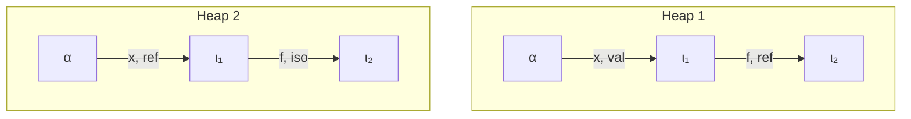
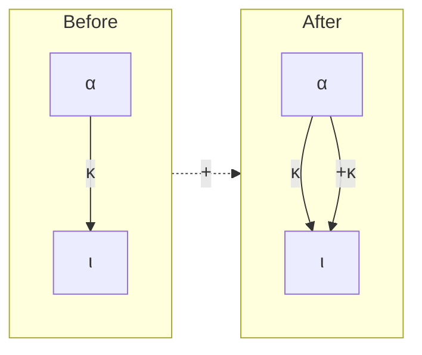
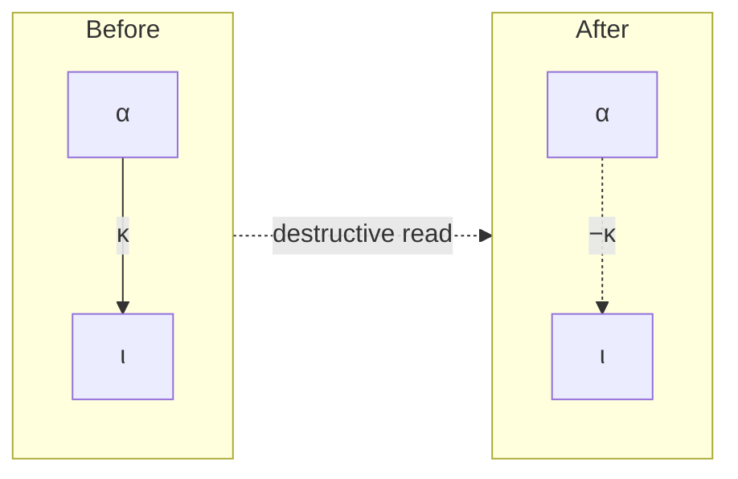

# A Principled Design of Capabilities in Pony

*George Steed, Imperial College London, MEng thesis, 2016.*
*Cleaned `pdftotext -layout` extraction. Dropped: front-matter, TOC,
Acknowledgements, ch. 1 (Motivation/Contributions — superseded by Abstract and 9.1),
and §§ 9.2, 9.3, 9.5 (project meta-narrative). `grep '^#'` gives a live outline.*

## Abstract

A formal model of a programming language gives confidence that the language fulfils
any guarantees it claims about safety or liveness, also helping to uncover bugs or inconsistencies within the language design or implementation. We focus on the programming
language Pony: a relatively new, actor-model, concurrent programming language with
an existing partial model showing that Pony’s type system guarantees freedom from
data-races but lacking a number of important features found in the language itself.

In this thesis we describe Pony G , a formal model for a significantly larger subset of
the Pony language. We begin by revisiting the existing formal model, simplifying and
enhancing the model considerably in several ways with a number of novel components.
Firstly, we introduce the explicit extracting viewpoint adaptation operator, which
allows us to distinguish between field read and write operations and allows us to type
such expressions in a less restrictive way than that enforced by the old model. Secondly,
we introduce the distinction between temporaries at the focus of the execution, which
we refer to as active temporaries, and other passive temporaries such as those being
passed as arguments to a method call. By combining these two new distinctions we
are able to considerably simplify the definition of well-formed runtime configurations
and more easily reason about the heap at arbitrary points during execution, allowing
us to prove that our well-formedness definitions are preserved through execution of the
program.

After simplifying the model, we move on to include a number of extensions found in
the Pony language, namely inheritance, unions, tuples and intersection types. We also
note and provide potential solutions for a number of bugs in the existing implementation
for the language exposed during development of the model, which could lead to data-races occurring.

# 2 Background

## 2.1 Actor-Based Programming

Traditionally, higher-level programming languages support some form of concurrency
construct, usually by allowing the programmer to create threads of execution. In Java,
for example, the class java.lang.Thread [15] is provided, the corresponding class
in C++ being std::thread [5]. This is generally a poor choice for general concurrent programming for a variety of reasons, the primary one being that threads created
locally within the same process share the address space of that process, so data-races
may occur unless correct synchronisation is used. This in turn raises the possibility of
further problems like deadlock and burdens the programmer with the complexities of
synchronisation primitives like semaphores and locks. Alternately the programmer may
choose to ignore these language concurrency constructs and instead use the operating
system to construct multiple concurrent processes. These independent processes have
the advantage of guaranteeing separation of address spaces by default and so naturally
avoid data-races, however processes are costly to create and communication with other
processes is expensive as it now requires the involvement of the operating system kernel.

Actor-based programming languages were first introduced by Hewitt et al. [9] as
an architecture for efficiently representing and running artificial intelligence languages.
It provides the illusion of distinct actors executing concurrently from one-another (although a single actor will itself execute sequentially) and enforces that they may only
communicate and invoke methods of other actors through message passing in an asynchronous manner. Many actor-model based programming languages such as Erlang [6]
implement a message passing system between processes which allows avoiding locks and
grants data-race freedom, but do not eliminate the significant performance cost incurred
by the copying of messages.

## 2.2 Pony

The Pony language provides static data-race freedom by ensuring at compile time that
no piece of data can be modified whilst also being read or modified by a different actor.
This has the advantage of ensuring that multiple actors can share an address space
without interfering and allow message passing to occur without needing to copy the
message or involve the operating system kernel.

Pony allows the definition of both functions and behaviours. Functions may be called
from within the same actor or from an actor on an object, while behaviours may only be
defined on an actor and are executed asynchronously by adding the call to the actor’s
message queue. As an example, consider the following small code segment:
```pony
actor A2
  be helloBehaviour(env: Env) =>
    env.out.print("Hello from A2 (be)")

   fun helloFunction(env: Env) =>
     env.out.print("Hello from A2 (fun)")

actor Main
  be helloBehaviour(env: Env) =>
    env.out.print("Hello from Main (be)")

    fun helloFunction(env: Env) =>
      env.out.print("Hello from Main (fun)")

    new create(env: Env) =>
      this.helloFunction(env)      // "Hello from Main (fun)"
      this.helloBehaviour(env)     // "Hello from Main (be)"
      A2.create().helloFunction(env) // fails to compile
      A2.create().helloBehaviour(env) // "Hello from A2 (be)"
```

From the above code we can identify a number of details of the Pony language.
Pony supports constructors (by convention the name is create, but alternately named
constructors are supported) with the program entry point (The main function in other
languages) is set to be the constructor of Main. Going through the combinations of
functions, we see that the instance of the actor Main is able to invoke both synchronous
(functions) and asynchronous (behaviours) methods of itself, but is unable to invoke
functions of other actors like an instance of A2, which we create a new instance of by
calling A2.create(). Finally the Env class is used to encapsulate the ability to print
to standard input, output and error.

### 2.2.1 Pony Capabilities

In order to ensure that data-races cannot occur, Pony utilises a system of capabilities
that are associated with all basic types, for example Foo val or Bar ref, as well as
allowing modifiers to denote the property that a value is unaliased by adding a caret
after the capability, such as Baz tagˆ. Pony’s capabilities model the operations that
are denied on aliases to the current object. As an example, consider an isolated object
Foo iso, this denies read and write aliases both locally and globally, so no other aliases
can exist to the object. A reference object Bar ref allows all local aliases to the object
within the same actor, but does not permit any global read or write aliases. As a final
example, an object of type Baz tag permits all local and global aliases, however as a
result their contents cannot be modified or even read, only the identity (address) of the
object can be known. These behaviours are summarised in table 1 and illustrated in the
below example:
```pony
class LightSwitch
  fun ref toggle() =>
    // methods modifying local state must be declared ref

    fun box is_on(): Bool val =>
      // methods that only read the state
      // may be declared box (default)
```

|                                 | Deny global read/write aliases (Mutable) | Deny global write aliases (Immutable) | Allow all global aliases (Opaque) |
|---------------------------------|------------------------------------------|---------------------------------------|-----------------------------------|
| Deny local read/write aliases   | *iso*                                    |                                       |                                   |
| Deny local write aliases        | trn                                      | *val*                                 |                                   |
| Allow all local aliases         | ref                                      | box                                   | *tag*                             |

*Table 1: Capability matrix, reproduced from [4]. Sendable capabilities are italicised.*

```pony
actor LightSwitchToggler
  be receive_iso(ls: LightSwitch iso) =>
    // iso objects can both read and modify the object
    ls.toggle()
    ls.is_on()

      be receive_val(ls: LightSwitch val) =>
        // val objects can read, but not modify the object
        ls.toggle() // this line fails to compile
        ls.is_on()

      be receive_tag(ls: LightSwitch tag) =>
        // tag objects can neither read nor modify the object
        ls.toggle() // this line fails to compile
        ls.is_on() // this line also fails to compile!
```

An important property gained from the presence of capabilities is the ability to
determine which types can be sent to other actors. As shown in table 1 and the example
above, any type with one of the three capabilities iso, val or tag can be sent to
another actor. Isolated objects (iso) can be trivially sent to other actors since no read
or write aliases exist to them in the entire program. Value objects (val) can be sent
since any remaining references in the sender are guaranteed to not be able to modify the
sent object, and neither will the receiving actor, hence this is safe to send since multiple
concurrent reads are a safe operation. Finally, objects with the tag capability can also
be sent for the opposite reason as isolated objects: any number of aliases can exist to
this object but cannot even read the contents of the object, so sending it to other actors
cannot cause the underlying structure to be modified.

All actors in Pony are visible to other actors with capability tag but see themselves
as ref. As a consequence, actors can fully modify their own state (but cannot see inside
any other actors), can be passed around as first-class values and executed in parallel
without worrying about data-races.

Finally, if a type does not specify a capability, it is assigned the default value for that
type. As we saw in the earlier example, the capability for the type Env was omitted.
In Pony a class may specify its default capability which, if omitted, means a class is
mutable (ref) by default. The Env class on the other hand explicitly specifies a default

capability of val which allows it to be sent to other actors as in our example. This is
just syntactic sugar, so is not of interest in a formal model and we omit further mention
of it.

### 2.2.2 Viewpoint Adaptation

As motivation for the need for viewpoint adaptation, let us first consider the two example
heaps shown below. We use the term α to refer to an actor, in both cases below the
only actor, and ω to refer to an object. Later we will use ι as a general term to refer to
either an actor or an object without distinguishing which. We use arrows to illustrate
the existence of fields (f) or local variables (x) in actors and objects, annotated with
their corresponding capability.



*Figure 1: Example Heap 1. α has variable `x : val` pointing to ι₁, which has field `f : ref` pointing to ι₂.*
*Figure 2: Example Heap 2. Same structure but `x : ref` and `f : iso`.*

In figure 1 we have a variable x of capability val, which in turn has a field of capability
ref. If the program attempts to access x.f, we need some method for determining the
capability of the resulting temporary alias. We use the viewpoint adaptation operator
(.) to give us this capability: in this case val . ref. Plainly this cannot give ref, since
val guarantees to be immutable, so in this case we give back the type of the source
object, namely val . ref = val.

The second example figure 2 is similarly structured, but with different capabilities.
Here we have that the type of the same temporary alias would be ref . iso. On initial
inspection we may think that we once again end up with the type of the receiver (ref),
however we can actually do better than that in this case. Since a field read gives back a
temporary rather than a named local variable we can in fact give back an iso temporary.

| Origin \ Field | iso | trn | ref | val | box | tag |
|----------------|-----|-----|-----|-----|-----|-----|
| iso            | iso | tag | tag | val | tag | tag |
| trn            | iso | trn | box | val | box | tag |
| ref            | iso | trn | ref | val | box | tag |
| val            | val | val | val | val | val | tag |
| box            | tag | box | box | val | box | tag |
| tag            | ⊥   | ⊥   | ⊥   | ⊥   | ⊥   | ⊥   |

*Table 2: Viewpoint adaptation, reproduced from [4]. Origin (row) viewed through a field of capability (column) yields the result.*

The full table of viewpoint adaptation operators is given in table 2, note how since
we cannot read or write to fields of tag objects, we simply say that tag . κ is undefined.

This definition of the viewpoint adaptation operator is mostly given through examples, making it difficult to justify certain values of the table. We must consider both the
capability of the object being accessed as well as that of the field in order to guarantee
that field reads and writes do not break guarantees about what objects are visible to
actors during program execution and in order to ensure data-races cannot occur. For
this reason we will later describe a more principled approach to deriving the values in
the table, in section 3.11.

Due to the strict guarantees it must make, there are challenges involved with extending viewpoint adaptation to support extensions to the model such as type expressions
(intersection, union and tuples) since this could potentially cause a variable to have a
number of different capabilities (this is elaborated on in section section 2.6.4).

### 2.2.3 Formal Model

A subset of the Pony language is already modelled covering a number of features: the
existence of actors with functions, behaviours and constructors, as well as capabilities,
viewpoint adaptation, aliasing and a number of proofs relating to the well-formedness
of the visibility of objects and the well-formedness of the heap [4]. Despite this, there
remains a large number of important language features that are unimplemented in the
formal model:

   • Both structural and nominal subtyping are supported in Pony through interfaces
     and traits.

   • Intersection types provide a way of combining traits and interfaces in order to
     ensure that a variable satisfies multiple definitions simultaneously.

   • Union types allow the programmer to declare that something may satisfy one of
     the provided elements, and is commonly used together with the None class to
     represent optional values that may or may not be present.

   • Tuples are supported in Pony in order to allow ad-hoc collections of objects (for
     example, in order to allow for multiple return values from a method call).

   • Generics are heavily used throughout Pony’s standard library and the ability to
     set default values on generic type parameters.

   • Partial application of functions is supported in Pony, allowing users to supply some
     number of functions to the function before invoking it later with the remaining
     arguments.

   • Pony supports delegates, where if a function is not found to be defined in a class,
     it instead attempts to call the method in the specified delegate.

## 2.3 Covariance and Contravariance

Covariance and contravariance [11, 12] refer to the ability of code to substitute a more
or less specialised type respectively in place of that declared by a class of method.

Covariance is used to indicate that a subtype of the expected type may be provided
instead of that originally declared. Consider an example of an inheriting class overriding
a method in Java, which allows for covariant return types. If a base class had declared
a method Foo thing() then a deriving class can happily override such a method with
a return type that is a subtype of Foo, e.g. Bar thing(), for Bar subtype of Foo.

Contravariance refers to the exact opposite of covariance, that a super-type may be
provided instead of the type expected by the declaration. To use the same example as
before, method arguments in some languages may be contravariant when being overridden in a base class, a method declared void thing(Bar arg) may be overridden with
void thing(Foo arg) in a derived class. This is safe since any objects calling thing
in the base class must pass a Bar object, which is guaranteed to be a subtype of Foo
and hence may be safety treated as such.

As a concrete example, consider the types B0, B1, B2, C0, C1, C2 with the following
subtyping relationships (where ≤ indicates subtyping, is read ”is a subtype of”):

                     B2 ≤ B1 ≤ B0                                 C2 ≤ C1 ≤ C0

We can now construct a base class A0 with a method overridden by the deriving
class A1 displaying both covariance and contravariance in a Java-like language:
```java
class A0 {
  C1 m(B1 x) {
    ...
  }
}

class A1 extends A0 {
  C2 m(B0 x) {
    ...
  }
}
```

   As explained previously, the derived class is able to utilise covariant return types to
specify a more specialised instance (C2 instead of C1) while contravariance of parameter
types allows the argument to be of a less specialised type (B0 instead of B1). Note also
that this can be expressed using arrow types, where C2 → B0 ≤ C1 → B1, or more
generally:

                                  T1’ ≤ T1 T2’ ≤ T2
                                 T1 → T2’ ≤ T1’ → T2

That is, a function taking a T1 and returning a T2’ is a subtype of a function taking
a T1’ and returning a T2 if both T1’ is a subtype of T1 and that T2’ is a subtype of
T2.

## 2.4 F-Bounded Polymorphism

F-Bounded Polymorphism, introduced by Canning et al. [2], is an extension to bounded
quantification (Cardelli and Wegner [3]) that allows for a more strict return type from inherited functions. As an example, consider the below example of bounded quantification
for a Cloneable interface:
```java
public interface Cloneable {
  Object clone();
}

public class String implements Cloneable {
  public Object clone() {
    ...
  }
}
```

   The above interface specifies a clone method, however since the interface has no
knowledge of the deriving class it is impossible to return any class more specialised
that Cloneable. With F-bounded polymorphism (also known as recursively bounded
quantification), the interface now changes to accept a generic parameter satisfying the
same Cloneable interface as such:
```java
public interface Cloneable<T extends Cloneable<T>> {
  T clone();
}

public class String implements Cloneable<String> {
  public String clone() {
    ...
  }
}
```

   By giving the interface knowledge of the type that implements it, we allow for a
well-typed return type of the clone method while still keeping the interface generic.

However notice that this only permits a single level of type-exactness unless the String
class itself is generic, consider the following extensions extending the basic String class:
```java
public class SpecialStringOne extends String {
  public String clone() {
    ...
  }
}

public class SpecialStringTwo extends String
        implements Cloneable<SpecialStringTwo> {
  ...
}
```

Since String does not take an argument, there is no way for SpecialStringOne
to inform the interface that a more exact type should be used instead. As an alternative
we may instead suggest SpecialStringTwo, that our derived class simply reimplement the interface. This however does not even compile as the class is now implementing
the same interface twice, which is disallowed in Java due to the erasure of generic types
at runtime.

### 2.4.1 Covariance and Contravariance in F-Bounded Polymorphism

In languages such as C# [11], the programmer may explicitly specify the variance of
generic classes at the declaration site as Foo<in T> or Foo<out T> to indicate contravariance and covariance respectively, with Foo<T> declaring the class to be invariant
(that is, neither covariant nor contravariant) over the type parameter.

Java on the other hand supports a form of use-site variance, where the variance of a
type is implicitly existentially quantified [12]. Consider the following example adapted
from one put forward by Kennedy and Pierce [12]:
```java
interface Func<A, B> {
  B apply(A a);
}

  class C {
  }

class D extends C {
  Func<? super D, ? extends C>
  cast(Func<? super C, ? extends D> f) {
    return f;
  }
}
```

   In this case, the ? extends T is used to declare covariance over the type T, with
? super T specifies contravariance. This could also be seen in the example of F-bounded

polymorphism earlier, as the type parameter of the interface is usually specified to ensure
it does in fact extend from the interface specified.

### 2.4.2 Issues with F-Bounded Polymorphism

Usage of F-bounded polymorphism in programming is highly unintuitive to the user, and
even worse subtyping becomes undecidable under the presence of recursive inheritance
and variance [8, 12]. Consider the following example from Greenman et al. [8], written in
a C#-like language making use of covariance (out), contravariance (in) and F-bounded
polymorphism:
```java
public interface Equatable<in T> {
  ...
}

public class List<out T> : Equatable<List<Equatable<T>>> {
  ...
}

public class Tree : List<Tree> {
  ...
}
```

We first declare an Equatable interface with a contravariant type parameter, then a
class List with a covariant type parameter. In order to allow for lists to be comparable
with other lists of possibly different types, we use F-bounded polymorphism to specify
that lists are equatable with a list of anything that is equatable with the argument
type. Finally we create a simple Tree class which simply stores the set of child nodes
by inheriting from List<Tree>, plus potentially some per-node information which we
have omitted.

Consider a compiler attempting to compile the above code. Imagine a judgement of
whether Tree is a subtype of List<Equatable<Tree>> was needed (e.g. checking
that assignment from the result of a method call is well-typed). The following sequence
of steps is one that a type-checker could conceivably take in attempting to prove the
aforementioned judgement:

                                    Tree <: List<Equatable<Tree>>
                             List<Tree> <: List<Equatable<Tree>>              (inheritance)
                                    Tree <: Equatable<Tree>                    (covariance)
                             List<Tree> <: Equatable<Tree>                    (inheritance)
Equatable<List<Equatable<Tree>>> <: Equatable<Tree>                           (inheritance)
                                    Tree <: List<Equatable<Tree>>          (contravariance)

Clearly this process will never terminate unless the compiler explicitly keeps track of
all previous steps taken, since the first and last steps of the sequence are identical (the
loop does in fact however correspond to a valid infinite proof of subtyping [8]). Such
loops pose a problem for implementation writers of type-checking for languages such as

C# and Java, and indeed examples such as this will cause mainstream compilers for
these languages to crash.

### 2.4.3 Materials and Shapes

Materials and Shapes, introduced by Greenman et al. [8], propose a much more intuitive
solution to the complexities inherent in usage of F-bounded polymorphism. It is observed
that usage of F-bounded polymorphism is limited to a subset of interfaces, such as Java’s
Comparable interface [14]. One example of this usage is in order to enforce that the
type of the argument or return type is the same as the deriving type, also known as the
self type. It can also be observed that these kinds of interfaces will rarely appear as the
parameter to a generic class, for example it would be highly unusual to have a variable
of type List<Equatable<Tree>>, one would question why the the author did not
simply write List<Tree> instead.

The solution proposed introduces a distinction between Shapes, which identify
classes utilising F-bounded polymorphism such as Java’s Comparable, from Materials,
which form the remainder of classes such as List. Greenman et al. note that this
separation of purpose is already present in a large amount of existing code and would
likely not break any existing code were it to be retrofitted to an existing language
such as Java. Additionally, by only permitting materials to be used as generic type
parameters we are able to simplify type-checking by removing the requirement of
allowing recursive inheritance for anything other than shapes.

   Utilising our earlier Comparable example, we would now alter our code to declare
the interface as a shape:
```java
public shape Cloneable<T> {
  T clone();
}

public class String implements Cloneable<String> {
  public String clone() {
    ...
  }
}
```

The declaration of Cloneable can now be simplified (note that the type parameter
of the shape is now implicitly bounded to inherit from itself rather than requiring the
complex interface declaration), however this may not be desirable if additional nonrecursive type parameters are wanted. The main benefit is achieved by disallowing
recursive inheritance on material classes (which are simply defined as any non-shape
class to allow retrofitting to existing code), which would improve error messages and
prevent abnormal and non-idiomatic usage of inheritance while removing the need to
declare usage of unintuitive F-bounded polymorphism.

## 2.5 Structural and Nominal Subtyping

Both structural and nominal subtyping [13] are supported in Pony as a method of
allowing the programmer to express the intention of provided interfaces.

Structural subtyping allows for the development of interfaces and automatic introduction of subtyping between interfaces and classes implementing interface methods
without the programmer having to explicitly inherit the interface. This is useful for
cases where the original programmer may not be aware of such interfaces existing or
should not need to care for the purpose of interfaces used only in cases like utility
methods, where only a subset of behaviour is actually required.

In contrast, nominal subtyping refers to the practice of explicitly specifying the
subtyping relation. This is done in Pony by defining a trait in an identical way to
how interfaces are specified. In this case, a class explicitly inherits the trait and hence
guarantees to provides all methods of that trait, something that can be checked by
the compiler. Nominal subtyping has the advantages that design intent is explicitly
preserved and that the use of nominal subtyping prevents the accidental introduction
of subtyping between unrelated types, however can cause rigidity especially when thirdparty classes are provided which cannot be easily modified.

As an example of how Pony utilises structural and nominal subtyping, consider the
following example from Pony’s online documentation:

```pony
trait Named
  fun name(): String val =>
    "Somebody"

  class Alice is Named

class AliceUsage
  fun use_named(x: Named ref) =>
    ...

    fun call_with_alice() =>
      var alice = Alice.create()
      this.receive_named(alice)
```

```pony
trait Named
  fun name(): String val =>
    "Somebody"

class Bob
  fun name(): String val =>
    "Bob"

class BobUsage
  fun use_named(x: Named ref) =>
    ...

  fun call_with_bob() =>
    var bob = Bob.create()
    this.receive_named(bob)
    // ˆ fails to compile
```
         In the left example, class Alice automatically inherits the function name from
     the trait Named, even though Alice did not explicitly provide it (although they may
     do so to override the implementation in Named, or if no default implementation was
     provided). As shown, an instance of Alice may be passed to a function expecting a
     Named, since subtyping is introduced by nominal inheritance. In the case of the right
     example however, Bob does not inherit nominally from Named and so may not be passed
     to the use named function as it expects an argument of type Named. This is because,

despite Bob providing all the same methods as Named, subtyping must be introduced
from traits explicitly by using the is keyword.
```pony
  interface Named
    fun name(): String val

class Charlie
  fun name(): String val =>
    "Charlie"

class CharlieUsage
  fun use_named(x: Named ref) =>
    ...

    fun call_with_charlie() =>
      var charlie = Charlie.create()
      this.receive_named(charlie)
```

Now suppose we modify our example to make Named an interface to instead utilise
structural subtyping. In this case, Charlie is implicitly a subtype of Named and may
be passed to a function like use named expecting an argument of type Named despite
the fact it never explicitly declared the subtyping relationship. Note that Charlie
could also have explicitly inherited Named using the is keyword, which would cause
the compiler to explicitly check that Charlie was a subtype of Named and cause an
error otherwise. This can also be used to inherit the default interface implementations
(for example, if Named had provided a function body then Charlie could simply
inherit explicitly using the is keyword and avoid specifying the method body in the
class itself).

### 2.5.1 Modelling Challenges

Since traits and interfaces are allowed to extend other traits and interfaces, even if they
are only declared later in the program, which gives rise to the potential for infinitely
recursive inheritance trees. These are explicitly disallowed by Pony and will have to be
disallowed in the model.

## 2.6 Intersection, Union and Tuple Types

Pony’s type system allows for the presence of intersection, union and tuple types in type
expressions as a way of expressing more complex types without introducing entire new
classes.

### 2.6.1 Intersection Types

Intersection types provide an easy way of specifying that a type satisfies several traits
or interfaces simultaneously and are used throughout Pony’s standard library. Consider
the following example using interfaces from Pony’s standard library.

  1   var value: (Hashable box & Stringable box)
   This code defines a variable called value with type (Hashable box &
Stringable box), that is to say that it guarantees that value satisfies both the
Hashable box interface and that of Stringable box (and hence both the string
and hash functions are available for users of value).
   From a modelling perspective, intersection types are used to indicate that a type is a
subtype of both inner types simultaneously, for example a variable of type (Hashable
box & Stringable box) would naturally be a subtype of both Hashable box and a
subtype of Stringable box, and by commutativity a subtype of (Stringable box
& Hashable box).

### 2.6.2 Union Types

Union types have a number of uses in Pony, the simplest and most well-known of which
is to provide a type-safe way of encoding that a value may or may not be present. For
example, consider a method get name which may either return a String val or else
nothing (represented in Pony using the None val type):
```pony
fun get_name(): (String val | None val) =>
  ...
```

Union types specify that a type is a subtype of either of the inner types, for example
(String val | None val) could be used to indicate that the value is either a String
val or a None val (or even possibly a subtype of both, although that makes little sense
in this example). The subtype relation with union types is the opposite of intersection
types, so in this case both String val and None val would be a subtype of (String
val | None val), but not the other way around.

### 2.6.3 Tuple Types

Tuples (also known as product types) provide a straight-forward way of creating ad-hoc
temporary collections of objects for the purpose of grouping them together. A good
example of this is to simulate the existence of multiple return values. Consider our
get name example from earlier, however now instead of optionally returning a String
val we wish to return a pair of them (separating first and last names, for example).
We can express this with the below signature:
```pony
fun get_name(): (String val, String val) =>
  ...
```

These types are formed by creating a tuple of two values, for example (String val,
String val) is the type of a two-element tuple containing elements of type String
val. Unlike union or intersection types, in this case neither the tuple or its elements
are subtypes of one-another.

### 2.6.4 Modelling Challenges

In Pony, capabilities are attached to the inner types in type expressions, which allows expressions potentially dangerous combinations of capabilities to be constructed. Consider

the following example we discovered:
```pony
class Data
  fun ref modify_data() =>
    ...

   fun box read_data() =>
     ...

actor DataReader
  be read_from_data(data: Data val) =>
    data.read_data()

actor Main
  new create(env: Env val) =>
    var data: (Data ref & Data val) = Data.create()
    DataReader.create().read_from_data(data)
    data.modify_data()
```

Note that since we are able to construct a value of type (Data ref & Data val),
we permit the variable data to have two reference capabilities simultaneously. By the
subtyping relationships defined previously, we are able to pass a val capability object
to the DataReader class (which allows it to read the data) while still retaining a
ref capability to allow us to locally modify the data. We now have a data-race that
is accepted by the current Pony compiler, the result that DataReader reads is nondeterministic and could be nonsensical depending on the definitions of read data and
modify data. This poses a problem from the point of view of modelling these types
since it in theory allows us to bypass the protections offered by viewpoint adaptation
and Pony’s capabilities. We elaborate on this further and present a potential solution
similar to that adopted by the Pony compiler in section 8.8.

A further issue identified concerning tuples is examined in section 7.6, however requires a deeper understanding of Pony’s type system so we omit discussion of it here.

## 2.7 Pony Generics

Pony supports generic types, where classes may take a number of type parameters, which
may in turn take an optional constraint and default value to take if no type parameters
are specified at the use-site. Consider an example of the Map type alias from the Pony
online documentation, which has the following definition:
```pony
type Map[K: (Hashable box & Comparable[K] box), V]
  is HashMap[K, V, HashEq[K]]
```
   This example shows a type alias (similar to typedef or using statements in C++)
declaring a new generic type Map. This generic type takes two parameters, a key type
K and a value type V and is defined in terms of existing HashMap and HashEq classes.
Additionally we constrain the type of the key to ensure it satisfies the Hashable box

and Comparable[K] box interfaces, which ensure that the key provides the hash and
compare methods respectively.

### 2.7.1 Modelling Challenges

The modelling of generics in Pony is simplified by the fact that generics in Pony are
invariant (unlike earlier examples in C# and Java, for example, where variance could
be explicitly specified at the declaration site and use-site explicitly).

There are many important extensions to the basic model of generics that can be
potentially omitted to make initial modelling of generics simpler:

   • Bounds on generics (e.g. the (Hashable box & Comparable[K] box) example
     previously) could be omitted in order to eliminate the complexity caused by ensuring that these bounds are satisfied, which will allow the modelling of lists and
     other simple generic collections

   • Default values on generic type parameters could also be omitted to simplify the
     modelling of usage of generic types, and should be easily be re-incorporated at a
     later time.

   One potential issue with modelling generics is the need to allow for generic viewpoint
adaptation. Pony allows specifying expressions such as this->A to allow the code to
specify the capability of the type as seen at the call site, which is not supported by the
current model.

## 2.8 Self Types

One of the most common uses of F-bounded polymorphism noted by Greenman et al.
[8] is to be able to use the type of the deriving class in an abstract interface. Self
types [1] perform exactly this purpose, providing a This type which represents the type
of the runtime object that derived it. As an example, consider the definition of our
Cloneable interface from earlier, rewritten to use self types in a Java-like language:
```java
public interface Cloneable {
  This clone();
}

public class String implements Cloneable {
  public String clone() {
    ...
  }
}
```

Note that by allowing the interface to implicitly reference the type of the derived
class, we avoid the need for the interface to take a type parameter and remove the need
for F-bounded polymorphism entirely in this case. It should however be noted that this
does not remove all uses of F-bounded polymorphism, since it only simplifies a subset
of the behaviour that can be simulated with F-bounded polymorphism, for example any

mutually recursive constraints would not be able to be expressed solely with the use of
a This type.

## 2.9 Prolog

To ease the burden of proving many of the simple lemmas we wish to use regarding
capabilities, we will utilise Prolog to systematically check for counterexamples where it
is feasible to exhaustively check the solution space. As an example, consider the formula
A ∧ (B ∨ C) =⇒ D, i.e. if A and either B or C hold, then D must also hold. We can
express this in the following Prolog rule:
 1    check_lemma_example :- A, (B; C), \+D.

   All rules in Prolog must have a name (check lemma example in this case), we then
encode negation of the required formula by converting the implication to a conjunction
and negating the right hand side: A ∧ (B ∨ C) =⇒ D ≡ ¬(A ∧ (B ∨ C) ∧ ¬D) (we use
commas to indicate conjunction, semicolons to indicate disjunction). If this rule can be
shown satisfiable then we have found a case where the formula does not hold, and hence
our lemma is invalid.
   For the Prolog code for a number of the lemmas shown later, refer to appendix D.

# 3 Base Model

We now present Pony G , an extension of the original model (Pony S ) presented by
Clebsch et al. [4]. We begin in this section by simplifying and expanding upon the
model appropriately, in the process making it more suitable for the extensions we will
be adding later. We then in subsequent sections extend this model, first with inheritance
(section 5), then with union types (section 6), tuples (section 7) and intersection types
(section 8). At each step we reconsider the definitions presented previously and extend
them as necessary.

## 3.1 Syntax

                 P   ∈  Program        ::=   CT AT
                CT   ∈ ClassDef        ::=   class C F K M
                AT   ∈ ActorDef        ::=   actor A F K M B
                RS   ∈ RunTypeID       ::=   A|C
                DS   ∈ DeclTypeID      ::=   A|C
                DT   ∈ DeclType        ::=   DS λ
                 F   ∈    Field        ::=   var f : DT
                 K   ∈    Ctor         ::=   new k(x : DT) ⇒ e
                 M   ∈    Func         ::=   fun κ m(x : DT) : DT ⇒ e
                 B   ∈    Behv         ::=   be b(x : DT) ⇒ e
                 n   ∈  MethID         ::=   k|m|b
                 λ   ∈  CapMod         ::=   κφ
                 κ   ∈    Cap          ::=   iso | trn | ref | val | box | tag
                 φ   ∈ AliasMod        ::=   −|ε
                 e   ∈    Expr         ::=   this | x | x = e | null | e; e
                                         |   e.f | e.f = e | recover e
                                         |   e.m(e) | e.b(e) | RS.k(e)
                E[·] ∈    ExprHole     ::=   x = E[·] | E[·]; e | (E[·]) | E[·].f
                                         |   e.f = E[·] | E[·].f = t | E[·].n(t)
                                         |   e.n(t, E[·], e) | recover E[·]

                                     Figure 3: Syntax.

The syntax of Pony G programs is presented in figure 3, with the naming convention
presented in figure 4. Like Igarashi et al. [10], we use the notation x to indicate a
comma-separated list of xi in sequence.

We begin by discussing the syntax for Pony G programs. A program is comprised of
a set of definitions of classes and actors:

• Classes in Pony G are near identical to their object-oriented counterparts, consisting of a class name as well as fields, constructors, methods.

• Actors are simply classes with an additional set of asynchronously executing methods called behaviours (introduced with be rather than fun).

                       C   ∈   ClassID         k   ∈   CtorID
                       A   ∈   ActorID         m   ∈   FuncID
                       f   ∈   FieldID         b   ∈   BehvID
                 this, x   ∈   SourceID        n   ∈   CtorID ∪ BehvID
                       t   ∈   TempID       y, z   ∈   LocalID

                                  Figure 4: Identifiers.

Pony supports named constructors which are invoked by prefixing the class or actor being
constructed (e.g. for a class Foo with a named constructor k1 taking no arguments, the
expression Foo.k1() constructs a new instance of the class).

In order to differentiate between types that can exist as static types and those that
can exist at runtime, we first introduce declared symbols (DS), which refer to the id of
the class or actor (without a capability), and declared types (DT), which for now may
be an actor or class. Runtime symbols (RS) for the time being are defined identically
to that of declared symbols (DS), however this will change when types that cannot exist
at runtime are introduced in later sections (such as traits and interfaces see section 5).
For the remainder of the syntax, we use only declared types with the exception of the
definition of constructor expressions (which obviously can only construct objects that
can exist at runtime).

All basic declared types in Pony are comprised of a symbol (also known as a type
identifier, DS) and a capability. Capabilities allow us to track what operations can be
applied on a type, what aliases can be made with it, whether it is mutable and more.
Capabilities are denoted as λ and are comprised of a basic capability κ and an optional
ephemeral modifier φ (see section 3.3 for more details).

### 3.1.1 Treatment of Null

The Pony language compiler does not support an uninitialised null value such as that
found in other object-oriented languages like Java and C++. This means that the
compiler must perform extra work to ensure that class and actor constructors initialise
all fields before they could be accessed. In Pony G we avoid the additional complexity
added by these checks simply by allowing the existence of null. Note that this obviously
does not hinder our goal of avoiding data-races since trying to access fields of null will
simply result in execution becoming stuck.

As an aside, we will note after the introduction of union types that it is indeed
possible to remove null from the language with some additional effort, but we do not
attempt to perform such an extension in this report. See section 6.10

### 3.1.2 Comparison to Pony S

In Pony S (the original model for the Pony language, presented by Clebsch et al. [4]),
there was no need to split types into types that could be represented in the program
and types that could exist at runtime since as figure 3 shows, they are the same before
any extensions are added.

We present a slightly modified definition of capabilities compared to the original
paper, which simplifies the handling of ephemeral modifiers and gains us more expressive
power (see section 3.3). This also simplifies the definition of types, since we no longer
distinguish between types and types with ephemeral modifiers (Type and ExtType in
Pony S ).

## 3.2 Operational Semantics

  χ ∈ Heap              =   Addr → (Actor ∪ Object)
  σ ∈ Stack             =   ActorAddr · Frame
  ϕ ∈ Frame             =   MethID × (LocalID → Value) × ExprHole
      LocalID           =   SourceID ∪ TempID
  v ∈ Value             =   Addr ∪ {null }
  ι ∈ Addr              =   ActorAddr ∪ ObjectAddr
  α ∈ ActorAddr
  ω ∈ ObjectAddr
      Actor             = ActorID × (FieldID → Value) × Message × Stack × Expr
      Object            = ClassID × (FieldID → Value)
  µ ∈ Message           = MethodID × Value

                               Figure 5: Runtime entities.

The entities used in the operational semantics are defined in figure 5 and are for now
unchanged from Pony S . We use σ to denote an actor with a set of stack frames for the
currently executing behaviour (i.e. σ = α · ϕ). A stack frame contains the identifier of
the current method or behaviour being executed, a mapping to specify the value of local
variables and finally the expression to be executed when the next stack frame finishes
executing and returns a value (empty if we are the top stack frame).

Values may be either an address (pointing to a class or actor instance), or the
special constant null (see section 3.1.1). Actors and Objects share the same basic
layout: each keeps track of its type as well as the value of all fields it contains. Actors
must additionally keep track of the set of messages received but not processed, the
stack frames for the current message being processed and the expression currently being
executed.

Figure 6 specifies how a Pony G program executes in a given heap χ. The
Global rule is used to choose some actor capable of progressing and executing a single
step in that actor, allowing arbitrary interleaving of the executed steps. The remaining
rules then have the form χ, σ, e      χ0 , σ 0 , e0 , specifying how an expression e executes
given the heap, an actor and its associated stack frames.

The remaining rules handle execution within the stack frames (σ) of a single actor:

• The ExprHole rule allows us to focus on and evaluate a part e of a larger overall
  expression E[e]. For example we may have that x1 = x2.f. We must first evaluate
  the field lookup, so we invoke the ExprHole rule with e defined as x2.f, which
  in turn would invoke ExprHole yet again to evaluate the local variable x2 to a
  temporary.

• The rules for field and local variable lookup, handling of null, sequential composition and assignment to both local variables and fields should not come as
  a surprise, they simply manipulate the top of the current actor’s stack (ϕ) and
  perform lookups into the heap (χ). What may be surprising is the usage of the
  temporary identifier t, which we defer to section 3.2.1, and the fact that assignment to local variables and fields returns the old value of the assignment. The
  latter will be extremely useful as it allows us to perform a destructive read on
  values, which in some cases may give us greater freedom to transfer ownership
  of the released object, specifically due to unaliasing (section 3.6) and extracting
  viewpoint adaptation (section 3.11.3).

• The Sync rule handles calling of synchronous methods (on object t with arguments t within an actor. We get the type of the object (χ(ι) ↓1 ) and use this
  to lookup the definition of the method m. We then construct a new stack frame,
  assigning the this pointer and arguments appropriately, with an empty continuation. The continuation on the current stack frame is replaced with the outer
  expression being evaluated in order to ensure that we can resume execution once
  the method being called is finished. Finally we construct the new stack with the
  new and modified frames, and replace the executing expression with the body of
  the method being called.

• Returning from synchronous methods is handled by the Return rule. In this case
  we simply discard the topmost stack frame and substitute the result of the method
  into the continuation provided, removing the continuation from the stack frame of
  the caller.

• The rule Async handled calling a behaviour on a given actor. Instead of constructing a new stack frame as we did in Sync, in this case we simply append our
  behaviour identifier and argument values onto the message queue of the actor.

• For actually executing behaviours, the Behave rule is required. Since we may only
  execute one behaviour at a time, we require that our stack and currently executing
  expression are both currently empty. The actor then takes the first behaviour
  identifier and argument values from the front of its message queue and constructs
  a new stack frame to execute the given behaviour. When a behaviour is finished
  executing (i.e. there is only a single stack frame and temporary object remaining,
  so no other rule would apply), we invoke the ReturnBe rule to terminate the
  behaviour.

• The rules for constructing an object (Ctor) and an actor (Ator) are similar to
  those used for calling methods and behaviours respectively (Sync and Async)
  but with the additional step of constructing the new instance in the heap and
  initialising its fields with the constant null.

• The only rule we have yet to consider is that of Rec, which simply discards a
  recover block surrounding a temporary when the expression within the block
  has finished evaluating. Recovery will be discussed in more detail later (see section 3.9).

### 3.2.1 Temporaries

The majority of the rules defined in figure 6 operate purely in terms of temporaries
(with the exception of those dealing explicitly with local variables) rather than allowing
local variables to be used in place. This simplifies the execution of expressions involving
local variables and ensures that we maintain a constant order of evaluation. Consider
the expressions x1.f = (x1 = x2) and x1.f.f = (x1 = x2): If local variables were allowed
to be used in place of temporaries, the lookup of x1 in the first case would be deferred
until after the reassignment, whereas the lookup of x1.f in the second would be executed
immediately, leading to an inconsistency.

As we will see in section 4.3, this will also help us by simplifying the number of cases
to consider when proving properties of our system.

### 3.2.2 Comparison to Pony S

In the original operational semantics presented in Pony S , each frame would store the
continuation of the frame it would return into rather than the frame the expression
actually executed in. This made the operational semantics marginally smaller but was
unintuitive and complicated the definition of well-formed heaps (see section 3.16).

We also add the ReturnBe rule (which the original model omitted) and Local
(which was previously avoided by allowing occurrences of temporaries to also be local
variables, as we discussed above in section 3.2.1).

χ, σ · ϕ, e   χ0 , σ · ϕ0 , e0                            χ, χ(α) ↓4 , χ(α) ↓5 χ0 , σ, e
                                       ExprHole                                              Global
 χ, σ · ϕ, E[e]   χ0 , σ · ϕ0 , E[e0 ]                             χ → χ0 [α 7→ (σ, e)]

       t∈/ ϕ ϕ0 = ϕ[t 7→ null ]
                                   Null                                                         Seq
      χ, σ · ϕ, null χ, σ · ϕ0 , t                                    χ, σ, t; e      χ, σ, e

                                                                        t0 ∈
                                                                           /ϕ
     t∈/ ϕ ϕ0 = ϕ[t 7→ ϕ(x)]                                ϕ = ϕ[x 7→ ϕ(t), t0 7→ ϕ(x)]
                                Local                                                        AsnLocal
      χ, σ · ϕ, x χ, σ · ϕ0 , t                             χ, σ · ϕ, x = t   χ, σ · ϕ0 , t0

                                                           t00 6∈ ϕ ϕ0 = ϕ[t00 7→ χ(ϕ(t), f)]
   t0 6∈ ϕ ϕ0 = ϕ[t0 7→ χ(ϕ(t), f)]                              χ0 = χ[ϕ(t), f 7→ ϕ(t0 )]
                                     Fld                                                           AsnFld
        χ, σ · ϕ, t.f χ, σ · ϕ0 , t0                        χ, σ · ϕ, t.f = t0   χ0 , σ · ϕ0 , t00

     Mr(χ(ϕ(t)) ↓1 , m) = (x, e)
ϕ00 = (m, [this 7→ ϕ(t), x 7→ ϕ(t))], ·)                           ϕ ↓3 = E[·] t0 ∈/ϕ
         ϕ0 = (ϕ ↓1 , ϕ ↓2 , E[·])                           00                0
                                                            ϕ = (ϕ ↓1 , ϕ ↓2 [t 7→ ϕ(t)], ·)
                                            Sync                                                  Return
 χ, σ · ϕ, E[t.m(t)]    χ, σ · ϕ0 · ϕ00 , e                 χ, σ · ϕ · ϕ0 , t χ, σ · ϕ00 , E[t0 ]

                                                           A = χ(α) ↓1 (n, v) · µ = χ(α) ↓3
       α = ϕ(t) χ(α) ↓3 = µ                                        Mr(A, n) = (x, e)
     χ0 = χ[α 7→ µ · (b, ϕ(t))]                              ϕ = (n, [this 7→ α, x 7→ v], ·)
                                    Async                                                    Behave

χ, σ · ϕ, t.b(t)  χ0 , σ · ϕ, t                           χ, α, ε   χ[α 7→ µ], α · ϕ, e

      ω 6∈ dom(χ) f = Fs(C)
           Mr(C, k) = (x, e)
       0
      χ = χ[ω 7→ (C, f 7→ null )]                                α 6∈ dom(χ) f = Fs(A)
   00
 ϕ = (k, [this 7→ ω, x 7→ ϕ(t)], ·)                      χ0 = χ[α 7→ (A, f 7→ null , (k, ϕ(t)), α, ε)]
         ϕ0 = (ϕ ↓1 , ϕ ↓2 , E[·])                                t∈ / ϕ ϕ0 = ϕ[t 7→ α]
                                             Ctor                                                        Ator
χ, σ · ϕ, E[C.k(t)]    χ0 , σ · ϕ0 · ϕ00 , e                   χ, σ · ϕ, A.k(t) χ0 , σ · ϕ0 , t

                                      Rec                                                    ReturnBe
       χ, σ, recover t      χ, σ, t                              χ, α · ϕ, t       χ, α, ε

             ϕ(t) = null
                                      Except
     χ, σ · ϕ, t.f   χ, σ · ϕ, t
  χ, σ · ϕ, t.f = t0    χ, σ · ϕ, t
   χ, σ · ϕ, t.n(t)   χ, σ · ϕ, t

                                            Figure 6: Execution.

|                                 | Deny global read/write aliases (Mutable) | Deny global write aliases (Immutable) | Allow all global aliases (Opaque) |
|---------------------------------|------------------------------------------|---------------------------------------|-----------------------------------|
| Deny local read/write aliases   | *iso*                                    |                                       |                                   |
| Deny local write aliases        | trn                                      | *val*                                 |                                   |
| Allow all local aliases         | ref                                      | box                                   | *tag*                             |

*Table 3: Capability matrix. Sendable capabilities (the diagonal: iso, val, tag) are italicised.*

## 3.3 Capabilities

The six basic capabilities in Pony G are modelled after the operations that are denied on
them both locally in the current actor and globally over many actors. The summary of
these properties are displayed in table 3.

• iso aliases deny read and write aliases both locally and globally, and as a result we
  are able to guarantee that there is only a single stable way (i.e. through a named
  variable rather than a temporary) of accessing the object in the entire program.
  We are able to read or write from the object, since there is no possibility of data-races, and we are able to give up our isolated ownership of the object in order to
  either send it to other actors or convert it to any other capability.

• trn aliases deny read and write aliases globally, but only write aliases locally. As
  with iso, no other actors will be able to read or write to the object so we are free
  to mutate it, however we may not send a mutable alias to other actors since this
  would allow us to read the object through our permitted local read aliases while
  another actor mutates the object through the mutable alias we sent to them.

• ref permits similar operations to trn except in this case we are permitted to
  make any number of mutable references within the local actor. The caveat here
  is that there is no way to easily convert this into a form suitable for sending to
  other actors, since there could be any number of mutable references remaining
  that could result in data-races.

• val aliases deny the existence of mutable aliases both globally and locally. Since
  we allow aliases in other actors we must be immutable and since we guarantee
  that there are no other mutable references, we can easily send this to other actors
  without needing to consider the possibility of introducing data-races.

• box aliases are similar to val in that they are also immutable and deny mutable
  aliases globally in other actors, however in this case we allow there to exist local
  mutable aliases in the same actor, and for this reason we do not allow box aliases
  to be sent to other actors. As an example consider an object with two aliases with
  capabilities ref and box in the same actor. Neither properties have been violated
  since both allow mutable and immutable local aliases. If the latter capability were
  to have been val, we would have violated the constraint that val denies local
  mutable references (i.e. ref in this case).

• Finally, tag aliases allow any number of aliases both globally and locally but
  as a result it is not safe to even read from these aliases, they are opaque values.
  Behaviours may be invoked on tag objects since they are executed asynchronously
  by the receiver.

Note that the upper diagonal of table 3 is unfilled as it does not make sense to have
a capability that permits more operations in other actors than it does in the local actor.

We use the term κ to refer to a basic capability, refer to section 3.1 for the definition.

### 3.3.1 Ephemeral Modifiers

Although the above six capabilities cover the vast majority of our use cases, there are
two more cases of interest if we consider the capabilities of unnamed aliases (temporary
objects) such as those returned from constructors. We have two cases to consider:

• An object with zero stable (non-temporary) aliases in the entire program. This is
  almost equivalent to the guarantee provided by iso, but with one alias removed.
  We therefore call this iso−, where the ephemeral modifier − indicates that an
  alias has been removed.

• An object with zero stable mutable aliases in the entire program. In this case this
  is almost equivalent to the guarantee we provided for trn, but once again with
  one alias removed. We therefore call this trn−.

We do not give these capabilities proper names as they are only of interest in a few
cases and cannot be used as the capability of any named variable or field.

We use the term λ to refer to a capability with an optional ephemeral modifier
attached (see section 3.1), however in many cases we are sure that a capability cannot
have an ephemeral modifier and so we simply use κ instead.

### 3.3.2 Ephemeral Capability Equivalence

For ease of notation we allow ephemeral modifiers on all six basic capabilities despite
the fact that only two of them are genuinely interesting. We therefore say that all other
capabilities (that is, not iso or trn) are equivalent to their ephemeral counterparts and
may be treated as one another interchangeably. This is shown in figure 7.

                                       κ 6∈ {iso, trn}
                                          κ φ ≡ κ φ0

                    Figure 7: Equivalence of ephemeral capabilities.

### 3.3.3 Comparison to Pony S

The six basic capabilities are unchanged from Pony S , however the original paper integrated ephemeral modifiers as part of a type rather than a capability. We find that

having ephemeral modifiers be part of a capability rather than a type allows us to express a greater number of things and allows us greater freedom when we attempt to
define viewpoint adaptation in section 3.11.

## 3.4 Compatibility

Capabilities are defined in terms of what operations are denied to an object with such
a capability. It is therefore a natural extension to define which capabilities can co-exist
and alias the same object or actor. We say that two capabilities are locally or globally
compatible if it is safe for two distinct aliases of these capabilities to alias the same
object.

We start by simply defining local and global compatibility for the six basic capabilities, addressing ephemeral capabilities later on in section 3.4.3.

### 3.4.1 Local Compatibility

| κ \ κ' | iso | trn | ref | val | box | tag |
|--------|-----|-----|-----|-----|-----|-----|
| iso    |     |     |     |     |     | ✓   |
| trn    |     |     |     |     | ✓   | ✓   |
| ref    |     |     | ✓   |     | ✓   | ✓   |
| val    |     |     |     | ✓   | ✓   | ✓   |
| box    |     | ✓   | ✓   | ✓   | ✓   | ✓   |
| tag    | ✓   | ✓   | ✓   | ✓   | ✓   | ✓   |

*Table 4: Locally compatible capabilities (κ ∼ₗ κ'). Symmetric. Reconstructed from `compat_l/2` in Appendix D.1.*

We begin by defining local compatibility. Figure 8 represents the situation where
there are two paths from a single actor α to an object ι. Assuming these paths are
distinct, we then use local compatibility to describe the capabilities κ and κ0 that the
two paths may have to ensure we cannot cause race conditions to occur or break the
guarantees given by the capabilities themselves. A summary of this definition is given
in table 4.

• iso obviously cannot be locally compatible with anything besides tag, since we
  guarantee that we hold the only stable and readable alias to the object in the
  entire program.

• trn for the same reason cannot be compatible with iso, trn or ref since we
  guarantee that we hold the only mutable alias in the entire program. Since we
  are mutable we must also forbid other val aliases existing, else these could be
  sent to other actors causing a data-race to occur. We therefore only allow local
  compatibility with box and tag in this case.

• ref must be compatible with itself, since we allow any number of mutable aliases
  locally. Additionally for the same reasons as trn, we allow local compatibility
  with box and tag but not val.

• val is both sendable and immutable. In order to ensure data-races cannot occur,
  we must ensure that no other aliases to this object are mutable, which leaves us
  locally compatible with val itself, as well as box and tag.

• box is also immutable like val, however since we are not sendable we do not require
  that no mutable references exist. This means that in addition to the capabilities
  locally compatible with val, we also allow trn and ref in this case.

• tag does not make any guarantees, and so we are able to simply make it locally
  compatible with everything!

### 3.4.2 Global Compatibility

| κ \ κ' | iso | trn | ref | val | box | tag |
|--------|-----|-----|-----|-----|-----|-----|
| iso    |     |     |     |     |     | ✓   |
| trn    |     |     |     |     |     | ✓   |
| ref    |     |     |     |     |     | ✓   |
| val    |     |     |     | ✓   | ✓   | ✓   |
| box    |     |     |     | ✓   | ✓   | ✓   |
| tag    | ✓   | ✓   | ✓   | ✓   | ✓   | ✓   |

*Table 5: Globally compatible capabilities (κ ∼g κ'). Symmetric. Reconstructed from `compat_g/2` in Appendix D.1.*

We now define global compatibility in a manner similar to that used to define local
compatibility. In this case (shown in figure 9), we now assume that we have two paths
from two distinct actors α and α0 to an object ι. We now use global compatibility to
describe the capabilities κ and κ0 that the two paths may have. A summary of this
definition is given in table 5.

   • Obviously if either of the capabilities are mutable (iso, trn or ref) then it is not
     possible for the other actor to have anything other than a tag alias to the object,
     since if they had a readable alias then a race condition could occur.

   • Along similar lines, if one capability is immutable (val or box) then we could not
     have any mutable capability in the other actor, as this would be a race condition
     once again. We could, however, have other immutable references in other actors,
     which is perfectly fine as this cannot possibly cause a data-race (note that even
     though box is not sendable, it is fine for it to exist elsewhere via subtyping from
     val).

   • Finally, as before, we allow tag compatibility with everything!

### 3.4.3 Compatibility with Ephemeral Capabilities and Types

Both here and in later sections we may wish to define both local and global compatibility
in terms of themselves (e.g. to describe compatibility over types in terms of that used for
capabilities). To avoid duplicating definitions (and later, lemmas), we use the shorthand
∼ (without a subscript on the relation) to indicate that either of ∼` or ∼g may be
substituted in place of all occurrences of ∼ in the equation in question.

Ephemeral modifiers are trivial to handle in the case of compatibility. As shown in
figure 10, we can simply remove the ephemeral modifier and consider compatibility of the
six original capabilities. Note the absence of a subscript on the compatibility relation,
which as discussed above we use to mean that both local and global compatibility satisfy
figure 10 if substituted for ∼.

                     κ φ ∼ κ0 φ0 iff κ ∼ κ0 (where ∼ = ∼` or ∼ = ∼g )

             Figure 10: Compatible capabilities with ephemeral modifiers.

Now that we have a definition of what capabilities can co-exist with one-another,
we must now expand this to entire declared types. The resulting definition is shown in
figure 11. This is not a particularly surprising definition: two types are compatible for
an object ι in a heap χ simply if they have compatible capabilities.

                                           λ ∼ λ0
                                    χ, ι ` DS λ ∼ DS λ0

                              Figure 11: Compatible types.

## 3.5 Aliasing



*Figure 12: Aliasing. Before: actor α has one path to object ι with capability κ. After: a new alias `+κ` is added, so α has two paths to ι.*

We now define the aliasing operator +, to give us the minimum compatible capability
when a new alias to an object has been made. An example of this is shown in figure 12,
where an actor α makes a second alias to an object ι. If the original path has capability
κ, the alias must have capability +κ. The results of this operator are summarised in
figure 13.

Note how taking the alias of an object with capability ref, val, box and tag returns
the exact same capability since these all permit multiple aliases to be made of the object
locally, and all of the mentioned capabilities are locally compatible with themselves.

For iso and trn we get tag and box respectively. iso guarantees that it is the
only stable alias to the object in the entire program, so an alias to it cannot allow any
operations to be performed on it (hence tag). Similarly trn guarantees that it is the
only mutable alias in the entire program, so an alias of it can only be immutable and
cannot be sendable since there remains a mutable alias, hence giving box.

Finally we also consider the result of aliasing the two capabilities for temporary
references. Since these were defined to be one alias removed from the two existing
capabilities iso and trn, the result of aliasing iso− and trn− simply gives back the
non-ephemeral versions of each.

We extend this to handle entire declared types by unpacking the capability of the
type and applying the aliasing operator, this can be seen in figure 13.
                               
                               
                               
                                κ     iff λ = κ−
                               
                               
                               tag iff λ = iso
                         +λ =
                               
                               
                                box iff λ = trn
                               
                                       iff λ = κ ∧ κ 6∈ {iso, trn}
                               
                               κ

                                   +(DS λ) = DS (+λ)

                                  Figure 13: Aliasing.

## 3.6 Unaliasing



*Figure 14: Unaliasing. Before: actor α has a stable path with capability κ to ι. After: that path is removed; a temporary path with capability `−κ` remains (drawn dashed to indicate it's a temporary, not a stable alias).*

When overwriting a local variable in a destructive read (e.g. x = e, see section 3.2,
AsnLocal), the old value of the variable is returned as a temporary. In this case we
have, as shown in figure 14, both removed a stable alias from the original object and
added a new temporary path to the object. We use the operator − to denote that an
alias has been removed from the capability specified.

For ref, val, box and tag we once again simply give back the exact same capability
since removing a single alias to something that is permitted to make infinitely many of
them does not give us any further guarantees.

For iso and trn we find that none of the six basic capabilities are suitable for representing such cases. Recall section 3.3.1, namely the introduction of the two ephemeral
capabilities iso− and trn−. iso− refers to an object with no stable aliases in the entire
program and trn refers to an object with only immutable references in a single actor.
We can therefore now have a way of expressing the unaliasing of these two capabilities:
it is simply their ephemeral counterparts. Recall from section 3.3.2 that we consider
ephemeral versions of ref, val, box and tag as if they were their non-ephemeral counterparts (e.g. ref− ≡ ref), which is why we are able to define unaliasing in figure 15
by simply appending an ephemeral modifier to the original capability.

                                      −(κ φ) = κ−

                                   −(DS λ) = DS (−λ)

                                  Figure 15: Unaliasing.

We also define the operator to allow us to find the unaliased result of any declared
type (DT) in figure 15. This is done in the same manner as for aliasing in section 3.5,
since for the time being we only consider simple types.

## 3.7 Sendable Types

                          Sendable(DS λ) iff λ ∈ {iso, val, tag}

                                 Figure 16: Sendable types.

As noted in table 3, capabilities on the diagonal are sendable to other actors.
This is due to the fact that at these points we have that the operations denied globally are
equivalent to those denied of other aliases locally. For example, an iso alias guarantees
that by transferring ownership from one actor to another, the property that no other
non-opaque aliases may exist either locally or globally is preserved. We therefore define
the types that are sendable in the same way, seen in figure 16, currently unchanged from
Pony S .

## 3.8 Safe-to-Write

| λ \ κ | iso | trn | ref | val | box | tag |
|-------|-----|-----|-----|-----|-----|-----|
| iso⁻  | ✓   | ✓   | ✓   | ✓   | ✓   | ✓   |
| iso   | ✓   |     |     | ✓   |     | ✓   |
| trn⁻  | ✓   | ✓   | ✓   | ✓   | ✓   | ✓   |
| trn   | ✓   | ✓   |     | ✓   |     | ✓   |
| ref   | ✓   | ✓   | ✓   | ✓   | ✓   | ✓   |
| val   |     |     |     |     |     |     |
| box   |     |     |     |     |     |     |
| tag   |     |     |     |     |     |     |

*Table 6: Safe-to-write on capabilities. Reconstructed from `safe_to_write/2` in Appendix D.1. Empty rows for val/box/tag reflect that immutable / opaque sources cannot be written through.*

In Pony G we have five mutable capabilities, however it is not safe to write to a field of
any capability within any mutable object. Consider a case where we have a ref variable
and a iso object with a ref field. If we were permitted to write the variable into the
field, we could then send the iso object to another actor and have two mutable aliases
in two different actors, leading to a data-race. For this reason we therefore define the
relation λ / κ to require that an object with capability λ may only be written to by
aliases with capability κ, with the definition given by table 6.

Note that iso− and trn− allow anything to be written to them, despite the fact
that their non-ephemeral counterparts do not:

   • An iso− object, if being written to, will never be seen again since by overwriting
     a field of the object, we lose our only alias to the object itself. This means that it
     is perfectly fine to write anything we like into the object.

   • Similarly, a trn− object has the same effect but with the exception that we merely
     lose our only mutable alias to the object as other immutable aliases may exist.

                                    λ / DS κ iff λ / κ

                      Figure 17: Safe-to-write on declared types.

We extend our definition of safe-to-write to allow us to express writing fields of any
declared type in figure 17. Note that while we could potentially extend this further to
allow us to write to objects of arbitrary declared type, we omit this from our model of
the language as neither field read nor field write are supported by the Pony language
compiler.

### 3.8.1 Comparison to Pony S

In the original model, safe to write of ephemeral types was defined to be the same as
their non-ephemeral counterparts (i.e. ∀κ . iso − /κ if and only if iso / κ and likewise
for trn− and trn). We realised that the ephemeral capabilities iso− and trn− could
be made to be much more permissive in terms of what they allow to be written to them,
and so adapted the table to include them as shown.

There is potential for further improvement here, since currently we alias the object being assigned before checking safe-to-write. We may be able to allow even more
programs if we are able to check safe-to-write before aliasing (our table then becomes
λ / λ0 ) as it may be that iso− or trn− are writeable in all cases for receiving objects
with capabilities iso and trn. This has not been explored in great detail, so we omit
further discussion of it.

## 3.9 Recovery

The Pony language adopts a system similar to that proposed by Gordon et al. [7], which
allows mutable types (ref in our case) to be recovered back to an isolated state (iso).
In Pony this takes the form of an explicit recover block which forbids access to non-sendable variables. The capability of the resulting alias is then able to be recovered to
a capability making more local guarantees (i.e. rising vertically up the original matrix
of the six capabilities found in table 3).

   • Any mutable capability iso, trn, ref may be recovered to iso− since we can
     guarantee that no other aliases to this object exist after leaving the block. If we
     were previously a trn or iso then we could not have been written to a field of an
     object outside the block since this would mean we had already violated uniqueness.
     Additionally, if we were a trn or ref alias then we could not be written to another

       field since the only mutable capability allowed inside the block is iso, and it is
       not safe to write a trn or ref alias into an iso: iso 6 / trn and iso 6 / ref.

   • If we were a box then we could not be aliasing something mutable by another
     alias, since box is not compatible with iso, and outside trn and ref aliases are
     not permitted to be referenced within a recover block so it could not be these
     either. We can therefore safely recover this to val.

   • For val and tag we cannot make any further guarantees, so we simply recover
     them to the same capability.

                             
                             iso− iff λ ∈ {iso φ, trn φ, ref}
                             
                             
                       R(λ) = val  iff λ ∈ {val, box}
                             
                             
                             tag  iff λ = tag

                                    R(DS λ) = DS (R(λ))

                                    Figure 18: Recovery.

In figure 18 we describe the rules informally described previously and extend this
definition to declared types by unpacking the capability as we did for aliasing and
unaliasing (see sections 3.5 and 3.6).

## 3.10 Subtyping

       iso− ≤ {iso, trn−}         trn− ≤ {trn, ref, val}        {trn, ref, val} ≤ box

                                                                   λ ≤ λ00 λ00 ≤ λ0
        {iso, box} ≤ tag                   λ≤λ                          λ ≤ λ0

                           Figure 19: Subtyping of capabilities.

The Pony G language supports subsumption: an alias to an object with one capability
may be implicitly treated as another capability in some situations. We use the notation
λ ≤ λ0 to denote that the capability λ is a subtype of (and may therefore be implicitly
treated as) the capability λ0 . Additionally, to save space we use the notation λ ≤ {λ0 , λ00 }
to denote that λ is both a subtype of λ0 and of λ00 .

The subtyping relationships for capabilities including ephemeral modifiers is presented in figure 19. The lower-middle and lower-right rules establish subtyping as a
reflexive and transitive relation over capabilities. The remaining rules cement the definitions that we have given for the capabilities so far: iso− can be converted to any
capability, trn− can be converted to any non-isolated capability and any capability
except for iso and tag can be treated as box.

   A graphical layout of the rules in figure 19 is presented in figure 20 with reflexivity
and transitivity omitted.

                       tag

                                     box

                                     trn            ref           val

                       iso          trn−

                      iso−

                           Figure 20: Subtyping of capabilities.

### 3.10.1 Extension to Declared Types

As usual we now extend subtyping in figure 21 to handle subtyping over arbitrary
declared types rather than simply capabilities. The rule S-Cap specifies that one type
is a subtype of itself with a different capability if the capabilities are subtypes. Note that
this also gives us reflexivity of subtyping on entire types due to reflexivity of subtyping
on capabilities. The other rule, S-Trans, specifies transitivity of subtyping in a similar
fashion to that used for capabilities. This is not technically needed at this point since
subtyping on capabilities is already transitive, but we will need this for later extensions
so we present it now for ease.

               DT ≤ DT00 DT00 ≤ DT0                     λ ≤ λ0
                                    S-Trans                       S-Cap
                     DT ≤ DT0                        DS λ ≤ DS λ0

                         Figure 21: Subtyping of declared types.

### 3.10.2 Comparison to Pony S

The original model had a slight variation on the subtyping relationship shown here due
to the lack of integration between the six basic capabilities and ephemeral modifiers. In
Pony S we had that iso ≤ trn, trn ≤ ref and trn ≤ val (which we have now fixed by
making it so that only iso− ≤ trn−, trn− ≤ ref and trn− ≤ val) which led to a large
number of ”nice-to-have” lemmas not holding. This in turn makes proving properties
about the model more challenging.

As an example, consider the simple assertion ∀κ, κ0 . κ ≤ κ0 =⇒ κ ∼` +κ0 , that
all supertypes are locally compatible after aliasing, which makes sense since everything
is compatible with its alias by definition of aliasing, and subtyping should preserve
local compatibility. This did not hold in the old system however, since iso ≤ trn but
+trn = box and iso 6∼` box. Since we no longer have that iso ≤ trn, this assertion
now holds.

## 3.11 Viewpoint Adaptation

By now we have defined both aliasing (section 3.5) and unaliasing (section 3.6) to indicate how capabilities behave when additional aliases to an object are created or destroyed, however what we have yet to discuss is how this works when accessing an object
through fields of another object. It is for this reason we now proceed define viewpoint
adaptation, starting with non-extracting viewpoint adaptation (the capability obtained
by field read) in section 3.11.2 and then describing extracting viewpoint adaptation (the
capability of the temporary returned by field write) in section 3.11.3.

Motivation for the existence of viewpoint adaptation itself can be found in section 2.2.2, however as mentioned the definition of the table itself was derived from
trial-and-error through examples rather than through a set of testable requirements. In
an effort to formalise these requirements and make them more principled, we present a
set of requirements for viewpoint adaptation operators that allows us to guarantee that
such an operator is well-defined.

### 3.11.1 Comparison to Pony S

It is here we begin to diverge from the original model more heavily. Pony S defines just
a single operator . for both reading and writing the value of fields. We now split this
definition in two as this allows us more room to optimise the definition and simplify
the requirements of each operator independently: we reuse the original operator . as
non-extracting viewpoint adaptation (the capability obtained on field read) and define
. as extracting viewpoint adaptation (the capability of the old value of a field or variable
returned by overwriting it).

Previous definitions of viewpoint adaptation such as that found in Pony S did not
include any kind of well-formedness definition or rules to indicate whether the definition
was correct. We not only provide this definition but go further in proving exhaustively
that our definition satisfies these requirements using Prolog.

### 3.11.2 Non-Extracting Viewpoint Adaptation

Non-extracting viewpoint adaptation expresses the capability at which an actor α may
see through an object ι to a field ι0 of the object given that the actor sees ι0 as capability
λ and the object ι0 has a field f of capability κ pointing to ι0 . In this case we say that
the actor α sees the field object ι0 as λ . κ, where the operator . denotes non-extracting
viewpoint adaptation. This scenario is shown in figure 22. Note the use of a dashed
line once again to indicate that the path is only a temporary, a proper alias would be

| λ \ κ | iso  | trn  | ref  | val | box | tag |
|-------|------|------|------|-----|-----|-----|
| iso⁻  | iso⁻ | iso⁻ | iso⁻ | val | val | tag |
| iso   | iso  | iso  | iso  | val | tag | tag |
| trn⁻  | iso⁻ | trn⁻ | trn⁻ | val | val | tag |
| trn   | iso  | trn  | trn  | val | box | tag |
| ref   | iso  | trn  | ref  | val | box | tag |
| val   | val  | val  | val  | val | val | tag |
| box   | tag  | box  | box  | val | box | tag |
| tag   | ⊥    | ⊥    | ⊥    | ⊥   | ⊥   | ⊥   |

*Table 7: Non-extracting viewpoint adaptation (λ . κ). Reconstructed from `viewpoint_adaptation/3` in Appendix D.1.*

created with capability +(λ . κ). The definition of non-extracting viewpoint adaptation
is presented in table 7.

In order to ensure that this definition is correct, we now present a series of
requirements that viewpoint adaptation must observe in order to ensure that we cannot
construct a data-race using the operator if we assume the starting environment is safe
(see section 3.15 for an actual definition of suitable environments):

Definition: Well-formed non-extracting viewpoint-adaptation.
∀λ, λ0 , λ00 , λ000 , κ, κ0 , κ00 , if −λ ≤ λ00 and either κ ∼` κ0 or κ = κ0 then

 R1. If λ or κ are immutable, so is λ . κ.

 R2. If κ ∼g κ0 then +(λ . κ) ∼g κ0 .

 R3. If either λ ∼` λ0 or λ = λ0 = κ00 then +(λ . κ) ∼` λ0 . κ0 .

 R4. If λ ∼g λ0 then +(λ00 . κ) ∼g λ0 . κ0 .

 R5. If Sendable(λ) then +(λ . κ) ∼g λ00 . κ0 .

3.11.2.1     R1: Preservation of Immutability

The first requirement is straight forward. If either of the arguments to the operator are
immutable (i.e. val or box) then obviously the result must also be immutable. This
constrains the value of the operator for cases where either argument is val or box so
that the result must be one of val, box or tag.

3.11.2.2    R2: Preservation of Field Global Compatibility

The second requirement, shown diagrammatically in figure 23, concerns cases where the
field (here ι0 ) may already be aliased by other variables or fields in other objects, possibly
in other actors. In this case, we require that when we make an alias to the object ι0 , the
capability of this new alias must retain global compatibility (i.e. +(λ . κ) ∼g κ00 in the
diagram).

                      α             α0                              α

                 λ                                             λ0        λ

      λ.κ             ι              κ00                            ι             λ.κ

                  κ                                            κ0        κ

                      ι0                                            ι0

 Figure 23: Viewpoint adaptation with           Figure 24: Viewpoint adaptation with locally
 globally compatible field capabilities.            compatible object/field capabilities.

3.11.2.3    R3: Preservation of Local Compatibility

Requirement three, shown in figure 24, says that if we could have any other way of
reaching the object ι through a capability λ0 (and possibly another way of reaching the
field from the same object with capability κ0 , or just κ) and our original capability λ
was not a temporary, then making an alias to the field must preserve local compatibility
with the path through the alternate object (i.e. +(λ . κ) ∼` λ0 . κ0 ).

3.11.2.4    R4: Preservation of Object Global Compatibility

Requirement four is similar to requirement two, but instead of requiring global compatibility on the field, we now ask for global compatibility for the path to the parent object
instead. This is shown in figure 25.

                           α             α0                         α             α0

                      λ             λ0                                                 λ

      λ.κ                  ι                              +(λ00 . κ)              ι

                 κ0             κ                                            κ0        κ

                           ι0                                                     ι0

Figure 25: Viewpoint adaptation with                Figure 26: Viewpoint adaptation with
globally compatible object capabilities.               sendable objects and subtyping.

3.11.2.5    R5: Preservation of Sendable Global Compatibility

Finally, requirement five specifies how sendable capabilities behave in the presence of
subtyping, shown in figure 26. This assumes that an alias is first created through a
subtype capability (giving +(λ00 . κ)) before the original capability is sent to another
actor, at which point we require global compatibility in a similar way to rule two.

3.11.2.6    Checking Requirements with Prolog

In order to ensure that the provided requirements are satisfied for the definition given in
table 7, we use a Prolog program to exhaustively check for potential counterexamples.
Unfortunately due to the circularity in the definition of well-formedness for the operator
it is not feasible to attempt to find all possible solutions to the operator or indeed if
our solution for the operator is optimal, a limitation of this definition. The code for
checking adherence to these requirements can be found in appendix D.2.

3.11.2.7    Expansion to Declared Types

Now that we have defined non-extracting viewpoint adaptation for capabilities, we once
again consider the definition of the operator for full declared types. As with previous
operators, this is not a particularly difficult task. The definition is shown in figure 27
and simply deconstructs the two types to yield their original capabilities, the result is
simply the type of the field with the capability obtained through viewpoint adaptation.

                                   λ . DS κ = DS (λ . κ)
                                  DS λ . DT = λ . DT

                  Figure 27: Viewpoint adaptation on declared types.

3.11.2.8    Comparison to Pony S

In the original paper a much stricter version of the operator was presented. By splitting
out extraction into a separate operator and combining ephemeral modifiers into capabilities we are now able to allow much more freedom when accessing fields of ephemeral, isolated and transition objects (formerly, iso.trn = iso.ref = tag and trn.ref = box).

### 3.11.3 Extracting Viewpoint Adaptation

Now that we have defined how an actor sees fields of an object, we can use this to define
extracting viewpoint adaptation. Consider the case shown in figure 28, where an actor
α sees an object ι as capability λ, which as before has a field with capability κ. If we
overwrite the field with a different value, what we get back is a temporary pointing
to the old value prior to being overwritten (similar to how we defined unaliasing in
section 3.6). We use the extracting viewpoint adaptation operator . to denote the

capability returned in this case, with Table 8 showing the definition of the operator in
a table format. Note how in this case we may in fact return temporary capabilities,
since we can end up in situations where no stable aliases to the field exist after we have
overwritten them.

| λ \ κ | iso  | trn  | ref  | val | box | tag |
|-------|------|------|------|-----|-----|-----|
| iso⁻  | iso⁻ | iso⁻ | iso⁻ | val | val | tag |
| iso   | iso⁻ | val  | tag  | val | tag | tag |
| trn⁻  | iso⁻ | trn⁻ | trn⁻ | val | val | tag |
| trn   | iso⁻ | val  | box  | val | box | tag |
| ref   | iso⁻ | trn⁻ | ref  | val | box | tag |
| val   | ⊥    | ⊥    | ⊥    | ⊥   | ⊥   | ⊥   |
| box   | ⊥    | ⊥    | ⊥    | ⊥   | ⊥   | ⊥   |
| tag   | ⊥    | ⊥    | ⊥    | ⊥   | ⊥   | ⊥   |

*Table 8: Extracting viewpoint adaptation (+(λ . κ)).*

We now present the requirements governing the definition of extracting viewpoint
adaptation. The requirements presented resemble closely rules two and three in the
corresponding definition for non-extracting viewpoint adaptation but can be simplified
greatly due to the lack of circularity it the definition. This also means it is easy to
compute the optimal definition of . for a given non-extracting viewpoint adaptation
definition criteria simply by trying all possible definitions for each case in turn,
preferring capabilities that make more guarantees (e.g. iso− is preferred to ref).

Definition: Well-formed extracting viewpoint-adaptation.
∀λ0 , λ00 , κ0 , κ00 .

 R1. If κ ∼g κ0 then +(λ . κ) ∼g κ0 .

 R2. If either λ ∼` λ0 or λ = λ0 = κ00 , and κ ∼` κ0 then +(λ . κ) ∼` (−λ0 ) . κ0 .

3.11.3.1   R1: Preservation of Global Compatibility

The first requirement, shown in figure 29, describes the case where a globally compatible
field capability has already been shared with another actor α0 . We therefore require
global compatibility when creating a new alias from the destructive read.

                                               α               α0

                                           λ

                                λ.κ            ι                κ0

                                           κ

                                               ι0

                   Figure 29: Extracting Viewpoint adaptation with
                         globally compatible field capabilities.

3.11.3.2   R2: Preservation of Local Compatibility

The other requirement, shown in figure 30, concerns the situation where we have multiple
possible ways of reaching the field object ι0 through ι. Note how the initial set-up of
figure 30 mimics that of figure 28, simply with additional compatible paths to the two
objects. We must therefore ensure that the newly-created alias is compatible with the
remaining paths to reach the field object (i.e. +(λ . κ) ∼` λ0 . κ0 ), however this is not
sufficient. Notice that even without a definition of extracting viewpoint adaptation, we
can simulate the effect of a subsequent destructive read of the alternate path to the
parent object ι, giving back a temporary with the more specific capability −λ0 . Since
we can use this capability to read the field of the temporary (which is guaranteed to be
more general than our previous attempt since ∀λ∀κ . (−λ) . κ ≤ λ . κ), we should require
compatibility on the capability returned by this read instead.

                           α                                              α

                      λ0        λ                                    λ0        λ

           λ.κ             ι          =⇒            (−λ) . κ              ι        λ.κ

                      κ0        κ                                    κ0        κ

                           ι0                                             ι0

                   Figure 30: Extracting Viewpoint adaptation with
                      locally compatible object/field capabilities.

It may be interesting to note that the definition of ref . κ corresponds exactly to
how we defined unaliasing (−κ, see section 3.6). This is what we would hope to see
however, since by definition (well-formed programs, appendix C) actors see themselves
as ref when executing behaviours.

3.11.3.3    Checking Requirements with Prolog

Once again we can check that our provided requirements are satisfied by using Prolog
to exhaustively check for potential counterexamples. We can in fact do a step better
than we could in the non-extracting viewpoint adaptation operator: since this definition
is intentionally non-circular, we can ask Prolog to find the optimal solution for the
extracting viewpoint adaptation operator given a valid definition of the non-extracting
operator (and indeed this is how we obtain the definition given in table 8). The code
for finding the single optimal solution is not presented in this report however the rules
themselves are presented in appendix D.3.

3.11.3.4    Expansion to Declared Types

Finally we extend this operator to full declared types as we have done for every operator
so far. As we have come to expect, this is an unsurprising definition, seen in figure 31, as
we simply deconstruct the two types to find their capability before applying extracting
viewpoint adaptation and augmenting the result with the type identifier of the field.

                                    λ . DS κ = DS (λ . κ)
                                   DS λ . DT = λ . DT

                      Figure 31: Extracting viewpoint adaptation.

3.11.3.5    Comparison to Pony S

The Pony S paper did not present an alternate triangle for the result of writing to a
field, instead using the equivalent of −(λ . κ). Our new definition is novel and allows us
additional freedom when overwriting fields, as we now have that iso . trn = val rather
than tag. Our addition of ephemeral capabilities also permits us to give back much
more permissive capabilities when overwriting fields of ephemeral objects.

One downside to our new definition of viewpoint adaptation is that we have actually
become more restrictive in our definition of trn . trn which is now val while in Pony S it
was permitted to be trn−. It may be possible to recover this at the expense of other
elements in the table (most importantly, trn − .box must give box rather than the val
allowed by our definition in order to be safe), but this possibility is not investigated
further.

             x∈Γ                                      Γ ` e : DT F(DT, f) = DT0
                       T-Local                                                  T-Fld
          Γ ` x : Γ(x)                                     Γ ` e.f : DT . DT

            DS ∈ P                                      Γ ` e : DT Γ ` e0 : DT0
                         T-Null                                                 T-Seq
      Γ ` null : DS iso−                                     Γ ` e; e0 : DT0

                                                  Γ ` e : DS λ Γ `A e0 : DT
 Γ(x) = DT Γ `A e : DT                        F(DS, f) = DT0 DT ≤ DT0 ` λ / DT
                       T-AsnLocal                                              T-AsnFld

Γ ` x = e : −DT                                   Γ ` e.f = e0 : λ . DT0

 Md(DT, m) = (DT, x : DT, DT0 )                Md(DS, b) = (DS ref, x : DT, DS tag)
 Γ `A e : DT Γ `A ei : DTi                      Γ `A e : DS tag Γ `A ei : DTi
                                T-Sync                                              T-Async
      Γ ` e.m(e) : DT0                                Γ ` e.b(e) : DS tag

Md(C, k) = (C ref, x : DT, C ref)                  Md(A, k) = (A ref, x : DT, A tag)
        Γ `A ei : DTi                                      Γ `A ei : DTi
                                  T-Ctor                                             T-Ator
      Γ ` C.k(e) : C ref                                 Γ ` A.k(e) : A tag

           Γ `S e : DT                             Γ\{x | ¬Sendable(Γ(x))} ` e : DT
                       T-Alias                                                      T-Rec
          Γ `A e : +DT                                  Γ ` recover e :R(DT)

   Γ ` e : DT0 DT0 ≤ DT
                        T-Subsume
        Γ `S e : DT

                                 Figure 32: Expression typing.

## 3.12 Type Rules

   Now that we have defined operators on capabilities and types, we can finally express the
   type of expressions. In some situations (the right-hand side when assigning, arguments
   when calling methods etc...) we need to ensure that an alias is taken rather than using
   the original capability (see the definition of aliasing section 3.5. We specify that we
   require aliasing by using `A to invoke the T-Alias rule rather than the standard typing
   judgement. This rule in turn invokes T-Subsume to allow for subtyping to occur.
       The rules T-Local, T-Null and T-Seq should come as no surprise. Local variables
   simply have their type given to them by the environment, sequences of expressions simply
   discard the first type and null is a unique alias to any valid type.

      • Field read is handled by T-Fld and is done by first typing the object expression
        and then looking up the field type and using viewpoint adaptation to obtain the
        type of the returned temporary (see appendix A for definition of F, section 3.11
        for viewpoint adaptation).

      • Local variable assignment is handled by the T-AsnLocal rule in a similar way to
        how we defined unaliasing (section 3.6). We lookup the type of the local variable
        in the environment and ensure that the type of the expression, when aliased, may
        produce an expression of the same type. The type of the assignment is simply the

     type of the variable with one alias removed since we return the previous value of
     the variable.

   • The T-AsnFld rule for assigning to fields utilises the extracting viewpoint adaptation operation . defined in section 3.11.3. We first type the left side of the
     expression and look up the field type. We then see if the right-hand side of the
     assignment can be typed with any safe-to-write (see section 3.8) subtype of the
     field type (this allows for example, writing into an ref field of an iso object even
     though iso 6 / ref). Finally we can use extracting viewpoint adaptation to yield
     the type of the original field with alias-removed.

   • Method and behaviour calls are handled with the T-Sync and T-Async rules
     respectively. Both rules work by first typing (with aliasing) both the source expression e and all argument types. We then lookup the method or behaviour being
     called (see appendix A for definition of Md) and ensure that the types are the
     same. The entire expression simply has the type of the function return type.

   • The constructors T-Ctor and T-Ator work in much the same way as T-Sync
     and T-Async, but they are only concerned with ensuring the type of the arguments are correct. The return type of both is either a ref (in the case of an object)
     or tag (in the case of an actor) alias to the newly created object.

   • Finally, we handle recovery through the T-Rec rule. We require that the inner expression can be typed with only sendable variables and apply the recovery
     operator R to the resulting type. See section 3.9 for more details.

   Our definition presented here has the additional bonus of being entirely syntax driven
(`A and `S are not syntax-driven but contain just a single rule) and hence satisfies
the subformula property. This means that given a typed expression, we can derive
constraints for the types of any sub-part of the expression by working through the rules
provided. We cannot derive the exact type of part of an expression in all cases however
due to the fact that we allow subtyping to occur through the T-Subsume rule.

### 3.12.1 Comparison to Pony S

In Pony S , the T-Subsume rule existed only to convert between ephemeral and non-ephemeral capabilities, with subtyping being permitted only within the T-Alias and
T-AsnFld rules. We have moved the subtyping out of T-Alias to replace the T-
Subsume rule with our own. The presence of full subtyping as its own rule also allows
us to use it in the definition of well-formed programs (see appendix C).

The T-AsnFld originally had a more complex definition as a result of the definition
of capabilities in Pony S . We have also introduced . , which allows us much more
flexibility compared to the original definition (which would have been equivalent to
−(λ . DT0 )).

Finally, object constructors in Pony S returned the equivalent of ref−, i.e. an
ephemeral reference, however in the presented system this is no different from ref itself,

so we simply write this instead. If one wishes to use a newly created object as a nonsubtype capability they may do so by enclosing the constructor in a recover expression
(this is no different from in Pony S and indeed the Pony language compiler itself, which
is able to implicitly recover constructed objects in many cases).

## 3.13 Active and Passive Temporaries

In order to prove properties of our model such as the preservation of well-formed visibility, we must require that there is at any point in time at most one temporary typed with
the non-aliasing typing judgement (` rather than `A ) such as the left hand side of field
lookup and assignment (see section 3.12). This property holds as a result of the order
of execution enforced by expression holes (see section 3.1), which requires that any part
of an expression used in a non-aliased way must be the final part to be executed.
     Temporaries whose capability has yet to be aliased are referred to as active temporaries. Temporaries such as the right hand side of assignments will be evaluated as an
active temporary initially, however in order to ensure that only one active temporary
exists at any one time we must at some point take the alias of its capability. After
aliasing, we refer to the temporary as passive.
     We partition the space of temporaries into active and passive temporaries as ta and
tp respectively:

                                                t = ta | tp

   The evolution of evaluation for a field assignment therefore proceeds as follows (where
  ∗ denotes any number of execution steps):

χ0 , σ0 , e.f = e0     ∗
                           χ1 , σ1 , e.f = ta   χ2 , σ2 , e.f = tp   ∗
                                                                         χ3 , σ3 , ta .f = tp   χ4 , σ4 , ta

We define the active temporary reduction step as an augmentation to the existing
execution rules in figure 33 and assume that all existing execution rules are modified
such that newly created temporaries are always active and all uses of temporaries require
passive temporaries with the exception of Fld, AsnFld, Return, Async and Rec
where the leftmost temporary in the expression must be an active temporary. A modified
version of the operational semantics is presented in figure 35 (for original
execution rules see section 3.2). To ensure that expressions can continue to be typed
after partial execution we also present new type rules for the two temporaries in figure 34
(The existing T-Local rule does not apply to temporaries). Passive temporaries may
only be typed in an aliased context (denoted by `A , see T-Passive) as that is the only
place where they should appear in an expression.

                                           tp ∈
                                              /ϕ
                                                                      Reduce
                       χ, σ · ϕ[ta 7→ v], ta    χ, σ · ϕ[tp 7→ v], tp

                               Figure 33: Active temporary reduction.

                        ta ∈ Γ                               tp ∈ Γ
                                     T-Active                             T-Passive
                     Γ ` ta : Γ(ta )                     Γ `A tp : Γ(tp )

                     Figure 34: Type rules for active/passive temporaries.

     χ, σ · ϕ, e   χ0 , σ · ϕ0 , e0                             χ, χ(α) ↓4 , χ(α) ↓5 χ0 , σ, e
                                        ExprHole                                               Global
  χ, σ · ϕ, E[e]   χ0 , σ · ϕ0 , E[e0 ]                              χ → χ0 [α 7→ (σ, e)]

      ta ∈/ ϕ ϕ0 = ϕ[ta 7→ null ]
                                    Null                                                            Seq
      χ, σ · ϕ, null χ, σ · ϕ0 , ta                                     χ, σ, ta ; e      χ, σ, e

                                                                           ta ∈
                                                                              /ϕ
        / ϕ ϕ0 = ϕ[ta 7→ ϕ(x)]
     ta ∈                                                     ϕ = ϕ[x 7→ ϕ(tp ), ta 7→ ϕ(x)]
                                  Local                                                               AsnLocal
       χ, σ · ϕ, x χ, σ · ϕ0 , ta                             χ, σ · ϕ, x = tp   χ, σ · ϕ0 , ta

                                                             t0a ∈
                                                                 / ϕ ϕ0 = ϕ[t0a 7→ χ(ϕ(ta ), f)]
   t0a ∈
       / ϕ ϕ0 = ϕ[t0a 7→ χ(ϕ(ta ), f)]                             χ0 = χ[ϕ(ta ), f 7→ ϕ(tp )]
                                       Fld                                                              AsnFld
       χ, σ · ϕ, ta .f χ, σ · ϕ0 , t0a                       χ, σ · ϕ, ta .f = tp     χ0 , σ · ϕ0 , t0a

                   ta 6∈ ϕ
       Mr(χ(ϕ(t)) ↓1 , m) = (x, e)
ϕ00 = (m, [this 7→ ϕ(tp ), x 7→ ϕ(tp ))], ·)                          ϕ ↓3 = E[·] t0a ∈
                                                                                      /ϕ
          ϕ0 = (ϕ ↓1 , ϕ ↓2 , E[·])                           ϕ = (ϕ ↓1 , ϕ ↓2 [ta 7→ ϕ0 (ta )], ·)
                                                               00                 0
                                               Sync                                                    Return
 χ, σ · ϕ, E[tp .m(tp )]   χ, σ · ϕ0 · ϕ00 , e                χ, σ · ϕ · ϕ0 , ta  χ, σ · ϕ00 , E[t0a ]

                                                             A = χ(α) ↓1 (n, v) · µ = χ(α) ↓3
       α = ϕ(ta ) χ(α) ↓3 = µ                                        Mr(A, n) = (x, e)
      χ0 = χ[α 7→ µ · (b, ϕ(tp ))]                             ϕ = (n, [this 7→ α, x 7→ v], ·)
                                       Async                                                   Behave
   χ, σ · ϕ, ta .b(tp ) χ0 , σ · ϕ, ta                          χ, α, ε   χ[α 7→ µ], α · ϕ, e

        ω 6∈ dom(χ) f = Fs(C)
            Mr(C, k) = (x, e)
       χ0 = χ[ω 7→ (C, f 7→ null )]                                 α 6∈ dom(χ) f = Fs(A)
  ϕ00 = (k, [this 7→ ω, x 7→ ϕ(tp )], ·)                   χ0 = χ[α 7→ (A, f 7→ null , (k, ϕ(tp )), α, ε)]
     ta 6∈ ϕ ϕ0 = (ϕ ↓1 , ϕ ↓2 , E[·])                             ta ∈/ ϕ ϕ0 = ϕ[ta 7→ α]
                                              Ctor                                                           Ator
 χ, σ · ϕ, E[C.k(tp )]  χ0 , σ · ϕ0 · ϕ00 , e                   χ, σ · ϕ, A.k(tp )  χ0 , σ · ϕ0 , ta

                                         Rec                                                     ReturnBe
       χ, σ, recover ta      χ, σ, ta                              χ, α · ϕ, ta        χ, α, ε

             ϕ(ta ) = null
                                          Except
     χ, σ · ϕ, ta .f   χ, σ · ϕ, ta
  χ, σ · ϕ, ta .f = tp    χ, σ · ϕ, ta
   χ, σ · ϕ, ta .n(t)   χ, σ · ϕ, ta

                    Figure 35: Execution with active and passive temporaries.

### 3.13.1 Well-Formed Temporaries

Now that we have a definition of active and passive temporaries we can express that the
maximum number of active temporaries in an actor at any point in time across all stack
frames is at most one. This is defined as well-formed temporaries in figure 36.

                  WFT(∆, χ) iff ∀α ∈ χ . |{ta | ∀i . ta ∈ ∆(α, i)}| ≤ 1

                          Figure 36: Well-formed temporaries.

## 3.14 Visibility

pe ∈  ExtPath    = (i, x)φ · fI | (i, tp )φ · fI | (i, ta ) · fI · fI
pg ∈ GeneralPath = pg | (i, ta )
I                = .| .

                        Figure 37: Extended and General Paths.

Previously we described the two viewpoint adaptation operators in section 3.11 as a
method for determining the capability resulting from a field read or write. A key observation here is that we can also use the operators to check the capability that would
be obtained after a series of field reads and writes (e.g. x.f.f.f or (x.f.f = y).f) by
repeatedly applying the viewpoint adaptation operators for each step of the path.

In order to be able to express this while reasoning about paths, we define a notion of
extended paths and general paths in figure 37. These represent paths beginning with a
local variable or temporary and followed by any number of field accesses. We augment
this with a ephemeral modifier on the local variable and a viewpoint adaptation operator
to each field access, corresponding to whether the value at that point in the path is being
overwritten or simply read from. Extended paths and general paths differ only in the
fact that extended paths may not include the exact path of an active temporary (i, ta ),
since the requirements on this is weaker than of any other path as it must have its
capability aliased before being assigned to anything or passed as the argument to a
method.

We define visibility in figure 38 with the form ∆, χ, ι ` ι : λ, pg to mean that under
some environment ∆ and heap χ, the path pg from object ι to object ι0 has capability
λ.

  1. V-This says simply that all actors see themselves as ref.

  2. The V-Read rule handles reading of a local variable: an actor sees a local variable
     or temporary z as the capability given by the type of z in the environment if being
     read.

  3. Similarly the V-Write rule handles overwriting of a local variable: an actor
     sees a temporary or local variable z as the unalias of the capability given by the
     environment if being overwritten. We also require that z 6= ta , that is to say that
     we cannot overwrite active temporaries, however this is only of interest later when
     proving preservation of well-formedness in section 4.3.

  4. Finally, V-Field handles field accesses. An object ι sees another object ι0 with
     some capability λ I κ if there is some path to an intermediate object ι00 with
     capability λ which has ι0 as a field with capability κ. The annotation on the field
     determines which viewpoint adaptation operator is used in this case.

                                                        χ(α, (i · z)) = ι
                                                        ∆(α, i, z) = DS λ
                                      V-This                                   V-Read
       ∆, χ, α ` α : ref, (0, this)                    ∆, χ, α ` ι : λ, (i, z)

                 z 6= ta                                ∆, χ, ι ` ι00 : λ, pg
             χ(α, (i · z)) = ι                              χ(ι00 , f) = ι0
            ∆(α, i, z) = DS κ                        F(χ(ι00 ) ↓1 , f) = DS κ
                                   V-Write                                        V-Field
         ∆, χ, α ` ι : −κ, (i, z)−                  ∆, χ, ι ` ι0 : λ I κ, pg · fI

                                      Figure 38: Visibility.

### 3.14.1 Comparison to Pony S

The original model contained an equivalent of these rules with the exception of V-
Write. The major change here is the introduction of extended and general paths (pe
and pg respectively) which allow us to encode a sequence of reads and writes along a
path. As we will see in a moment, this lends itself nicely to a straight-forward definition
of what it means for a heap to have well-formed visibility.

## 3.15 Well-Formed Visibility

### 3.15.1 Motivation

Recall back to our definition of compatibility in section 3.4, we wanted a way to determine which capabilities could safely co-exist with each other. Now that we have a
method of determining the capability of any arbitrary path through a heap, we can
develop a notion of well-formed visibility in order to check that a heap is safe with respect to ensuring data-races cannot occur. We begin with a naive definition and identify
potential issues before giving the correct definition.

### 3.15.2 Initial Definition

Let us begin by considering the following two simple heaps, shown in figures 39 and 40.

                                                                        α

                                                                          x, iso

                          α                                             ι1

              x1, iso          x2, iso                      f1, ref           f2, ref

                         ι1                                             ι2

      Figure 39: Example Heap 1 (Invalid).            Figure 40: Example Heap 2 (Valid).

Let us begin by attempting a definition that says that the capabilities of all paths
to an object must be locally compatible (i.e. if ∆, χ, α ` ι, λ, pe and ∆, χ, α ` ι, λ0 , pe0
then λ ∼` λ0 ). This is good for the first example, we can see ι1 through (i, x1) as an
iso and likewise through (i, x2), iso 6∼` iso and so we are done, this heap is invalid as
expected.

The second example goes less smoothly however: we can see ι2 through (i, x) · f1.
and (i, x) · f2. , both with capability iso . ref = iso. Since iso 6∼` iso once again, this
means that our initial definition using local compatibility is unsuitable for proving this
second heap correct.

Our next attempt derives inspiration from the earlier well-formedness definitions
of the two viewpoint adaptation operators (see section 3.11. We noted that the main
concern to safety in the case of these operators was that the field reads could lead to
an additional alias to the object, causing many of our definitions to contain a term of
the form +(λ I κ). We can adapt this to a revised definition of well-formed visibility,
requiring that the capabilities of paths to an object must be locally compatible after
aliasing of one of them (i.e. if ∆, χ, α ` ι, λ, pe and ∆, χ, α ` ι, λ0 , pe0 then λ ∼` λ0 ).

Checking our two examples, we now see that both cases work as expected:

   • Our counterexample to the first heap no longer holds, since +iso ∼` iso, but
     we can get a new counterexample by using the unaliased version of the two local
     variables. We can see ι1 through both (i, x1)− and through (i, x2)− as an iso−,
     and since +(iso−) 6∼` iso− we have one again proven this heap invalid.

   • Similarly our counterexample from the second heap no longer holds for the same
     reason as the first. Unlike the first however we cannot simply use extracting
     viewpoint adaptation in this case. The two paths (i, x) · f1. and (i, x) · f2. both
     have capability iso . ref, which is tag. In this case we would not be able to
     construct a counterexample except by using paths that interfere with each other
     (such as overwriting the value of x in at least one of the paths.

### 3.15.3 Interfering Paths

When checking that two extended paths to the same object are allowed to co-exist, we
need to ensure that we are not checking an invalid pair of paths (e.g. checking a path
against itself). If two paths from the same actor α are judged to interfere with each
other, we say that χ, α ` Interferes(pe, pe0 ).
   There are two main cases of interest here:

   • The simpler case is simply if two paths share their final step then they are said
     to overlap. This is shown in the first and second cases of path interference, and
     shown diagrammatically in figure 41 where pe · f. and pe0 · f. interfere.

   • If two paths share some field access in some object, and at least one of them
     performs extracting viewpoint adaptation or unaliasing on this field then it is
     invalid for the other path to also use the same path (as the result now depends on
     the order in which the paths are enacted). This is shown in the third and fourth
     cases of path interference and diagrammatically in figure 42 where pe · f. · f0I and
     pe0 · fI · f0I interfere.

                                                                   α

                   α                                          pe             pe0

              pe            pe0                                    ι0

                                                                         f
                   ι0
                                                                   ι00
                        f
                                                              f              f0

                   ι                                               ι

Figure 41: Path interference on                Figure 42: Path interference due
            the final step.                                to overlapping.

χ, α ` OverlapsWith(pe, pe0 ) iff ∃pe00 , pe000 , f, fI , f0 I such that either

   1. pe = (i, z)φ · fI and pe0 = (i, z)− · f0 I , or

   2. pe = pe00 · fI · fI and pe0 = pe000 · f. · f0 I and χ(α, pe00 ) = χ(α, pe000 ).

χ, α ` Interferes(pe, pe0 ) iff
   1. ∃i, z, φ, φ0 such that pe = (i, z)φ and pe0 = (i, z)φ , or

   2. ∃pe00 , pe000 , f such that pe = pe00 · fI and pe0 = pe000 · fI and χ(α, pe00 ) = χ(α, pe000 ),
      or

   3. χ, α ` OverlapsWith(pe, pe0 ), or

   4. χ, α ` OverlapsWith(pe0 , pe).

                                      Figure 43: Interfering paths.

### 3.15.4 Well-Formed Visibility

WFV (∆, χ) iff
∀α, α0 , ι ∈ χ.∀pe, pe0 , pg, pg 0 .∀i, ta .∀λ, λ0 ,

   1. If α 6= α0 and ∆, χ, α ` ι, λ, pg and ∆, χ, α0 ` ι, λ0 , pg 0 then λ ∼g λ0 .

   2. If ∆, χ, α ` ι, λ, pe and ∆, χ, α ` ι, λ0 , pe0 then either

        (a) +λ ∼` λ0 , or
        (b) χ, α ` Interferes(pe, pe0 ).

   3. If ∆, χ, α ` ι, λ, pe and ∆, χ, α ` ι, λ0 , (i, ta ) then +(+λ0 ) ∼` λ and +λ ∼` +λ0 .

                                   Figure 44: Well-formed visibility.

From our initial attempt at a definition of well-formed visibility we now present the full
and correct definition. We require that the following requirements hold, corresponding
to cases of figure 44:

• The first case says that any two general paths from different actors to the same
  object ι must have paths with globally compatible capabilities.

• Case two requires that for any pair of extended paths, it must be that they are
  typed with capabilities such that the alias of one is locally compatible with the
  other (and vice-versa), or the paths interfere with each other.

• Finally we must give a much weaker requirement for the combination of active
  temporaries and extended paths, since active temporaries must first be aliased

before being used in most situations such as being sent to other actors (it will
either be aliased and then used or will be used for an operation such as field read
or write, being discarded in the process). We therefore simply take the second
case and add an additional alias operation to the capability of the temporary. In
this case we can also discard the possibility of interference, since this cannot occur
by the structure of pe (recall our definition of extended paths: pe may not be of
the form (i, ta )).

Note that we do not require anything locally of pairs of active temporaries since we
assume the number of active temporaries in a single actor is limited to at most one (see
section 3.13.1).

### 3.15.5 Comparison to Pony S

The original definition of well-formed visibility presented in Pony S was completely different from the form presented here, utilising a number of special cases to handle the
constraints posed by iso and trn capabilities, however this caused a significant issue
when we attempted to add extensions to the initial model. In order to allow our definition to be readily extended to other extensions like unions, tuples and intersection types
we had to ensure that the number of special cases was reduced as much as possible by
trying out a variety of solutions for the definition.

In one alternate solution, we introduced the concept of bubbles which restricted the
aliases that could pass through the barrier to fields of the bubble object. iso objects
were one such example: they introduce both a read and write bubble (so readable or
writeable fields of the iso object may not be aliased outside the bubble. This solution
seemed promising however once again had issues with extensibility and also did not fully
deal with the problem of temporary objects.

Extended paths and compatibility between their capabilities provides a nice solution
to all of these problems, since we need no special cases and handles temporaries reasonably naturally. As we will see later when we come to add extensions to our Pony G model
(see section 5.5), this definition is almost trivial to extend to handle additional types
without additional complexity.

Finally, the definition of interference between paths in the model presented by
Pony S was significantly simpler than that presented here (equivalent to just the first
two cases of Interferes) due to the fact that paths now contain a notion of what operation is performed upon them.

### 3.15.6 Examples

We now present a pair of slightly larger examples to demonstrate application of our
definition of well-formedness, focusing on the interesting cases of local compatibility
once again.

                   α                                                   α

                     x, iso                                             x, iso

                   ι1                                                  ι1

                        f2, trn                            f1, ref          f2, ref

       f1, ref           ι2                                     ι2           ι3

                        f1, box                             f1, ref         f1, ref

                   ι3                                                  ι4

Figure 45: Example Heap 1 (Invalid).                Figure 46: Example Heap 2 (Valid).

We begin by observing the heap described by figure 45. We have a number of pairs
of extended paths to consider in this case however since we are trying to prove this
heap invalid we need only find a single case that does not fulfil the requirements of
well-formedness. Consider the case where pe = (i, x) · f1. and pe0 = (i, x) · f2. · f1. ,
giving us λ = iso . ref = iso and iso . trn . box = val . box = val. We require that
+λ ∼` λ0 and +λ0 ∼` λ however +val 6∼ ` iso since +val = val and val 6∼ ` iso. As
we have been able to find a counterexample, we can say that this heap is not valid.

The next heap we consider is that shown in figure 46. For conciseness we explore
simply proving well-formedness for paths leading to ι4 . We now consider all possible
combinations of pairs of paths:

   • Any paths of the form (i, x)− · fI (performing unaliasing on x) will interfere with
     any other path to ι4 , so we can discount these immediately.

   • Any pairs of paths who share the last step to ι4 (i.e. if both go through ι2 or both
     go through ι3 in this case) then they must interfere, so we ignore these as well.

   • If extracting viewpoint adaptation is used on any of the fields in this heap through
     any of the remaining paths then we will have well-formedness trivially satisfied
     (since iso . ref = tag, and tag is compatible with anything).

   • We have one final case to check: pe = (i, x) · f1. · f1. and pe0 = (i, x) · f2. · f1. ,
     giving λ = λ0 = iso . ref . ref = iso. We require that +λ ∼` λ0 and +λ0 ∼` λ,
     which obviously holds since +iso = tag.

   Since we have been able to say that all possible pairs of paths satisfy well-formedness,
we can safely say that this heap is valid.

## 3.16 Well-Formed Heaps

Now that we have defined well-formedness in terms of visibility, we can now reasonably
easily express what it means for an entire heap to be well-formed. This is given by the
judgement ∆ ` χ, which says that under the given type rules, the specified heap is
well-formed.
   • ∆ ` χ iff ∀ι ∈ dom(χ) . χ ` ι and ∀α ∈ χ . ∆, χ ` α and WFV (∆, χ) and
     WFT (χ)

   • χ ` ι iff ∀f ∈ Fs(χ(ι) ↓1 ) . χ, χ(ι, f) ` F(χ(ι) ↓1 , f)

   • ∆, χ ` α iff χ(α) = ( , , µ̄, α · ϕ, e) and ∀i . ∆, χ, α, ϕ ` i and ∀j . ∆, χ, α, µ ` j

   • ∆, χ, α, ϕ ` i iff given ϕi = (n, , E[·]) and Md(ϕi , χ) = (DT, x : DT0 , DT00 ) and
     ∆(α, i) = Γ then

       1. Γ(this) = DT and Γ(xj ) = DT0 j
       2. ∀z ∈ ϕi . χ, ϕi (z) ` Γ(z)
       3. If i = 1 then ϕi (this) = α
                               / Γ and Γ00 = Γ[ta 7→ Md(ϕi+1 , χ) ↓3 ]
       4. If i < |ϕ|, given ta ∈
          then Γ00 `S E[t] : DT00
       5. If i = |ϕ| then Γ `S e : DT00 and E[·] = ·

   • ∆, χ, α, µ ` i iff given µi = (b, v) and vj = ι and Md(χ(α) ↓1 , b) = ( , x : DT, )
     and ∆(α, −i) = Γ then

       1. χ, ι ` DTj 
       2. Γ(xj ) = DTj

   • χ, ι ` DT iff χ(ι) ↓1 = RS and ∃λ such that RS λ ≤ DT

                              Figure 47: Well-formed heaps.

   The rules for determining well-formed heaps are presented in figure 47 and are broken
down into a number of parts:

   • A heap is well-formed in the given environment (∆ ` χ) if and only if all objects
     and actors in the heap are well-formed with respect to the heap (χ ` ι), all actors
     are well-formed with respect to the heap and environment and finally well-formed
     visibility and well-formed temporaries hold for the heap and environment provided
     (WFV (∆, χ) and WFT (∆, χ)).

   • An object or actor is well-formed with respect to a given heap (χ ` ι) if and only
     if for all fields of the object, the runtime type of the object is a subtype of what
     it was declared to be (χ, ι ` DT).

   • An actor is well-formed with respect to a given heap and environment (∆, χ ` α)

     if and only if each stack frame is well-formed (∆, χ, α, ϕ ` i) and each message
     in the message queue of the actor is well-formed (∆, χ, α, µ ` j).

   • The ith stack frame of an actor is well-formed (∆, χ, α, ϕ ` i) if and only if the
     type of this and any arguments to the method have the correct type (χ, ι ` DT),
     and the type of the expression for that stack frame (after substituting in the result
     of the in-flight method call, if applicable) matches the return type for the method.
     We also require that the topmost stack frame has an empty continuation (since it
     has not currently awaiting the result of a method call).

   • The ith message to an actor is well-formed (∆, χ, α, µ ` i) if and only if all values
     for the arguments to the behaviour are subtypes of that expected (χ, ι ` DT).

### 3.16.1 Comparison to Pony S

Unlike well-formed visibility, this definition has not changed significantly from that
presented in Pony S . Subtyping has been added and we now allow subsumption when
checking that return types are as expected, in keeping with the definition of well-formed
programs (see appendix C).

Previous versions of well-formed heaps also made a requirement at each stack frame
about the temporaries that could be in existence at any one time. We move this requirement to the top-level definition of well-formed heaps to reduce complexity of the
other definitions.

We add the judgement χ, ι ` DT to avoid repetition and make modifying the definition for tuples and intersection types easier.

Finally, in Pony S , the continuation of each stack frame was stored in the stack
frame above it. This made for a simpler operational semantics but was unintuitive and
slightly complicated the definition of well-formed heaps, so as noted when we discussed
the operational semantics (see section 3.2) we now store the continuation for a stack
frame in the frame itself.

# 4 Theorems

## 4.1 Notation

Since our concept of extended paths allows a large number of combinations (whether
to take the unalias of the base and whether to use viewpoint adaptation or standard
non-extracting viewpoint adaptation), we use the following forms to reduce the burden
of writing down each possible combination:

• We use the form φλ to indicate that the formula should be duplicated and replaced
  such that one formula now contains simply λ and the other −λ.

• We use the form λ I κ to indicate that the formula should be duplicated and
  replaced such that one formula contains λ . κ and the other λ . κ.

   We may combine these independently of each other, doubling the number of expanded formulas for each unique occurrence. For example, the formula φλ I κ ∼` φλ I
κ would be equivalent to writing the following four individual assertions:

1. λ . κ ∼` λ . κ

2. −λ . κ ∼` −λ . κ

3. λ . κ ∼` λ . κ

4. −λ . κ ∼` −λ . κ

One further piece of syntax we use is that for substitution of subpaths (such as in
order to construct a path valid at a previous execution step). We use the following
syntax pe[Y \X] to indicate that if the path contains a subpath matching X then we
replace it with Y . For example:

                                   (i, ta ) · f. [(i, x)\(i, ta )] = (i, x) · f.
                          (i, tp )− · f. [(i, x)φ \(i, tp )φ · f. ] = (i, x)−

## 4.2 Lemmas

Before proving anything, we must first establish a number of lemmas concerning capabilities. These are all either straight-forward enough to be checked by exhaustion
(done using Prolog by attempting to find a counterexample, see appendix D) or can be
constructed from other lemmas already proven.

Lemma 1. ∀λ, λ0 . if λ ∼ λ0 and λ ≤ λ00 then λ00 ∼ λ0
         Subtyping preserves compatibility, proved using Prolog.
         (see appendix D, lemma subtyping preserves compatibility)

Lemma 2. ∀λ . λ ≤ +λ
         Aliases of capabilities are subtypes, proved using Prolog.
         (see appendix D, lemma alias is subtype)

Lemma 3. ∀λ . λ ≤ φ(+λ)
         Ephemerals of aliases of capabilities are subtypes, proved using Prolog.
         (see appendix D, lemma alias with ephemeral is subtype)

Lemma 4. ∀λ, λ0 . if λ ∼ λ0 then +λ ∼ λ0
         Aliasing preserves compatibility, this follows trivially from lemmas 1
         and 2.

Lemma 5. ∀λ, λ0 , λ00 . if +λ ∼ λ00 and λ ≤ λ0 then +λ0 ∼ λ00
         Subtyping preserves aliased compatibility, Proved using Prolog.
         (see appendix D,
         lemma subtyping preserves aliased compatibility)

Lemma 6. ∀λ, λ0 , κ . if λ ≤ λ0 then λ I κ ≤ λ0 I κ
         Viewpoint adaptation preserves subtyping, proved using Prolog.
         (see appendix D,
         lemma viewpoint adaptation preserves subtyping)

Lemma 7. ∀λ, λ0 , λ00 , κ . if λ ≤ λ0 and λ I κ ∼ λ00 then λ0 I κ ∼ λ00
         Viewpoint adaptation preserves compatibility after subtyping, this follows
         directly from lemmas 1 and 6.

Lemma 8. ∀λ, λ0 , κ, κ0 . if λ ∼g λ0 then λ I κ ∼g λ0 I κ0
         Global compatibility is preserved by viewpoint adaptation with arbitrary
         capabilities, proved using Prolog.
         (see appendix D, lemma compat global preserved)

Lemma 9. ∀λ, λ0 , λ00 , κ . if λ ≤ λ0 and λ I κ ∼ λ00 then λ0 I κ ∼ λ00 and λ I κ ≤ λ0 I κ
         Unbounded viewpoint adaptation preserves compatibility and subtyping,
         this follows from lemmas 6 and 7.

Lemma 10. ∀λ, λ0 , λ00 , κ . if λ ≤ λ0 and +(λ I κ) ∼ λ00 then +(λ0 I κ) ∼ λ00 and
         λ I κ ≤ λ0 I κ
         Unbounded viewpoint adaptation preserves aliased compatibility and
         subtyping, this follows from lemmas 5 and 6.

Lemma 11. ∀λ, λ0 , λ00 , κ . if λ I κ ∼ λ0 and λ ≤ λ00 then φ(+λ00 ) I κ ∼ λ0
         Subtyping, aliasing, ephemeral modifiers and unbounded viewpoint
         adaptation preserves compatibility, this follows directly from lemmas 3
         and 9 since λ ≤ φ(+λ00 ).

Lemma 12. ∀λ, λ0 , κ, κ0 . if +(λ I κ) ∼` λ I κ0 and λ ≤ λ0 then
         +(φ(+λ0 ) I κ) ∼` φ(+λ0 ) I κ0
         This follows from lemmas 3 and 10.

Lemma 13. ∀λ, λ0 , λ00 , κ . if +(λ I κ) ∼` λ0 and λ ≤ λ00 then +(φ(+λ00 ) I κ) ∼` λ0
         Subtyping, aliasing, ephemeral modifiers and unbounded viewpoint
         adaptation preserves aliased compatibility, this follows directly from
         lemmas 3 and 10 since λ ≤ φ(+λ00 ).

Lemma 14. ∀λ, λ0 , λ00 , κ . if +λ ∼` λ0 I κ and λ0 ≤ λ00 then +λ ∼` φ(+λ00 ) I κ
         Subtyping, aliasing, ephemeral modifiers and unbounded viewpoint
         adaptation preserves compatibility with an alias, this is simply a weaker
         version of lemma 11.

Lemma 15. ∀λ, λ0 , κ . if +(+λ) ∼` λ I κ0 and λ ≤ λ0 then +(φ(+λ0 )) ∼` φ(+λ0 ) I κ
         This follows from lemmas 1, 3, 5 and 7.

Lemma 16. ∀λ, λ0 , κ . if +(λ I κ0 ) ∼` +λ and λ ≤ λ0 then +(φ(+λ0 ) I κ) ∼` φ(+λ0 )
         This follows from lemmas 1, 3, 5 and 7.

Lemma 17. ∀λ, λ0 , I, κ . if λ I κ = λ0 then ∃I0 such that λ I0 κ = −λ0
         If unbounded viewpoint adaptation yields one capability, there must also
         be another sequence of viewpoint adaptation operators along the same
         series of capabilities that yields the unalias. Proved using Prolog.
         (see appendix D, lemma treat paths as ephemeral).

Lemma 18. ∀λ, λ0 , λ00 , λ000 . if +(+λ) ∼` φλ000 and +(φλ000 ) ∼` +λ and λ ≤ λ00 then
         +(φ(+λ00 )) ∼` φλ000 and +(φλ000 ) ∼` φ(+λ00 )
         Proved using Prolog (see appendix D,
         lemma active temporary reduce case2).

Lemma 19. ∀λ, λ0 , λ00 , λ000 , κ . if +(+λ) ∼` φλ000 I κ and +(φλ000 I κ) ∼` +λ and
         λ ≤ λ00 then +(φ(+λ00 )) ∼` φλ000 I κ
         This follows from lemmas 17 and 18 since ∃λ0000 , κ such that
         φλ000 = φλ0000 I κ.

Lemma 20. ∀λ, λ0 , λ00 , λ000 , κ . if +(+λ) ∼` φλ000 I κ and +(φλ000 I κ) ∼` +λ and
         λ ≤ λ00 then +(φλ000 I κ) ∼` φ(+λ00 )
         This follows from lemmas 17 and 18 since ∃λ0000 , κ such that
         φλ000 = φλ0000 I κ.

Lemma 21. ∀κ . + (+κ) ∼` φκ and +(φκ) ∼` +κ
         Proved using Prolog (see appendix D, lemma local temp self).

Lemma 22. ∀λ, λ0 , κ, if +(+λ) ∼` φλ0 . and +(φλ0 ) ∼` +λ then
         +(+(λ . κ)) ∼` φλ0 I κ and +(φλ0 I κ) ∼` +(λ . κ)
         Proved using Prolog (see appendix D, lemma fld case1).

Lemma 23. ∀λ, λ0 , κ, κ . if +(+λ) ∼` φλ0 I κ and +(φλ0 I κ) ∼` +λ then
         +(+(λ . κ)) ∼` φλ0 I κ I κ and +(φλ0 I κ I κ) ∼` +(λ . κ)
         This follows from lemmas 17 and 22.

Lemma 24. ∀λ, λ0 , κ . if +(λ I κ) ∼` λ0 and +λ0 ∼` λ I κ then +(+(λ . κ)) ∼` λ0 and
         +λ0 ∼` +(λ . κ)
         This reasonably trivially follows from lemma 4 after expansion of I.

Lemma 25. ∀λ, κ . if +(φκ) ∼` λ and +λ ∼` φκ then +(+(−κ)) ∼` λ and
         +λ ∼` +(−κ)

             Once again, this reasonably trivially follows from lemma 4 after expansion
             of φ.

Lemma 26. ∀λ, λ0 , κ, κ0 . if κ0 ≤ κ and λ / κ0 and +(+λ) ∼` φλ0 and +(φλ0 ) ∼` +λ
         then −κ0 ≤ φλ0 I κ
         Proved using Prolog (see appendix D,
         lemma asnfld assigned value pre).

Lemma 27. ∀λ, λ0 , κ, κ0 , κ . if κ0 ≤ κ and λ / κ0 and +(+λ) ∼` φλ0 and +(φλ0 ) ∼` +λ
         then −κ0 I κ ≤ φλ0 I κ I κ
         This follows from lemmas 6 and 26.

Lemma 28. ∀λ, λ0 , κ, κ0 , κ . if κ0 ≤ κ and λ / κ0 and +(+λ) ∼` φλ0 I κ0 and
         +(φλ0 I κ0 ) ∼` +λ
         then −κ0 I κ ≤ φλ0 I κ0 I κ I κ
         This follows from lemmas 17 and 27.

Lemma 29. ∀λ, λ0 , λ00 , κ, κ0 , κ, κ0 . if κ0 ≤ κ and λ / κ0 and +(+λ) ∼` φλ00 I κ0 and
         +(φλ00 I κ0 ) ∼` +λ and φκ0 I κ ∼g λ0 then φλ00 I κ0 I κ I κ ∼g λ0
         This follows from lemmas 1 and 28.

Lemma 30. ∀λ, λ0 , λ00 , κ, κ0 , κ, κ0 . if κ0 ≤ κ and λ / κ0 and +(+λ) ∼` φλ00 I κ0 and
         +(φλ00 I κ0 ) ∼` +λ and +(φκ0 I κ) ∼` λ0 then +(φλ00 I κ0 I κ I κ) ∼` λ0
         This follows from lemmas 5 and 28.

Lemma 31. ∀λ, λ0 , λ00 , κ, κ0 , κ, κ0 . if κ0 ≤ κ and λ / κ0 and +(+λ) ∼` φλ00 I κ0 and
         +(φλ00 I κ0 ) ∼` +λ and +λ0 ∼` φκ0 I κ then +λ0 ∼` φλ00 I κ0 I κ I κ
         This follows from lemmas 1 and 28.

Lemma 32. ∀λ, λ0 , λ00 , κ, κ0 , κ, κ0 . if κ0 ≤ κ and λ / κ0 and +(+λ) ∼` φλ00 I κ0 and
         +(φλ00 I κ0 ) ∼` +λ and +(λ0 . κ) ∼` φκ0 I κ then
         +(λ0 . κ) ∼` φλ00 I κ0 I κ I κ
         This is simply a more specialised version of lemma 31.

Lemma 33. ∀λ, λ0 , λ00 , κ, κ0 , κ, κ0 . if κ0 ≤ κ and λ / κ0 and +(+λ) ∼` φλ00 I κ0 and
         +(φλ00 I κ0 ) ∼` +λ and +(λ0 . κ) ∼` φκ0 I κ then
         +(+(λ0 . κ)) ∼` φλ00 I κ0 I κ I κ
         This follows trivially from lemmas 4 and 32.

Lemma 34. ∀λ, λ0 , λ00 , κ, κ0 , κ, κ0 . if κ0 ≤ κ and λ / κ0 and +(+λ) ∼` φλ00 I κ0 and
         +(φλ00 I κ0 ) ∼` +λ and +(λ0 . κ) ∼` φκ0 I κ then
         +(λ0 . κ) ∼` +(φλ00 I κ0 I κ I κ)
         This follows trivially from lemmas 4 and 32.

Lemma 35. ∀λ, λ0 . if λ ∈ {iso−, iso, val, tag} and +(φλ) ∼` λ0 and +λ0 ∼` φλ then
         φλ ∼g λ0
         Proved using Prolog (see appendix D, lemma async local to global).

Lemma 36. ∀λ, κ . if λ ∈ {iso−, iso, val, tag} then λ I κ ∈ {iso−, iso, val, tag}
         Proved using Prolog (see appendix D,
         lemma ephemeral sendable preserved).

Lemma 37. ∀λ, κ, κ . if Sendable(κ) and +(φκ I κ) ∼` λ and +λ ∼` φκ I κ then
         λ ∼g φκ I κ
         This follows from lemmas 17, 35 and 36.

Lemma 38. ∀λ, κ, κ, κ0 , κ00 . if Sendable(κ) and +(φκ I κ) ∼` λ and +λ ∼` φκ I κ
         then λ I κ00 ∼g φκ I κ I κ0
         This follows from lemmas 8 and 37.

Lemma 39. ∀λ, κ, κ . if φλ ∼g λ0 then +(φλ) ∼` λ0 and +λ0 ∼` φλ
         Proved using Prolog (see appendix D, lemma async global to local).

Lemma 40. ∀λ, κ, κ . if φκ I κ ∼g λ then +(φκ I κ) ∼` λ and +λ ∼` φκ I κ
         This follows from lemmas 17 and 39.

Lemma 41. ∀λ, κ, κ . if φκ I κ ∼g λ then +(φκ I κ) ∼` +λ and +(+λ) ∼` φκ I κ
         This follows from lemmas 4 and 40.

## 4.3 Preservation of Well-Formed Visibility

Theorem. Well-formed visibility is preserved.
∀∆, χ, χ0 , σ, σ 0 , e, e0 , α, i . If

   • WFV(∆, χ)

   • WFT(∆, χ)

   • χ, σ, e → χ0 , σ 0 , e0

   • ∆(α, i) ` e : DT

then ∃∆0 such that

   • ∆0 (α, i) ` e0 : DT

   • WFT(∆0 , χ0 )

   • WFV(∆0 , χ0 )

   As shown above, we need to show that for any heap satisfying well-formed visibility,
well-formed temporaries, doing any one valid step of execution of a well-typed expression
preserves well-formed visibility, well-formed temporaries and the type of the expression.
   We now proceed by considering performing a case analysis on the execution rule
used (i.e. the third precondition above).

### 4.3.1 Uninteresting Cases

We can informally handle a large number of these cases given that they should not be
able to do anything unsafe.

The rules ExprHole and Global simply delegate their work to a contained expression, so obviously satisfy preservation if and only if their contained expression undergoing
evaluation also does.

The Null and Except rules simply assign the special constant value null to a
temporary. Since null does not point to an object in the heap we cannot have any paths
involving it, so well-formed visibility is trivially preserved.

The Return and ReturnBe rules simply discard the current topmost stack frame
and do not introduce further aliases, so well-formed visibility must be preserved.

The two constructor rules Ctor and Ator are simply special cases of the Sync and
Async rules respectfully where the this alias is newly created (which obviously cannot
cause a data-race since it is not aliased by anything else.

The rules for a method calls and starting execution of behaviours in an actor, Sync
and Behave respectively, seem complex at first glance however further inspection reveals
that they actually simply rename variables. The temporaries in the case of Sync are all
passive, and so we simply rename them to proper local variables in a new stack frame
with no changes in capabilities. Similarly for Behave we rename the local variables
in the message into the stack frame for executing the behaviour, once again with no
changes to the capabilities of the variables.

Finally the Seq rule allows us to handle sequential execution of expressions by discarding the first expression when it has been evaluated. This cannot possibly introduce
aliases or temporary values, so well-formed visibility must be preserved.

### 4.3.2 Case One: Active Temporary Reduction

If we are about to execute a rule that would create a new active temporary alias, we
must first weaken the capability assigned to any pre-existing active temporary in the
heap as described in section 3.13. An example of this is shown in figure 48: We replace
the active temporary ta with the passive temporary tp , and replace its capability with
the alias of some supertype such that the type of expression being evaluated remains
the same.

                                           α       ta     tp

                                               λ        +λ00

                                                   ι

                           Figure 48: Active temporary reduction.

We wish to show that ∀χ, χ0 , ∆, ∆0 , α, ϕ, ϕ0 , E[·], α0 . if WFV(∆, χ) and WFT(∆, χ)
and χ, α·ϕ, E[ta ]  χ0 , α, ·ϕ0 , E[tp ] and ∆(α, i) ` E[ta ] : DT then ∃λ00 .∆0 = ∆[(α, i, tp ) 7→
+λ00 ] and λ00 ≥ ∆(α, i, ta ) and ∆0 (α, i) ` E[tp ] : DT and WFV(∆0 , χ0 ). For the purposes
of this proof we assume that such a λ00 exists and proceed by considering each of the
cases of well-formed visibility in turn, assuming the above preconditions hold.

4.3.2.1    Case One: Reduce: WFV1 (Global Paths)

                               α          ta   tp                   α0

                                     λa        +λ00

                                          ι0
                                                        pg 0 , λ0
                                   f, κ

                                          ι

                  Figure 49: Active temporary reduction: Global paths.

Take arbitrary λ, λ0 , ι, pg, pg 0 , assume that α 6= α0 and ∆0 , χ0 , α ` ι : λ, pg and
∆0 , χ0 , α0 ` ι : λ0 , pg 0 . We wish to show that λ ∼g λ0 .

We begin with a case analysis on the value of pg:

• If pg 6= (i, tp )φ · fI then λ ∼g λ0 holds trivially by WFV1(∆, χ) as neither path
  has changed compared to the old heap.

• If pg = (i, tp )φ · fI then we have that:

(1) λ = φ(+λ00 ) I κ by structure of pg and definition of visibility.
(2) Visibility of ι using the old temporary: ∆, χ, α ` ι : λa I κ, (i, ta ) · fI .
(3) Visibility of the α0 path is unchanged: ∆0 , χ0 , α0 ` ι : λ0 , pg 0 .
(4) Global compatibility of the old temporary path and the α0 path:

λa I κ ∼g λ0 by WFV1(∆, χ), (2) and (3)
(5) By lemma 11 and (4) we have that φ(+λ00 ) I κ ∼g λ0 .
(6) After substituting (5) for λ by (1) gives us λ ∼g λ0 as required.

4.3.2.2     Case One: Reduce: WFV2 (Local Non-Active Paths)

                                             α        ta            tp

                                                   λa           +λ00

                                                        ι0
                                      pe0 , λ0
                                                             f, κ

                                                         ι

              Figure 50: Active temporary reduction: Non-active local paths.

Take arbitrary λ, λ0 , ι, pe, pe0 , assume that ∆0 , χ0 , α ` ι : λ, pe and ∆0 , χ0 , α ` ι : λ0 , pe0 .
We wish to show that either +λ ∼` λ0 or χ, α ` Interferes(pe, pe0 ).

Interference Lemma:
If χ, α ` Interferes(pe[(i, ta )\(i, tp )], pe0 [(i, ta )\(i, tp )]) then χ0 , α ` Interferes(pe, pe0 ).

We once again begin by a case analysis over the values of pe and pe0 :

• If pe = (i, tp )φ · fI and pe0 = (i, tp )φ · f0I (for non-empty fI and f0 I ) then we
  have that:

Lemma 11: ∀λ, λ0 , λ00 , κ . if λ I κ ∼ λ0 and λ ≤ λ00 then φ(+λ00 ) I κ ∼ λ0

   (1) λ = φ(+λ00 ) I κ by definition of visibility and pe.
   (2) λ0 = φ(+λ00 ) I κ0 by definition of visibility and pe0 .
   (3) Visibility of pe using the old temporary: ∆, χ, α ` ι : λa I κ, (i, ta ) · fI
   (4) Visibility of pe0 using the old temporary: ∆, χ, α ` ι : λa I κ0 , (i, ta ) · f0I
   (5) By WFV2(∆, χ), (3) and (4) either
       χ, α ` Interferes(pe[(i, ta )\(i, tp )], pe0 [(i, ta )\(i, tp )]) (in which case we are
       done by interference lemma) or both +(λa I κ) ∼` λa I κ0 and
       +(λa I κ0 ) ∼` λa I κ.
   (6) By (5) and lemma 12 we have that +(φ(+λ00 ) I κ) ∼` φ(+λ00 ) I κ0 and
       +(φ(+λ00 ) I κ0 ) ∼` φ(+λ00 ) I κ.
   (7) After substituting (6) for λ and λ0 by (1) and (2), we have +λ ∼` λ0 and
       +λ0 ∼` λ as required.

• If pe = (i, tp )φ · fI and pe0 6= (i, tp )φ · f0I (for non-empty fI ) then we have that:

   (1) λ = φ(+λ00 ) I κ by definition of visibility and pe.
   (2) Visibility of pe using the old temporary: ∆, χ, α ` ι : λa I κ, (i, ta ) · fI · fI
   (3) Visibility of the pe0 path is unchanged: ∆, χ, α ` ι : λ0 , pe0 .
   (4) By WFV2(∆, χ), (2) and (3) either
       χ, α ` Interferes(pe[(i, ta )\(i, tp )], pe0 [(i, ta )\(i, tp )]) (in which case we are
       done by interference lemma) or both +(λa I κ) ∼` λ0 and +λ0 ∼` λa I κ.
   (5) By (4) and lemmas 13 and 14 we have that +(φ(+λ00 ) I κ) ∼` λ0 and
       +λ0 ∼` φ(+λ00 ) I κ.
   (6) After substituting (5) for λ by (1) gives us +λ ∼` λ0 and +λ0 ∼` λ as
       required.

• If pe = (i, tp )φ and pe0 = (i, tp )φ · f0I (for non-empty f0 I ) then we have that:

   (1) λ = φ(+λ00 ) by definition of visibility and pe.
   (2) λ0 = φ(+λ00 ) I κ by definition of visibility and pe0 .
   (3) Visibility of pe using the old temporary: ∆, χ, α ` ι : λa , (i, ta )
   (4) Visibility of pe0 using the old temporary: ∆, χ, α ` ι : λa I κ0 , (i, ta ) · f0I
   (5) +(+λa ) ∼` λa I κ0 and +(λa I κ0 ) ∼` +λa by WFV3(∆, χ), (3) and (4).
   (6) By (5) and lemmas 15 and 16 we have that +(φ(+λ00 )) ∼` φ(+λ00 ) I κ and
       +(φ(+λ00 ) I κ) ∼` φ(+λ00 ).
   (7) After substituting (6) for λ and λ0 by (1) and (2) gives us +λ ∼` λ0 and
       +λ0 ∼` λ as required.

Lemma 12: ∀λ, λ0 , κ, κ0 . if +(λ I κ) ∼` λ I κ0 and λ ≤ λ0 then +(φ(+λ0 ) I κ) ∼` φ(+λ0 ) I κ0
Lemma 13: ∀λ, λ0 , λ00 , κ . if +(λ I κ) ∼` λ0 and λ ≤ λ00 then +(φ(+λ00 ) I κ) ∼` λ0
Lemma 14: ∀λ, λ0 , λ00 , κ . if +λ ∼` λ0 I κ and λ0 ≤ λ00 then +λ ∼` φ(+λ00 ) I κ
Lemma 15: ∀λ, λ0 , κ . if +(+λ) ∼` λ I κ0 and λ ≤ λ0 then +(φ(+λ0 )) ∼` φ(+λ0 ) I κ
Lemma 16: ∀λ, λ0 , κ . if +(λ I κ0 ) ∼` +λ and λ ≤ λ0 then +(φ(+λ0 ) I κ) ∼` φ(+λ0 )

   • If pe = (i, tp )φ and pe0 6= (i, tp )φ · fI then we have that:

(1) λ = φ(+λ00 ) by definition of visibility and pe.
(2) λ0 = φλ000 I κ by definition of visibility.
(3) Visibility of pe using the old temporary: ∆, χ, α ` ι : λa , (i, ta )
(4) Visibility of the pe0 path is unchanged: ∆, χ, α ` ι : φλ000 I κ, pe0 .
(5) +(+λa ) ∼` λ0 and +λ0 ∼` +λa by WFV3(∆, χ), (3) and (4).
(6) By (5) and lemmas 19 and 20 we have that +(φ(+λ00 )) ∼` φλ000 I κ and

+(φλ000 I κ) ∼` φ(+λ00 ).
(7) After substituting (6) for λ and λ0 by (1) and (2) gives us +λ ∼` λ0 and

+λ0 ∼` λ as required.

   • If none of the above cases (including commutativity) match then either +λ ∼` λ0
     or χ0 , α ` Interferes(pe, pe0 ) hold trivially by WFV2(∆, χ), since these paths have
     not been changed (by previous cases and commutativity, neither pe nor pe0 may
     not be of the form (i, tp )φ · fI ).

4.3.2.3    Case One: Reduce: WFV3 (Local Active Paths)

This case cannot possibly occur since well-formed temporaries requires us to have at
most one active temporary per actor before execution, and we have just destroyed it.

Hence we have successfully shown that active temporary reduction successfully preserves well-formed visibility.

### 4.3.3 Case Two: Local

Local handles converting a local variable x into an active temporary ta by simply
constructing a new temporary pointing to the same address. We give the temporary the
same capability as that of the local variable.

                                         α        x      ta

                                              κ           κ

                                                  ι

                               Figure 51: Execution of Local.

We wish to show that ∀χ, χ0 , ∆, ∆0 , α, ϕ, ϕ0 , α0 , if WFV(∆, χ) and WFT(∆, χ) and
χ, α · ϕ, x  χ0 , α, ·ϕ0 , ta and ∆0 = ∆[(α, i, ta ) 7→ ∆(α, i, x)] then WFV(∆0 , χ0 ). We

Lemma 19: ∀λ, λ0 , λ00 , λ000 , κ . if +(+λ) ∼` φλ000 I κ and +(φλ000 I κ) ∼` +λ and λ ≤ λ00 then
+(φ(+λ00 )) ∼` φλ000 I κ

Lemma 20: ∀λ, λ0 , λ00 , λ000 , κ . if +(+λ) ∼` φλ000 I κ and +(φλ000 I κ) ∼` +λ and λ ≤ λ00 then
+(φλ000 I κ) ∼` φ(+λ00 )

proceed by considering each of the cases of well-formed visibility in turn, assuming the
above preconditions hold.

4.3.3.1   Case Two: Local: WFV1 (Global Paths)

                             α          x    ta                 α0

                                   κ         κ

                                        ι0

                                 f, κ                       pg 0 , λ0

                                        ι

                     Figure 52: Execution of Local: Global paths.

Take arbitrary λ, λ0 , ι, pg, pg 0 , assume that α 6= α0 and ∆0 , χ0 , α ` ι : λ, pg and
∆0 , χ0 , α0 ` ι : λ0 , pg 0 . We wish to show that λ ∼g λ0 .

We begin with a case analysis on the value of pg:

   • If pg 6= (i, ta ) · fI then λ ∼g λ0 holds trivially by WFV1(∆, χ) as neither path
     has changed compared to the old heap.

   • If pg = (i, ta ) · fI then we have that:

(1) λ = κ I κ by structure of pg and definition of visibility.
(2) Visibility of ι using the local variable in the old heap:

∆, χ, α ` ι : κ I κ, (i, x) · fI .
(3) Visibility of the α0 path is unchanged: ∆, χ, α0 ` ι : λ0 , pg 0 .
(4) Global compatibility of the local variable path and the α0 path: κ I κ ∼g λ0

by WFV1(∆, χ), (2) and (3)
(5) After substituting (4) for λ by (1) gives us λ ∼g λ0 as required.

4.3.3.2     Case Two: Local: WFV2 (Local Non-Active Paths)

                                           α       x        ta

                                               κ             κ

                                                   ι0

                                pe0 , λ0                f, κ (non-empty)

                                                   ι

                  Figure 53: Execution of Local: Local non-active paths.

Take arbitrary λ, λ0 , ι, pe, pe0 , assume that ∆0 , χ0 , α ` ι : λ, pe and ∆0 , χ0 , α ` ι : λ0 , pe0 .
We wish to show that either +λ ∼` λ0 or χ0 , α ` Interferes(pe, pe0 ).

Interference Lemma:
If χ, α ` Interferes(pe[(i, x)\(i, ta )], pe0 [(i, x)\(i, ta )]) then χ0 , α ` Interferes(pe, pe0 ).

We once again begin by a case analysis over the value of pe:

• If pe = (i, ta ) · fI (for non-empty fI ) then we have that:

(1) λ = κ I κ by structure of pe and definition of visibility.
(2) Visibility of ι using the local variable x: ∆, χ, α ` ι : κ I κ, (i, x) · fI
(3) Visibility of ι using pe0 after substitution: ∆, χ, α ` ι : λ, pe0 [(i, x)\(i, ta )]
(4) By WFV2(∆, χ), (3) and (4) either

χ, α ` Interferes((i, x) · fI , pe0 [(i, x)\(i, ta )]) (in which case we are done by

interference lemma) or both +(κ I κ) ∼` λ0 and +λ0 ∼` κ I κ.
(5) After substituting (4) for λ by (1), we have +λ ∼` λ0 and +λ0 ∼` λ as

required.

• If the above case (including commutativity) does not match then either +λ ∼` λ0
  or χ0 , α ` Interferes(pe, pe0 ) hold trivially by WFV2(∆, χ), since these paths have
  not been changed (by previous cases with commutativity, neither pe nor pe0 may
  be of the form (i, ta ) · fI ).

4.3.3.3    Case Two: Local: WFV3 (Local Active Paths)

                                             α         x    ta

                                                  κ          κ
                                     pe, λ
                                                       ι0

                    Figure 54: Execution of Local: Local active paths.

Take arbitrary λ, λ0 , ι, pe, assume that ∆0 , χ0 , α ` ι : λ, pe and ∆0 , χ0 , α ` ι : λ0 , (i, t0a ).
We wish to show that both +(+λ0 ) ∼` λ and +λ ∼` +λ0 .

We once again begin by a case analysis over the value of pe:

• If pe = (i, x)φ then we know that:

(1) λ = φκ by structure of pe and definition of visibility.
(2) λ0 = κ by structure of (i, ta ) and definition of visibility.
(3) By lemma 21 we have that +(+κ) ∼` φκ and +(φκ) ∼` +κ.
(4) After substituting (3) for λ and λ0 by (1) and (2), we have +(+λ0 ) ∼` λ and

+λ ∼` +λ0 as required.

• Else we know that:

(1) λ0 = κ by structure of (i, ta ) and definition of visibility.
(2) pe0 = pe[(i, x)\(i, ta )], an equivalent path in the old heap.
(3) The old path preserves visibility ∆, χ, α ` ι : λ, pe0
(4) Visibility of x in the old heap: ∆, χ, α ` ι : κ, (i, x)
(5) By WFV2(∆, χ), (3) and (4) either χ, α ` Interferes((i, x), pe0 ) (which

cannot happen in this case) or both +κ ∼` λ and +λ ∼` κ.
(6) By (5) and lemma 4 we have that +(+κ) ∼` λ and +λ ∼` +κ.
(7) After substituting (6) for λ0 by (1), we have +(+λ0 ) ∼` λ and +λ ∼` +λ0 as

required.

### 4.3.4 Case Three: Fld

Fld handles an expression of the form ta .f by first looking up the address of the active
temporary ta in the stack frame ϕ before then finding the object and its field in the
heap, assigning this to a new active temporary t0a . After execution, as shown in figure 55,

Lemma 21: ∀κ . + (+κ) ∼` φκ and +(φκ) ∼` +κ

Lemma 4: ∀λ, λ0 . if λ ∼ λ0 then +λ ∼ λ0

there is an additional active temporary alias to the field object ι0 . All other aliases to
the field remain with the exception of the original ta which has now been destroyed.

                                         α         ta    t0a

                                               λ

                                                   ι0
                                                         λ.κ
                                              f, κ

                                                     ι

                               Figure 55: Execution of Fld.

We wish to show that ∀χ, χ0 , ∆, ∆0 , α, ϕ, ϕ0 , α0 , if WFV(∆, χ) and WFT(∆, χ) and
χ, α · ϕ, ta .f  χ0 , α, ·ϕ0 , t0a and ∆0 = ∆[(α, i, t0a ) 7→ ∆(α, i, ta ) . F(χ(ta ), f)] then
WFV(∆0 , χ0 ). We proceed by considering each of the cases of well-formed visibility in
turn, assuming the above preconditions hold.

4.3.4.1    Case Three: Fld: WFV1 (Global Paths)

                             α          ta      t0a                α0

                                   λ

                                        ι0
                                                λ.κ
                                  f, κ

                                        ι00                    pg 0 , λ0

                                 f, κ

                                         ι

                       Figure 56: Execution of Fld: Global paths.

Take arbitrary λ, λ0 , ι, pg, pg 0 , assume that α 6= α0 and ∆0 , χ0 , α ` ι : λ, pg and
∆0 , χ0 , α0 ` ι : λ0 , pg 0 . We wish to show that λ ∼g λ0 .

We begin with a case analysis on the value of pg:

   • If pg 6= (i, t0a ) · fI then λ ∼g λ0 holds trivially by WFV1(∆, χ) as neither path
     has changed compared to the old heap.

• If pg = (i, t0a ) · fI then we have that:

(1) λ = λ . κ I κ by structure of pg and definition of visibility.
(2) Visibility of ι using the old temporary:

∆, χ, α ` ι : λ I κ I κ, (i, ta ) · fI · fI .
(3) Visibility of the α0 path is unchanged: ∆, χ, α0 ` ι : λ0 , pg 0 .
(4) Global compatibility of the old temporary path and the α0 path:

λ I κ I κ ∼g λ0 by WFV1(∆, χ), (2) and (3)
(5) By expansion of I and (4) we have that λ . κ I κ ∼g λ0 .
(6) After substituting (5) for λ by (1) gives us λ ∼g λ0 as required.

4.3.4.2      Case Three: Fld: WFV2 (Local Non-Active Paths)

                                              α        ta        t0a

                                                  λa

                                                       ι0
                                                                 λa . κ
                                                  f, κ

                                   pe0 , λ0            ι00

                                                             f, κ (non-empty)

                                                         ι

                     Figure 57: Execution of Fld: Local non-active paths.

Take arbitrary λ, λ0 , ι, pe, pe0 , assume that ∆0 , χ0 , α ` ι : λ, pe and ∆0 , χ0 , α ` ι : λ0 , pe0 .
We wish to show that either +λ ∼` λ0 or χ0 , α ` Interferes(pe, pe0 ).

Interference Lemma:
If χ, α ` Interferes(pe[(i, ta ) · fI \(i, t0a )], pe0 [(i, ta ) · fI \(i, t0a )])
then χ0 , α ` Interferes(pe, pe0 ).

We once again begin by a case analysis over the values of pe and pe0 :

• If pe = (i, t0a ) · fI (for non-empty fI ) and pe0 = (i, t0a ) · f0 I (for non-empty f0 I )
  then we have that:

        (1) λ = λa . κ I κ by structure of pe and definition of visibility.
        (2) λ0 = λa . κ I κ0 by structure of pe0 and definition of visibility.

   (3) Visibility of ι using the old temporary and fI :
       ∆, χ, α ` ι : λa I κ I κ, (i, ta ) · fI · fI
   (4) Visibility of ι using the old temporary and f0I :
       ∆, χ, α ` ι : λa I κ I κ0 , (i, ta ) · fI · f0 I
   (5) By WFV2(∆, χ), (3) and (4) either
       χ, α ` Interferes(pe[(i, ta ) · fI \(i, t0a )], pe0 [(i, ta ) · fI \(i, t0a )]) (in which case
       we are done by interference lemma) or both +(λa I κ I κ) ∼` λa I κ I κ0
       and +(λa I κ I κ0 ) ∼` λa I κ I κ.
   (6) By expansion of I and (5) we have that +(λa . κ I κ) ∼` λa . κ I κ0 and
       +(λa . κ I κ0 ) ∼` λa . κ I κ.
   (7) After substituting (6) for λ and λ0 by (1) and (2), we have +λ ∼` λ0 and
       +λ0 ∼` λ as required.

• If pe = (i, t0a ) · fI (for non-empty fI ) and pe0 6= (i, t0a ) · f0 I then we have that:

   (1) λ = λa . κ I κ by structure of pe and definition of visibility.
   (2) Visibility of ι using the old temporary:
       ∆, χ, α ` ι : λa I κ I κ, (i, ta ) · fI · fI
   (3) Visibility of the pe0 path is unchanged from the old heap: ∆, χ, α ` ι : λ0 , pe0
   (4) By WFV2(∆, χ), (2) and (3) either
       χ, α ` Interferes(pe[(i, ta ) · fI \(i, t0a )], pe0 [(i, ta ) · fI \(i, t0a )]) (in which case
       we are done by interference lemma) or both +(λa I κ I κ) ∼` λ0 and
       +λ0 ∼` λa I κ I κ.
   (5) By expansion of I and (4) we have that +(λa . κ I κ) ∼` λ0 and
       +λ0 ∼` λa . κ I κ.
   (6) After substituting (5) for λ by (1) gives us +λ ∼` λ0 and +λ0 ∼` λ as
       required.

• If the above cases (including commutativity) do not match then either +λ ∼` λ0
  or χ0 , α ` Interferes(pe, pe0 ) hold trivially by WFV2(∆, χ), since these paths have
  not been changed (by previous cases with commutativity, neither pe nor pe0 may
  be of the form (i, t0a ) · fI ).

4.3.4.3    Case Three: Fld: WFV3 (Local Active Paths)

                                            α         ta    t0a

                                                 λa

                                                      ι0
                                                           λa . κ
                                    pe, λ
                                                f, κ

                                                       ι

                      Figure 58: Execution of Fld: Local active paths.

Take arbitrary λ, λ0 , ι, pe, assume that ∆0 , χ0 , α ` ι : λ, pe and ∆0 , χ0 , α ` ι : λ0 , (i, t0a ).
We wish to show that both +(+λ0 ) ∼` λ and +λ ∼` +λ0 .

We once again begin by a case analysis over the value of pe:

• If ∃pe00 such that pe = pe00 · fI (where χ0 (α, pe00 ) = χ(α, (i, ta )) = ι0 ) then we
  have that:

(1) ∃λ00 such that λ = λ00 I κ (by structure of pe and definition of visibility).
(2) λ00 = φλ000 I κ by definition of visibility.
(3) λ0 = λa . κ (by structure of (i, ta ) and definition of visibility).
(4) Visibility of the path to ι0 using the old temporary: ∆, χ, α ` ι0 : λa , (i, ta )
(5) Visibility of the pe00 path to ι0 is unchanged from the old heap after

substitution: ∆, χ, α ` ι0 : φλ000 I κ, pe00 [(i, ta ) · f. \(i, t0a )]
(6) +(+λa ) ∼` λ00 and +λ00 ∼` +λa by WFV3(∆, χ), (4) and (5).
(7) By lemma 23 and (6) we have that +(+(λa . κ)) ∼` λ00 I κ and

+(λ00 I κ) ∼` +(λa . κ).
(8) After substituting (7) for λ and λ0 by (1) and (2), we have that +(+λ0 ) ∼` λ

and +λ ∼` +λ0 as required.

• If not the above case, then we have that:

(1) λ0 = λa . κ (by structure of (i, t0a ) and definition of visibility).
(2) An equivalent path to pe in the old heap: pe0 = pe[(i, ta ) · f. \(i, t0a )]
(3) Visibility of ι using the old temporary: ∆, χ, α ` ι : λa I κ, (i, ta ) · fI
(4) Visibility of the path pe0 in old heap: ∆, χ, α ` ι : λ, pe0

Lemma 23: ∀λ, λ0 , κ, κ . if +(+λ) ∼` φλ0 I κ and +(φλ0 I κ) ∼` +λ then +(+(λ . κ)) ∼` φλ0 I κ I
κ and +(φλ0 I κ I κ) ∼` +(λ . κ)

(5) By WFV2(∆, χ), (3) and (4) either χ, α ` Interferes((i, ta ) · f. , pe0 ) (which

cannot be true in this case) or both +(λa I κ) ∼` λ and +λ ∼` λa I κ.
(6) By lemma 24 and (5) we have that +(+(λa . κ)) ∼` λ and +λ ∼` +(λa . κ).
(7) After substituting (6) for λ0 by (1) we have that +(+λ0 ) ∼` λ and

+λ ∼` +λ0 as required.

### 4.3.5 Case Four: AsnLocal

The AsnLocal execution rule handles assignment to local variables. For this rule we
have two situations to consider: the value being assigned (which simply gains an alias
and loses a passive temporary), and the value being overwritten (which loses an alias
and gains a temporary with an unaliased capability). These cases are shown in figure 59
and figure 60 respectively.

              α        tp    x                                  α        x     ta

                   κ         κ                                       κ         −κ

                       ι                                                 ι

Figure 59: Execution of the AsnLocal               Figure 60: Execution of the AsnLocal
         rule: Assigned value.                             rule: Overwritten value.

We wish to show that ∀χ, χ0 , ∆, ∆0 , α, ϕ, ϕ0 , α0 , if WFV(∆, χ) and WFT(∆, χ) and
χ, α · ϕ, x = tp    χ0 , α, ·ϕ0 , ta and ∆0 = ∆[(α, i, ta ) 7→ −∆(α, i, x)] and WFT(∆0 , χ0 )
and ∆ (x) = ∆(tp ) then WFV(∆0 , χ0 ). We proceed by considering each of the cases of
       0

well-formed visibility in turn for each of the assigned and overwritten values with the
above preconditions.

Lemma 24: ∀λ, λ0 , κ . if +(λ I κ) ∼` λ0 and +λ0 ∼` λ I κ then +(+(λ . κ)) ∼` λ0 and +λ0 ∼`
+(λ . κ)

4.3.5.1     Case Four: AsnLocal: WFV1 (Global Paths)

      α          tp   x                 α0            α         x     ta                    α0

            κ         κ                                     κ
                                                                           −κ
                 ι0                                             ι0
                                                                                pg 0 , λ0
                          pg 0 , λ0
          f, κ                                             f, κ

                 ι                                              ι

   Figure 61: Execution of AsnLocal:                Figure 62: Execution of AsnLocal:

Assigned value with global paths.               Overwritten value with global paths.

     Take arbitrary λ, λ0 , ι, pg, pg 0 , assume that α 6= α0 and ∆0 , χ0 , α ` ι, λ, pg and
∆0 , χ0 , α0 ` ι, λ0 , pg 0 . We wish to show that λ ∼g λ0 .

We begin with a case analysis on the value of pg:

   • If pg = (i, x)φ · fI then we have that:

(1) λ = φκ I κ by structure of pg and definition of visibility.
(2) Visibility of ι using the old temporary tp : ∆, χ, α ` ι : φκ I κ, (i, tp )φ · fI .
(3) Visibility of the α0 path is unchanged: ∆, χ, α0 ` ι : λ0 , pg 0 .
(4) Global compatibility of the old temporary path and the α0 path:

φκ I κ ∼g λ0 by WFV1(∆, χ), (2) and (3)
(5) From (4) we have that φκ I κ ∼g λ0 , which after substituting for λ by (1)

gives us λ ∼g λ0 as required.

   • If pg = (i, ta ) · fI then we have that:

(1) λ = −κ I κ by structure of pg and definition of visibility.
(2) Visibility of ι using the overwritten variable x:

∆, χ, α ` ι : φκ I κ, (i, x)φ · fI .
(3) Visibility of the α0 path is unchanged: ∆, χ, α0 ` ι : λ0 , pg 0 .
(4) Global compatibility of the old variable (x) path and the α0 path:

φκ I κ ∼g λ0 by WFV1(∆, χ), (2) and (3).
(5) From (4) and expansion of φ we have that −κ I κ ∼g λ0 .
(6) After substituting (5) for λ by (1) gives us λ ∼g λ0 as required.

   • If neither of the above cases match, then λ ∼g λ0 holds trivially by WFV1(∆, χ)
     as neither path has changed compared to the old heap.

4.3.5.2     Case Four: AsnLocal: WFV2 (Local Non-Active Paths)

                                                                          α       x        ta
                   α         tp          x
                                                                              κ
                         κ               κ                                                      −κ
                                                                                  ι0
                             ι0                                 pe0 , λ
            pe0 , λ0                                                                   f, κ (non-empty)
                                  f, κ
                                                                                  ι
                             ι

                                             Figure 64: Execution of AsnLocal:
   Figure 63: Execution of AsnLocal:
                                            Overwritten value with local non-active
Assigned value with local non-active paths.
                                                            paths.

  Take arbitrary λ, λ0 , ι, pe, pe0 , assume that ∆0 , χ0 , α ` ι, λ, pe and ∆0 , χ0 , α ` ι, λ0 , pe0 .
We wish to show that either +λ ∼` λ0 or χ0 , α ` Interferes(pe, pe0 ).

Interference Lemma:
If χ, α ` Interferes(pe[(i, tp )φ \(i, x)φ ][(i, x)− \(i, ta )], pe0 [(i, tp )φ \(i, x)φ ][(i, x)− \(i, ta )])
then χ0 , α ` Interferes(pe, pe0 ).

We once again begin by a case analysis over the value of pe:

• If pe = (i, x)φ · fI then we have that:

(1) λ = φκ I κ by structure of pe and definition of visibility.
(2) pe00 = pe[(i, tp )φ \(i, x)φ ] = (i, tp )φ · fI , the equivalent of pe in the old heap.
(3) pe000 = pe0 [(i, tp )φ \(i, x)φ ][(i, x)− \(i, ta )], the equivalent of pe0 in the old

heap.
(4) Visibility of ι using the old temporary: ∆, χ, α ` ι : φκ I κ, pe00
(5) Visibility of the pe0 path is unchanged from in old heap using the pe000 path:

∆, χ, α ` ι : λ0 , pe000
(6) By WFV2(∆, χ), (4) and (5) either χ, α ` Interferes(pe00 , pe000 ) (in which

case we are done by interference lemma) or both +(φκ I κ) ∼` λ0 and

+λ0 ∼` φκ I κ.
(7) From (6) we have that +(φκ I κ) ∼` λ0 and +λ0 ∼` φκ I κ, which after

substituting for λ by (1) gives us +λ ∼` λ0 and +λ0 ∼` λ as required.

• If pe = (i, ta ) · fI (for non-empty fI ) then we have that:

        (1) λ = −κ I κ by structure of pe and definition of visibility.
        (2) pe00 = pe[(i, x)− \(i, ta )] = (i, x)− · fI , the equivalent of pe in the old heap.

(3) pe000 = pe0 [(i, tp )φ \(i, x)φ ][(i, x)− \(i, ta )], the equivalent of pe0 in the old

heap.
(4) Visibility of ι using the overwritten variable x: ∆, χ, α ` ι : −κ I κ, pe00
(5) Visibility of the pe0 path is unchanged from the old heap using the pe000 path:

∆, χ, α ` ι : λ0 , pe000
(6) By WFV2(∆, χ), (4) and (5) either χ, α ` Interferes(pe00 ], pe000 ]) (in which

case we are done by interference lemma) or both +(−κ I κ) ∼` λ0 and

+λ0 ∼` −κ I κ.
(7) From (6) we have that +(−κ I κ) ∼` λ0 and +λ0 ∼` −κ I κ, which after

substituting for λ by (1) gives us +λ ∼` λ0 and +λ0 ∼` λ as required.

• If the above cases (including commutativity) do not match then either +λ ∼` λ0
  or χ0 , α ` Interferes(pe, pe0 ) hold trivially by WFV2(∆, χ), since these paths have
  not been changed (by previous cases with commutativity, neither pe nor pe0 may
  be of the form (i, x)φ · fI or (i, ta ) · fI ).

4.3.5.3     Case Four: AsnLocal: WFV3 (Local Active Paths)

                                               α       x       ta

                                       pe, λ       κ
                                                                    −κ

                                                       ι

 Figure 65: Execution of AsnLocal: Overwritten value with local active temporary
                                    paths.

Take arbitrary λ, λ0 , ι, pe, assume that ∆0 , χ0 , α ` ι, λ, pe and ∆0 , χ0 , α ` ι, λ0 , (i, t0a ). We
wish to show that both +(+λ0 ) ∼` λ and +λ ∼` +λ0 .

Interference Lemma:
If χ, α ` Interferes(pe[(i, tp )φ \(i, x)φ ][(i, x)− \(i, ta )], pe0 [(i, tp )φ \(i, x)φ ][(i, x)− \(i, ta )])
then χ0 , α ` Interferes(pe, pe0 ).

• We have that:

(1) λ0 = −κ by structure of (i, ta ) and definition of visibility.
(2) pe0 = pe0 [(i, tp )φ \(i, x)φ ][(i, x)− \(i, ta )], the equivalent of pe in the old heap.
(3) Visibility of ι using the old variable x: ∆, χ, α ` ι : −κ, (i, x)−
(4) Visibility of the pe path is unchanged from the old heap using pe0 :

∆, χ, α ` ι : λ, pe0

(5) By WFV2(∆, χ), (3) and (4) either χ, α ` Interferes((i, x)− , pe0 ) (which cannot be true in this case) or both +(φκ) ∼` λ and +λ ∼` φκ.
(6) By lemma 25 and (4) we have that +(+(−κ)) ∼` λ and +λ ∼` +(−κ).
(7) After substituting (5) for λ0 by (1) we have that +(+λ0 ) ∼` λ and +λ ∼` +λ0

as required.

From the above cases we have now shown that the execution of an assignment to a
local variable preserves well-formed visibility.

### 4.3.6 Case Five: AsnFld

AsnFld handles assignment to a field of a temporary and has the form ta .f = tp . We
once again have two general cases to consider. The first of these is the value being
assigned (shown in figure 66) which, since we have a passive temporary, maintains the
same capability. The second is the value being overwritten (shown in figure 67) which is
returned by constructing a new active temporary with capability obtained by extracting
viewpoint adaptation. For each of these cases we must consider paths to both the object
itself and fields of the object, both locally and globally.

             α        ta     tp                                    α         ta    t0a

                  λ                                                      λ

                      ι           κ0                                         ι
                                                                                  λ.κ
                       κ                                                 κ

                             ι0                                              ι0

   Figure 66: Execution of AsnFld:                       Figure 67: Execution of AsnFld:
            Assigned value.                                     Overwritten value.
     We wish to show that ∀χ, χ0 , ∆, ∆0 , α, ϕ, ϕ0 , α0 , if WFV(∆, χ) and WFT(∆, χ) and
χ, α · ϕ, ta .f = tp   χ0 , α, ·ϕ0 , t0a and ∆0 = ∆[(α, i, t0a ) 7→ ∆(α, i, ta ) . F(∆(α, i, ta ) ↓1
, f)] and WFT(∆0 , χ0 ) then WFV(∆0 , χ0 ). We proceed by considering each of the cases
of well-formed visibility in turn for each of the assigned and overwritten values with the
above preconditions.

Lemma 25: ∀λ, κ . if +(φκ) ∼` λ and +λ ∼` φκ then +(+(−κ)) ∼` λ and +λ ∼` +(−κ)

4.3.6.1        Case Five: AsnFld: WFV1 (Global Paths)

               α        ta        tp                       α0          α          ta    t0a               α0

                   λa                                                        λ
  pe00 , λ00
                        ι0                κ0                                      ι0
                                                                                        λ.κ
                        f, κ                                               f, κ
                                               pg 0 , λ0
                                  ι00                                             ι00         pg 0 , λ0
                               f, κ                                        f, κ

                                      ι                                           ι

      Figure 68: Execution of AsnFld:                                Figure 69: Execution of AsnFld:
         Assigned value global paths.                                 Overwritten value global paths.

     Take arbitrary λ, λ0 , ι, pg, pg 0 , assume that α 6= α0 and ∆0 , χ0 , α ` ι, λ, pg and
∆0 , χ0 , α0 ` ι, λ0 , pg 0 . We wish to show that λ ∼g λ0 .

We begin with a case analysis on the value of pg:

• If pg = pe00 · fI · fI and χ0 (pe00 ) = ι0 then we know that:

(1) λ = λ00 I κ I κ by structure of pg and definition of visibility.
(2) λ00 = φλ000 I κ0 by definition of visibility.
(3) Visibility of ι using the old temporary tp : ∆, χ, α ` ι : φκ0 I κ, (i, tp )φ · fI .
(4) Visibility of the α0 path is unchanged: ∆, χ, α0 ` ι : λ0 , pg 0 .
(5) Global compatibility of the old temporary path and the α0 path:

φκ0 I κ ∼g λ0 by WFV1(∆, χ), (3) and (4)
(6) By lemma 29 and (5) we have that φλ000 I κ0 I κ I κ ∼g λ0 .
(7) After substituting (6) for λ by (1) and (2) gives us λ ∼g λ0 as required.

• If pg = (i, t0a ) · fI then we have that:

        (1) λ = λ . κ I κ by structure of pg and definition of visibility.
        (2) Visibility of ι using the overwritten field path:
            ∆, χ, α ` ι : λ I κ I κ, (i, ta ) · fI · fI .
        (3) Visibility of the α0 path is unchanged: ∆, χ, α0 ` ι : λ0 , pg 0 .
        (4) Global compatibility of the old field path and the α0 path: λ I κ I κ ∼g λ0
            by WFV1(∆, χ), (2) and (3).

Lemma 29: ∀λ, λ0 , λ00 , κ, κ0 , κ, κ0 . if κ0 ≤ κ and λ / κ0 and +(+λ) ∼` φλ00 I κ0 and +(φλ00 I κ0 ) ∼`
+λ and φκ0 I κ ∼g λ0 then φλ00 I κ0 I κ I κ ∼g λ0

        (5) From (4) and expansion of I we have that λ . κ I κ ∼g λ0 .
        (6) After substituting (5) for λ by (1) gives us λ ∼g λ0 as required.

• If neither of the above cases hold then λ ∼g λ0 holds trivially by WFV1(∆, χ) as
  neither path has changed compared to the old heap.

4.3.6.2      Case Five: AsnFld: WFV2 (Local Non-Active Paths)

                       α        ta        tp                                 α          ta      t0a

                           λa                                                      λa
          pe00 , λ00
                                ι0                κ0                                    ι0
                                                                                              λa . κ
                                f, κ                                                κ
               pe0 , λ0                                               pe0 , λ0
                                          ι00                                           ι00

                                       f, κ                                         κ

                                              ι                                         ι

Figure 70: Execution of AsnFld:                          Figure 71: Execution of AsnFld:
   Assigned value local non-active paths.                 Overwritten value local non-active paths.

  Take arbitrary λ, λ0 , ι, pe, pe0 , assume that ∆0 , χ0 , α ` ι, λ, pe and ∆0 , χ0 , α ` ι, λ0 , pe0 .
We wish to show that either +λ ∼` λ0 or χ0 , α ` Interferes(pe, pe0 ).

Interference Lemma:
If χ, α ` Interferes(pe[(i, tp )φ \pe00 ][(i, ta )·f. \(i, t0a )], pe0 [(i, tp )φ \pe000 ][(i, ta )·f. \(i, t0a )])
and χ0 (pe00 ) = χ0 (pe000 ) = χ((i, tp )φ ) then χ0 , α ` Interferes(pe, pe0 ).

We once again begin by a case analysis over the values of pe and pe0 :

• If pe = pe00 · fI · fI and pe0 = pe000 · fI · f0 I and χ0 (pe00 ) = χ0 (pe000 ) = χ((i, ta )) = ι0
  and χ0 (pe00 · fI ) = χ((i, tp )) = ι00 then we have that:

(1) λ = λ00 I κ I κ by structure of pe and definition of visibility.
(2) λ0 = λ000 I κ I κ0 by structure of pe0 and definition of visibility.
(3) Visibility of ι using tp and fI : ∆, χ, α ` ι : φκ I κ, (i, tp )φ · fI
(4) Visibility of ι using tp and f0I : ∆, χ, α ` ι : φκ I κ0 , (i, tp )φ · f0 I
(5) By WFV2(∆, χ), (3) and (4) either

χ, α ` Interferes((i, tp )φ · fI , (i, tp )φ · f0 I ) (in which case we are done by

interference lemma) or both +(φκ I κ) ∼` φκ I κ0 and

+(φκ I κ0 ) ∼` φκ I κ.

(6) From (5) and lemma we have that +(λ00 I κ I κ) ∼` λ000 I κ I κ0 and

+(λ000 I κ I κ0 ) ∼` λ00 I κ I κ.
(7) After substituting (6) for λ and λ0 by (1) and (2) we have that +λ ∼` λ0

and +λ0 ∼` λ as required.

• If pe = pe00 · fI · fI and pe0 = (i, t0a ) · f0 I and χ0 (pe00 ) = χ((i, ta )) = ι0 and
  χ0 (pe00 · fI ) = χ((i, tp )) = ι00 and χ0 ((i, t0a )) = χ((i, ta ) · fI ) = ι000 then we have
  that:

        (1) λ = λ00 I κ I κ by structure of pe and definition of visibility.
        (2) λ00 = φλ000 I κ0 by definition of visibility.
        (3) λ0 = λa . κ I κ0 by structure of pe0 and definition of visibility.
        (4) pe000 = pe[(i, tp )φ \pe00 · fI ] = (i, tp )φ · fI , the equivalent of pe in the old heap.
        (5) pe0000 = pe0 [(i, ta ) · f. \(i, t0a )] = (i, ta ) · f. · f0 I , the equivalent of pe0 in the
            old heap.
        (6) Visibility of pe000 in the old heap: ∆, χ, α ` ι : φκ0 I κ, pe000
        (7) Visibility of pe0000 in the old heap: ∆, χ, α ` ι : λa . κ I κ, pe0000
        (8) By WFV2(∆, χ), (6) and (7) either χ, α ` Interferes(pe000 , pe0000 ) (in which
            case we are done by interference lemma) or both +(φκ0 I κ) ∼` λa . κ I κ
            and +(λa . κ I κ) ∼` φκ0 I κ.
        (9) From (8) and lemmas 30 and 31 we have that
            +(φλ000 I κ0 I κ I κ) ∼` λa . κ I κ0 and +(λa . κ I κ0 ) ∼` φλ000 I κ0 I κ I κ.
      (10) After substituting (9) for λ and λ0 by (1) through (3) gives us +λ ∼` λ0 and
           +λ0 ∼` λ as required.

• If pe = pe00 · fI · fI and χ0 (pe00 ) = χ((i, ta )) = ι0 and χ0 (pe00 · fI ) = χ((i, tp )) = ι00 ,
  and neither of the previous cases, then we have that:

(1) λ = λ00 I κ I κ by structure of pe and definition of visibility.
(2) λ00 = φλ000 I κ0 by definition of visibility.
(3) pe000 = pe[(i, tp )φ \pe00 · fI ] = (i, tp )φ · fI , the equivalent of pe in the old heap.
(4) Visibility of ι using the old path: ∆, χ, α ` ι : φκ I κ, pe000
(5) Visibility of the pe0 path is unchanged from the old heap: ∆, χ, α ` ι : λ0 , pe0
(6) By WFV2(∆, χ), (4) and (5) either χ, α ` Interferes(pe000 , pe0 ) (in which case

we are done by interference lemma) or both +(φκ I κ) ∼` λ0 and

+λ0 ∼` φκ I κ.

Lemma 30: ∀λ, λ0 , λ00 , κ, κ0 , κ, κ0 . if κ0 ≤ κ and λ / κ0 and +(+λ) ∼` φλ00 I κ0 and +(φλ00 I κ0 ) ∼`
+λ and +(φκ0 I κ) ∼` λ0 then +(φλ00 I κ0 I κ I κ) ∼` λ0

Lemma 31: ∀λ, λ0 , λ00 , κ, κ0 , κ, κ0 . if κ0 ≤ κ and λ / κ0 and +(+λ) ∼` φλ00 I κ0 and +(φλ00 I κ0 ) ∼`
+λ and +λ0 ∼` φκ0 I κ then +λ0 ∼` φλ00 I κ0 I κ I κ

(7) From (6) and lemmas 30 and 31 we have that +(φλ000 I κ0 I κ I κ) ∼` λ0

and +λ0 ∼` φλ000 I κ0 I κ I κ.
(8) After substituting (7) for λ by (1) and (2) gives us +λ ∼` λ0 and +λ0 ∼` λ

as required.

• If pe = (i, t0a ) · fI and neither of the previous cases, then we have that:

(1) λ = λa . κ I κ by structure of pe and definition of visibility.
(2) pe00 = pe[(i, ta ) · f. \(i, t0a )] = (i, ta ) · f. · fI , the equivalent of pe in the old

heap.
(3) Visibility of ι using the old path: ∆, χ, α ` ι : λa . κ I κ, pe00
(4) Visibility of the pe0 path is unchanged from the old heap: ∆, χ, α ` ι : λ0 , pe0
(5) By WFV2(∆, χ), (4) and (5) either χ, α ` Interferes(pe00 , pe0 ) (in which case

we are done by interference lemma) or both +(λa . κ I κ) ∼` λ0 and

+λ0 ∼` λa . κ I κ.
(6) After substituting (5) for λ by (1) we have +λ ∼` λ0 and +λ0 ∼` λ as

required.

• If the above case (including commutativity) does not then either +λ ∼` λ0 or
  χ0 , α ` Interferes(pe, pe0 ) hold trivially by WFV2(∆, χ), since these paths have
  not been changed (by previous cases with commutativity, neither pe nor pe0 may
  be of the form pe00 · fI · fI ).

4.3.6.3     Case Five: AsnFld: WFV3 (Local Active Paths)

                                              α         ta      t0a

                                                    λ

                                                        ι
                                       pe0 , λ0               λ.κ
                                                    κ

                                                        ι0

                     Figure 72: Execution of AsnFld: Overwritten value
                              with local active temporary paths.

Take arbitrary λ, λ0 , ι, pe, assume that ∆0 , χ0 , α ` ι, λ, pe and ∆0 , χ0 , α ` ι, λ0 , (i, t0a ). We
wish to show that both +(+λ0 ) ∼` λ and +λ ∼` +λ0 .

Lemma 30: ∀λ, λ0 , λ00 , κ, κ0 , κ, κ0 . if κ0 ≤ κ and λ / κ0 and +(+λ) ∼` φλ00 I κ0 and +(φλ00 I κ0 ) ∼`
+λ and +(φκ0 I κ) ∼` λ0 then +(φλ00 I κ0 I κ I κ) ∼` λ0

Lemma 31: ∀λ, λ0 , λ00 , κ, κ0 , κ, κ0 . if κ0 ≤ κ and λ / κ0 and +(+λ) ∼` φλ00 I κ0 and +(φλ00 I κ0 ) ∼`
+λ and +λ0 ∼` φκ0 I κ then +λ0 ∼` φλ00 I κ0 I κ I κ

Interference Lemma:
If χ, α ` Interferes(pe[(i, tp )φ \pe00 ][(i, ta )·f. \(i, t0a )], pe0 [(i, tp )φ \pe000 ][(i, ta )·f. \(i, t0a )])
and χ0 (pe00 ) = χ0 (pe000 ) = χ((i, tp )φ ) then χ0 , α ` Interferes(pe, pe0 ).

We once again begin by a case analysis over the value of pe:

• If pe = pe00 · fI · fI for non-empty fI where χ0 (pe00 ) = χ((i, ta )) = ι0 , then we
  know that:

(1) λ = λ00 I κ I κ
(2) λ00 = φλ000 I κ0
(3) λ0 = λa . κ
(4) ∆, χ, α ` ι : φκ0 I κ, (i, tp )φ · fI
(5) ∆, χ, α ` ι : λa . κ, (i, ta ) · f.
(6) By WFV2(∆, χ), (4) and (5) either χ, α ` Interferes((i, tp )φ · fI , (i, ta ) · f. )

(which cannot happen in this case) or both +(φκ0 I κ) ∼` λa . κ and

+(λa . κ) ∼` φκ0 I κ.
(7) By (6) and lemmas 33 and 34 we have that both

+(+(λa . κ)) ∼` φλ000 I κ0 I κ I κ and +(φλ000 I κ0 I κ I κ) ∼` +(λa . κ).
(8) After substituting (7) for λ and λ0 by (1) through (3) we have +(+λ0 ) ∼` λ

and +λ ∼` +λ0 as required.

• If the above case does not hold, then we know that:

(1) λ0 = λa . κ
(2) ∆, χ, α ` ι : λa . κ, (i, ta ) · f.
(3) ∆, χ, α ` ι : λ, pe
(4) By WFV2(∆, χ), (2) and (3) either χ, α ` Interferes(pe, (i, ta ) · f. ) (which

cannot happen in this case) or both +λ ∼` λa . κ and +(λa . κ) ∼` λ.
(5) After substituting (4) for λ0 by (1) we have +λ ∼` λ0 and +λ0 ∼` λ.
(6) By (5) and lemma 4 we have +λ ∼` +λ0 and +(+λ0 ) ∼` λ as required.

From the above cases we have now shown that the execution of an assignment to a
field preserves well-formed visibility.

### 4.3.7 Case Six: Async

The Async rule handles invocation of a behaviour in an actor and has the form ta .b(tp )
where ta points to the actor on which the behaviour is to be executed and tp are the

Lemma 33: ∀λ, λ0 , λ00 , κ, κ0 , κ, κ0 . if κ0 ≤ κ and λ / κ0 and +(+λ) ∼` φλ00 I κ0 and +(φλ00 I κ0 ) ∼`
+λ and +(λ0 . κ) ∼` φκ0 I κ then +(+(λ0 . κ)) ∼` φλ00 I κ0 I κ I κ

Lemma 34: ∀λ, λ0 , λ00 , κ, κ0 , κ, κ0 . if κ0 ≤ κ and λ / κ0 and +(+λ) ∼` φλ00 I κ0 and +(φλ00 I κ0 ) ∼`
+λ and +(λ0 . κ) ∼` φκ0 I κ then +(λ0 . κ) ∼` +(φλ00 I κ0 I κ I κ)

arguments to the behaviour. Since the sending actor (α) has the receiver as ta in this
case is guaranteed to have capability tag, so we ignore it. One final restriction is that
the capability of the arguments being sent must be sendable, i.e. κ ∈ {iso, val, tag}.

                              α        tp                α       xj

                                   κ
                                                             κ

                                       ι

                              Figure 73: Execution of Async.

We wish to show that ∀χ, χ0 , ∆, ∆0 , α, ϕ, ϕ0 , α0 , if WFV(∆, χ) and WFT(∆, χ) and
χ, α · ϕ, ta .b(tp ) χ0 , α, ·ϕ0 , ta and ∆0 = ∆[(α0 , −i, x) 7→ ∆(α, i, tp )] and WFT(∆0 , χ0 )
then WFV(∆0 , χ0 ). We proceed by considering each of the cases of well-formed visibility
in turn assuming the above preconditions hold.

4.3.7.1    Case Six: Async: WFV1 (Global Paths)

Take arbitrary λ, λ0 , ι, pg, pg 0 , assume that α 6= α0 and ∆0 , χ0 , α ` ι, λ, pg and
∆0 , χ0 , α0 ` ι, λ0 , pg 0 . We wish to show that λ ∼g λ0 .

We begin with a case analysis on the value of pg 0 :

   • If pg 0 = (−i, xj )φ · fI and then we know that:

(1) λ0 = φκ I κ by structure of pg 0 and definition of visibility.
(2) Visibility of ι using the old temporary tp : ∆, χ, α ` ι : φκ I κ, (i, tp )φ · fI .
(3) Visibility of the α path is unchanged: ∆, χ, α ` ι : λ, pg (since if it did

change, it was because it was also an argument to the function, in which

case we are in WFV2 instead).
(4) By WFV2(∆, χ), (2) and (3) either χ, α ` Interferes(pg, (i, tp )φ · fI ) or

both +(φκ I κ) ∼` λ and +λ ∼` φκ I κ.

      (5a) Assume that the latter of (4) holds, by lemma 37 we have that λ ∼g φκ I κ.
      (6a) Substituting (5a) for λ0 by (1) we have that λ ∼g λ0 as required.

     (5b) Assume that the interference property of (4) holds. Since we know that we
          are not in the exact same path (see (3)), there must be some prefix such
          that pg 0 = (−i, x)φ · f0I · f00I and pg = pg 00 · f000I and
          χ0 ((−i, x)φ · f0I ) = χ((i, tp )φ · f0I ) = χ0 (pg 00 ) = χ(pg 00 ) = ι0 which did not
          interfere.

Lemma 37: ∀λ, κ, κ . if Sendable(κ) and +(φκ I κ) ∼` λ and +λ ∼` φκ I κ then λ ∼g φκ I κ

      (6b) Visibility of the first prefix: ∆, χ, α ` ι : φκ I κ0 , (i, tp )φ · f0I .
      (7b) λ = λ00 I κ000 by structure of pg and visibility.
      (8b) By WFV2(∆, χ), (6b) and (7b) either χ, α ` Interferes(pg, (i, tp )φ · fI )
           (which cannot happen in these path prefixes by definition) or both
           +(φκ I κ0 ) ∼` λ00 and +λ00 ∼` φκ I κ0 .
      (9b) By (8b) and LEMMA (∀λ00 , κ, κ0 , κ00 , κ000 . if Sendable(κ) and
           +(φκ I κ0 ) ∼` λ00 and +λ00 ∼` φκ I κ0 then λ00 I κ000 ∼g φκ I κ0 I κ00 )
           lemma 38 we have that λ00 I κ000 ∼g φκ I κ0 I κ00 .
     (10b) By (9b), after substituting for λ and λ0 by (1) and (5b) through (7b) we
           have that λ ∼g λ0 as required.

• If the above case does not hold then λ ∼g λ0 holds trivially by WFV1(∆, χ) as
  neither path has changed compared to the old heap.

4.3.7.2     Case Six: Async: WFV2 (Local Non-Active Paths)

Take arbitrary λ, λ0 , ι, pe, pe0 , assume that ∆0 , χ0 , α0 ` ι, λ, pe and ∆0 , χ0 , α0 ` ι, λ0 , pe0 .
We wish to show that either +λ ∼` λ0 or χ0 , α0 ` Interferes(pe, pe0 ).
We begin by a case analysis over the values of pe and pe0 :

• If pe = (−i, xj )φ · fI and pe0 = (−i, xk )φ · f0 I then we are done trivially: both
  paths satisfied WFV2(∆, χ) in α, so they must satisfy WFV2(∆0 , χ0 ) in α0 .

• If pe = (−i, xj )φ · fI and pe0 6= (−i, xk )φ · f0 I then we know that:

(1) λ = φκ I κ by structure of pe and definition of visibility.
(2) Visibility of ι using the old temporary tp : ∆, χ, α ` ι : φκ I κ, (i, tp )φ · fI .
(3) Visibility of the pe0 path is unchanged: ∆, χ, α0 ` ι : λ0 , pe0
(4) By WFV1(∆, χ), (2) and (3) we have that φκ I κ ∼g λ0 .
(5) By (4) and lemma 40 we have that +(φκ I κ) ∼` λ0 and +λ0 ∼` φκ I κ.
(6) After substituting (5) for λ by (1) we have that +λ ∼` λ0 and λ0 ∼` λ as

required.

• If the above cases (including commutativity) do not then either +λ ∼` λ0 or
  χ0 , α ` Interferes(pe, pe0 ) hold trivially by WFV2(∆, χ), since these paths have
  not been changed (by previous cases with commutativity, neither pe nor pe0 may
  be of the form (−i, xj )φ · fI ).

Lemma 38: ∀λ, κ, κ, κ0 , κ00 . if Sendable(κ) and +(φκ I κ) ∼` λ and +λ ∼` φκ I κ then λ I κ00 ∼g
φκ I κ I κ0

Lemma 40: ∀λ, κ, κ . if φκ I κ ∼g λ then +(φκ I κ) ∼` λ and +λ ∼` φκ I κ

4.3.7.3    Case Six: Async: WFV3 (Local Active Paths)

Take arbitrary λ, λ0 , ι, pe, assume that ∆0 , χ0 , α0 ` ι, λ, pe and ∆0 , χ0 , α0 ` ι, λ0 , (i, ta ).
We wish to show that both +(+λ0 ) ∼` λ and +λ ∼` +λ0 .

We begin by a case analysis over the value of pe:

• If pe = (−i, xj )φ · fI then we know that:

(1) λ = φκ I κ by structure of pe and definition of visibility.
(2) Visibility of ι using the old temporary tp : ∆, χ, α ` ι : φκ I κ, (i, tp )φ · fI .
(3) Visibility of the ta path is unchanged: ∆, χ, α0 ` ι : λ0 , (i, ta )
(4) By WFV1(∆, χ), (2) and (3) we have that φκ I κ ∼g λ0 .
(5) By (4) and lemma 41 we have that +(φκ I κ) ∼` +λ0 and

+(+λ0 ) ∼` φκ I κ.
(6) After substituting (5) for λ by (1) we have that +(+λ0 ) ∼` λ and +λ ∼` +λ0

as required.

• If the above case does not hold then +(+λ0 ) ∼` λ and +λ ∼` +λ0 hold trivially
  by WFV3(∆, χ), since these paths have not been changed.

### 4.3.8 Case Seven: Rec

The Rec rule handles recovery of a temporary ta from an initial capability λ to a
stronger capability R(λ) as defined in section 3.9. This is shown diagrammatically in
figure figure 74.

                                        α        ta     t0a

                                             λ
                                                          R(λ)

                                                 ι

                                 Figure 74: Execution of Rec.

Unfortunately, proving that recovery satisfies our theorem would require a stricter
precondition than what we have from well-formedness. We would instead have to
strengthen our guarantee to that given by the recover block (that the expression within
the block is able to be typed without non-sendable local variables) and prove that it
is preserved for all possible executions once again, should they occur within a recover
block. This is understandably intractable given the time constraints of this report, so
we omit attempting to show that recovery preserves well-formedness.

Lemma 41: ∀λ, κ, κ . if φκ I κ ∼g λ then +(φκ I κ) ∼` +λ and +(+λ) ∼` φκ I κ

# 5 Extending with Inheritance

Our first extension to the Pony G model defined in section 3 is the addition of inheritance
to the language. The Pony language compiler supports both nominal and structural
inheritance using traits and interfaces to express these respectively. Classes, actors
as well as traits and interfaces themselves may inherit from any number of traits and
interfaces, while classes and actors on the other hand may not be inherited from at
all. Traits and interfaces provide a set of method and behaviour stubs declaring the
signatures of the functions to be provided by any inheriting classes.

It may be interesting to note that despite the fact that interfaces provide us with
structural inheritance, we are still free to use it in a nominal fashion by explicitly electing
to inherit from an interface. These interfaces are explicitly checked by the compiler (in
the same way that nominal inheritance is checked) at the site of the inheriting definition
rather than at the point that structural subtyping is required.

Since traits and interfaces may not be constructed at runtime, our definition of
the operational semantics and well-formed heaps are left unchanged from the definition
presented in section 3.2 and section 3.16 respectively. Well-formed heaps works based
on the subtyping relationship to determine whether objects are well-formed, however we
can avoid having to touch the definition directly by simply extending subtyping, as we
would have done anyway.

The new types maintain the same structure as the actors and classes previously
defined, each has a type identifier and capability. Since this structure is maintained,
we find that we can avoid needing to update a large number of our definitions: aliasing
(+), unaliasing (−), recovery (R), viewpoint-adaptation (. and . ), whether a type is
sendable and safe-to-write can all be left unmodified from our original definitions for
Pony G .

Finally, the Pony language enforces that the graph of inheritance for interfaces and
traits is acyclic, since all traits and interfaces in a cycle will have the exact same method
and behaviour stubs. This is not important for our purposes and does not threaten the
safety of the language, so we omit it from this model.

## 5.1 Syntax

 P   ∈   Program        ::=   NT ST CT AT
NT   ∈   TraitDef       ::=   trait N MS BS I
ST   ∈ InterfaceDef     ::=   interface S MS BS I
CT   ∈   ClassDef       ::=   class C F K M I
AT   ∈   ActorDef       ::=   actor A F K M B I
 I   ∈   ParentID       ::=   N|S
RS   ∈ RunTypeID        ::=   A|C
DS   ∈ DeclTypeID       ::=   A|C|N|S
BS   ∈   BehvStub       ::=   be b(x : DT)
MS   ∈   FuncStub       ::=   fun κ m(x : DT) : DT

                             Figure 75: Changes to syntax.

                         N ∈ TraitID         S ∈ InterfaceID

                               Figure 76: New identifiers.

We begin by modifying the syntax of Pony G to accommodate this new functionality, with
the result shown in figure 75 (changes highlighted, unchanged rules omitted). We first
add two new identifiers N and S to distinguish traits (nominal) and interfaces (structural)
from class or actor identifiers. Using these new identifiers, we now define five new syntax
rules and augment a further four:

   • We add the two terms BehvStub and FuncStub to allow for behaviour and method
     stubs. Note that these differ from the original definitions of Behv and Func in
     figure 3 only in that they lack a function body.

   • We add a new term ParentID which may refer to either a trait or interface identifier
     (see figure 76), and augment the rules for classes and actor definitions with a set
     of inherited traits or interfaces.

   • Trait and interfaces definitions, TraitDef and InterfaceDef , are created containing
     an identifier, a list of method and behaviour stubs, as well as any number of
     inherited traits or interfaces.

   • The definition of a program is augmented with a list of trait and interface definitions.

   • Finally we update the definition of declared types (DeclTypeID) to allow for usage
     of traits and interfaces in type signatures. Note that we omit this change from the
     RunTypeID rule, since traits and interfaces may not exist at runtime.

   As we said previously, the lack of effect on the operational semantics means that no
changes to the structure of expressions or expression holes are required. Additionally,

due to the distinction between declared type identifiers and runtime type identifiers (DS
and RS respectfully), we implicitly already have the distinction that only types that can
exist at runtime can be created: recall the definition of expressions from section 3.1,
RS.k(e), only actors and classes may have a constructor invoked.

## 5.2 Compatibility

Our original definition of compatibility over types (defined in section 3.4.3) was constructed using the implicit assumption that two distinct declared type identifiers (DS)
could never refer to the same underlying class. If we maintained this definition, the
situation in figure 77 would fail to satisfy compatibility despite being a perfectly valid
heap if the class C was defined to inherit from the trait N.

                                             α

                                     N ref        C ref

                                              ι

                      Figure 77: An example heap (Valid if C v N).

### 5.2.1 Subclassing

In order to avoid the issue highlighted in figure 77, we first define a new relation DS v DS0
to mean that the type DS inherits (either structurally or nominally) from the type DS0 .
Note the absence of any capability λ in this relation, as we are only concerned with
inheritance rather than full-blown subtyping.

         DS v DS00 DS00 v DS0
                              SC-Trans                              SC-Refl
               DS v DS0                                   DS v DS

                                                  Ms(S) ⊆ Ms(DS)
             I ∈ Is(DS)                           Bs(S) ⊆ Bs(DS)
                        SC-Nominal                               SC-Struct
               DS v I                                 DS v S

                                  Figure 78: Subclassing.

   We define the relation in figure 78, its rules are as follows:

   • The two rules SC-Trans and SC-Refl define subclassing as a reflexive and transitive relation.

   • As shown in SC-Nominal, a type identifier DS is a subclass of some parent identifier I (which may be either a trait or an interface as described in the syntax
     on section 5.1) if the parent is a member of the set of traits and interfaces that

        DS explicitly inherits from (where I retrieves the aforementioned set of inherited
        definitions, see appendix A).

   • Finally, SC-Struct handles structural inheritance. In this case a type identifier
     DS is a subclass of an interface S if the methods and behaviours required by S are
     a subset of those provided by DS (Ms and Bs retrieves the set of method and
     behaviour stubs for a definition, once again see appendix A).

### 5.2.2 Type Compatibility

                                           λ ∼ λ0
                                χ(ι) ↓1 v DS χ(ι) ↓1 v DS0
                                    χ, ι ` DS λ ∼ DS0 λ0

                      Figure 79: Compatible types using subclassing.

Now that we have a definition of subclassing we can remedy the problematic heap posed
in figure 77 with our revised definition of compatibility over declared types, shown in
figure 79.

While previously we required the exact same type identifier DS for both the left and
right side of the relation, we now allow the two types of an object ι to differ as long as
the actual type of the object is a subclass of the two.

Note how this relation now depends explicitly on the heap and actor on which we
make this judgement. We could have simply ignored the type entirely however as we
will see when we come to add further extensions such as unions (see section 6.2), this
would lead us to classify many perfectly satisfactory heaps as invalid. It may seem that
this complicates the definition of compatibility, however since an object will not change
its actual type during execution, the majority of the lemmas we had previously defined
in section 4.2 will continue to hold.

## 5.3 Subtyping

  DT ≤ DT00 DT00 ≤ DT0                     λ ≤ λ0                DS v DS0
                       S-Trans                       S-Cap                   S-Subclass
        DT ≤ DT0                        DS λ ≤ DS λ0            DS λ ≤ DS0 λ

                    Figure 80: Changes to subtyping of declared types.

In order to pass around classes and actors as if they were traits or interfaces we must
ensure that our definition of subtyping (originally defined in section 3.10) allows us
to treat one type as the other when combined with the T-Subsume rule for typing
(section 3.12).

One straightforward way of implementing this is simply to augment the subtyping
relation definition with two further rules, one each for nominal and structural subtyping,
however note how we have already defined these rules for a separate relation, specifically

v when we discussed compatibility in section 5.2.1. We can therefore escape with
defining just a single new relation S-Subclass, shown in figure 80. By delegating
the relation to subclassing, we allow the subtyping rule to handle both nominal and
structural subtyping with no further work.

With this in place we find that we in fact need no actual changes to the type rules
originally presented for Pony G in section 3.12. Field and method lookup are amended
in appendix A as expected and the remainder of the type system simply works with no
further effort on our part.

## 5.4 Visibility

                                                         χ(α, (i · z)) = ι
               χ(α) ↓1 = A                                ∆(α, i, z) = DT
                                     V-This                                     V-Read
      ∆, χ, α ` α : A ref, (0, this)                   ∆, χ, α ` ι : DT, (i, z)

               z 6= ta                                  ∆, χ, ι ` ι00 : DT, pg
          χ(α, (i · z)) = ι                                 χ(ι00 , f) = ι0
          ∆(α, i, z) = DT                              F(χ(ι00 ) ↓1 , f) = DT0
                                 V-Write                                             V-Field
      ∆, χ, α ` ι : −DT, (i, z)−                   ∆, χ, ι ` ι0 : DT I DT0 , pg · fI

                                   Figure 81: Visibility.

Our previous definition of visibility (section 3.14) was defined to give simply the capability of a path rather than its full declared type. This was sufficient for our purposes
at that time and simplified proving preservation of well-formedness, however with the
knowledge that we will eventually be adding unions, tuples and intersection types we
must now alter visibility to involve entire declared types. The new definition of visibility
is given in figure 81 and contains the following modified rules:
   • An actor sees itself in V-This as its own type with capability ref, as we had in
     the original definition.

   • Reading and writing to local variables (V-Read and V-Write simply replace
     occurrences of capabilities with declared types and otherwise remain unchanged.

   • V-Field is modified similarly to the other rules, we simply replace occurrences of
     capabilities with the corresponding declared types.

We have already declared all the used operators for declared types a long time
in advance in addition to their standard definitions on capabilities as we made our
way through the base model for Pony G (unaliasing: section 3.6, viewpoint adaptation:
section 3.11), so no further work is required to modify visibility in order to use this new
definition.

Note that this definition maps very closely to that originally presented in section 3.14
and so there is no reason for lemmas using such a definition to become invalid, although
we do not pursue attempting to prove these properties formally.

## 5.5 Well-Formed Visibility

WFV (∆, χ) iff
∀α, α0 , ι ∈ χ.∀pe, pe0 , pg, pg 0 .∀i, ta .∀DT, DT0 ,

   1. If α 6= α0 and ∆, χ, α ` ι, DT, pg and ∆, χ, α0 ` ι, DT0 , pg 0 then χ, ι ` DT ∼g DT0 .

   2. If ∆, χ, α ` ι, DT, pe and ∆, χ, α ` ι, DT0 , pe0 then either

        (a) χ, ι ` +DT ∼` DT0 , or
        (b) χ, α ` Interferes(pe, pe0 ).

   3. If ∆, χ, α ` ι, DT, pe and ∆, χ, α ` ι, DT0 , (i, ta ) then χ, ι ` +(+DT0 ) ∼` DT and
      χ, ι ` +DT ∼` +DT0 .

                                  Figure 82: Well-formed visibility.

As with visibility, we now need to slightly modify well-formedness to use our new notions
of visibility and compatibility on full declared types. This is presented on figure 82.

The main concern in this case is whether the replacement of straight-forward compatibility on capabilities (λ ∼ λ0 ) with the more complex declared type compatibility
(DT ∼ DT0 ) is amenable to being able to prove that well-formedness is preserved through
execution. As we mentioned in the revised definition of compatibility (section 5.2.2),
although we now depend of the actual type of the object being considered rather than
simply its capability, we can argue that since the type of the object does not change
there is no reason why this constraint should be broken. The remaining constraint is
that on the capabilities of the declared types, which is no different from our original
definition of well-formed visibility in section 3.15.

# 6 Extending with Union Types

We continue our extensions to the Pony G language started in section 5 by now extending
our model with support for union types. The Pony compiler supports arbitrary unions
of types but for ease we restrict ourselves to purely unions of pairs of types as opposed
to n-element unions. It is trivial to extend this to any number of types per union simply
by nesting union types within one-another.

Once again there are no changes to the operational semantics of the model, since
union types cannot actually exist at runtime as they must be either one type or the other,
or something that inherits from both types of the union. The compiler also supports
the idea of a match statement in order to examine an object with a union type and
extract the corresponding actual type the object at runtime, however we omit this from
our model in favour of allowing methods to be called on union types, something also
supported by the compiler, which dispatches the method to the actual type at runtime.

As we had when extending Pony G with inheritance, the typing rules need no further
modification besides the additional subtyping rules presented in this extension. We
allow methods and behaviours to be invoked on union types as long as the types of
the arguments are exactly the same (we can relax this behaviour in section 8, when
intersection types are introduced), and hence method and behaviour lookup (Md, see
appendix A) are amended such that invoking a method on a union returns a union of
its result types and similarly for a behaviour.

## 6.1 Syntax

                         DT ∈ DeclType ::= DS λ | (DT|DT)

                             Figure 83: Changes to syntax.

Extending the Pony G syntax to handle union types is extremely simple: we augment
the definition of declared types (DT) to allow unions in addition to our original simple
type identifiers with capabilities. In keeping with the Pony compiler, the union itself
does not have a capability of its own. Changes are shown in figure 83.

No changes are needed to the definitions of functions, behaviours or in fact anything
else, since they simply require a declared type to be present. Since this may now be a
union type, we do not need to concern ourselves with these cases explicitly.

## 6.2 Compatibility

Now that we have union types we can much more easily see the issue that was hinted at
when we defined our new compatibility over declared types in section 5.2.2. Consider the
(perfectly valid) heap shown in figure 84, where a single actor α has two distinct paths
to an object ι with visibility (C1 ref|C2 val) and (C3 iso|C1 ref). We cannot simply
require local compatibility of all pairs of elements from the two unions since val 6∼ ` ref
(as well as several more incompatibilities). Similarly we cannot only check pairs of

elements whose types match since val 6∼ ` iso for the two C2 parts of the types. As we
described in section 5.2.2, we get around this problem by only considering superclasses
of the actual type of the object itself (C1 in the example). This means that for the
example shown, we require only that ref ∼` ref, which is satisfied.

                                            α

                        (C1 ref|C2 val)            (C2 iso|C1 ref)

                                          ι : C1

                         Figure 84: An example heap (Valid).

                λ ∼ λ0
     χ(ι) ↓1 v DS χ(ι) ↓1 v DS0                           χ, ι ` DT0 ∼ DT
                                C-Subclass                                C-Comm
         χ, ι ` DS λ ∼ DS0 λ0                             χ, ι ` DT ∼ DT0

            χ, ι ` DT ∼ DT0                               χ, ι ` DT ∼ DT00
                                 C-Union1                                      C-Union2
        χ, ι ` DT ∼ (DT0 |DT00 )                      χ, ι ` DT ∼ (DT0 |DT00 )

                       Figure 85: Changes to compatible types.

To handle union types, we extend our definition of compatibility over declared types
as shown in figure 85. Our original rule, now called C-Subclass, is unchanged from its
previous definition, however we now need a few additional rules to handle the presence
of unions:

   • The first rule we introduce is the C-Comm rule to allow for commutativity. This
     allows us to avoid duplicating rules to handle unions (and later on, intersections
     as well) for each side of the relation where a single rule will suffice.

   • We then add the two rules C-Union1 and C-Union2 to actually handle union
     types. We simply require that some element of the union is compatible with
     the entire other type, which when combined with the other three rules allows us
     to check all possible pairings of the inner types and capabilities in the case of
     comparing two unions for compatibility, such as the example seen in figure 84.

## 6.3 Aliasing and Unaliasing

        (                                                    (
         DS (+λ)         iff DT = DS λ                        DS (−λ)           iff DT = DS λ
+DT =                                                −DT =
         (+DT0 |+DT00 ) iff DT = (DT0 |DT00 )                 (−DT0 |−DT00 )    iff DT = (DT0 |DT00 )

           Figure 86: Aliasing.                                Figure 87: Unaliasing.

New definitions for the aliasing and unaliasing operations, shown in figures 86 and 87,
are natural extensions of the original definitions (see sections 3.5 and 3.6). If the declared
type being operated on is simply a type identifier and capability, we simply take the
alias or unalias of the capability as required, however if a union type is present then we
must recursively apply the operator to the two component types of the union, creating
a new union of the newly aliased or unaliased parts.

## 6.4 Sendable Types

                           (
                            λ ∈ {iso, val, tag}                    iff DT = DS λ
          Sendable(DT) =
                             Sendable(DT0 ) ∧ Sendable(DT00 )      iff DT = (DT0 |DT00 )

                                Figure 88: Sendable types.

Similarly to aliasing and unaliasing, we now extend the definition of types that can be
sent to other actors. The resulting definition is shown in figure 88 and is once-again
a natural extension of its initial definition for Pony G (see section 3.7): a union type is
sendable if and only if both of its component types are also sendable.

## 6.5 Recovery

                               (
                                DS (R(λ))               iff DT = DS λ
                     R(DT) =
                                  (R(DT0 )|R(DT00 ))    iff DT = (DT0 |DT00 )

                                     Figure 89: Recovery.

Extending our definition of recovery (original definition: section 3.9) to handle union
types is as expected, shown in figure 89: the recovery of a union simply gives back a
union of the recovered component types. This is perfectly safe since we still allow only a
single value to be recovered despite the type itself involving multiple component types.

## 6.6 Safe-to-Write

                                  (
                                   λ/κ                  iff DT = DS κ
                       λ / DT =
                                   λ / DT0 ∧ λ / DT00   iff DT = (DT0 |DT00 )

                                   Figure 90: Safe-to-write.

   Safe-to-write also needs to be extended to handle fields with union types. The resulting
   definition is shown in figure 90 and is structured in a similar way to determining whether
   a type is sendable: unions of types may be written to a field if and only if both members
   of the union could be written into the field. We ignore the actual type of the members
   in this operator and instead deal only with their capabilities, so the fact that we are
   unpacking the union into its component types (which may not be a subtype of the actual
   field type) is not an issue here.

## 6.7 Subtyping

DT ≤ DT00 DT00 ≤ DT0                     λ ≤ λ0                          DS v DS0
                     S-Trans                       S-Cap                             S-Subclass
      DT ≤ DT0                        DS λ ≤ DS λ0                      DS λ ≤ DS0 λ

DT ≤ DT0                         DT ≤ DT00                      DT ≤ DT00 DT0 ≤ DT00
                   S-Union11                        S-Union12                            S-Union2
 DT ≤ (DT0 |DT00 )                DT ≤ (DT0 |DT00 )                    (DT|DT0 ) ≤ DT00

                     Figure 91: Changes to subtyping of declared types.

   As well as compatibility and the other operators, we also need to introduce a number of
   new subtyping rules to ensure that properties like commutativity and associativity hold
   between pairs of union types. The following new rules augment the subtyping relation,
   as shown in figure 91:

      • The two rules S-Union11 and S-Union12 allow for any declared type to be a
        subtyping of a union if it is a subtype of either of the members of the union type.
        This is unsurprisingly similar to the definition of compatibility, where we required
        simply that only one member of the union had to be compatible and the other
        could be absolutely anything.

      • Finally, the S-Union2 rule allows a subtype to be treated as any declared type if
        both members of the union are themselves subtypes. Note how the combination
        of the three rules gives us commutativity and associativity of union types under
        subtyping without explicitly defining them.

## 6.8 Viewpoint Adaptation

                              (
                               DS (λ . κ)             iff DT = DS κ
                  λ . DT =
                               (λ . DT0 |λ . DT00 )   iff DT = (DT0 |DT00 )
                              (
                        0      λ . DT0                      iff DT = DS κ
                DT . DT =
                               (DT00 . DT0 |DT000 . DT0 )   iff DT = (DT00 |DT000 )

                   Figure 92: Non-extracting viewpoint adaptation.

                              (
                               DS (λ . κ)             iff DT = DS κ
                  λ . DT =
                               (λ . DT0 |λ . DT00 )   iff DT = (DT0 |DT00 )
                              (
                               λ . DT0                      iff DT = DS κ
                 DT . DT0 =
                               (DT00 . DT0 |DT000 . DT0 )   iff DT = (DT00 |DT000 )

                      Figure 93: Extracting viewpoint adaptation.

The next operator for us to define is viewpoint adaptation (originally defined in section 3.11). We split the definition of viewpoint adaptation on declared types into two
halves. One half recursively splits the left type of the operator DT I DT0 until a type
identifier and capability is reached. We then have the form λ I DT0 and again repeatedly examine the type until an identifier and capability are reached. We then apply the
operator to all pairs of capabilities before reconstructing any unions we originally had.

One potential concern is the explosion in number of unions present in a type since the
number of simple types and capabilities in the resulting union is the product of the number of simple types in the two input declared types multiplied together. For example,
consider that (C1 iso|C2 ref) . (C3 iso|C4 box) = ((C3 iso|C4 tag)|(C3 iso|C4 box)).
In many situations however we will be able to significantly simplify such types
through subtyping, such as the above case where ((C3 iso|C4 tag)|(C3 iso|C4 box)) ≤
((C3 iso|C4 tag)|C4 box) ≤ (C3 iso|C4 tag).

## 6.9 Well-Formedness

In section 5.5 we adapted our definition of well-formed visibility to handle declared
types rather than working in terms of pure capabilities. When combined with the fact
that extending Pony G with unions once again does not introduce any new types that
can exist at runtime, this means that we do not need to extend our definitions of well-formed visibility and well-formed heaps at all. The definitions as previously provided
simply work as expected with the new definitions for compatibility and subtyping, as
well as the extended definitions of aliasing, unaliasing, sendable, recovery and viewpoint-adaptation.

## 6.10 Removal of null

The addition of unions provides us with an additional interesting opportunity: we can
now remove the special constant null from the language entirely in order to more closely
match the Pony language itself (which does not have a null value), as we can now
simulate it by introducing some class None and replacing all possibly-null occurrences
of types with the union of the type itself and None. The Null and Except execution
rules, as well as the typing rule T-Null, may then be removed from the model entirely.

Some kind of constant would still be required for the initial content of class and actor
fields, so an additional well-formedness definition would be required to ensure that fields
cannot be accessed before they have been written to (such a check is already performed
by the Pony compiler). For this reason we choose not to pursue this opportunity and
instead continue to focus on other extensions to our model.

# 7 Extending with Tuples

Our next extension to the Pony G language is the addition of tuples, also known as
product types. As with unions we restrict ourselves to simply discussing pairs of elements
rather than any length of tuples as the Pony language supports, but once again this is
merely a trivial limitation intended to simplify reading of the model.

Unlike our previous extensions, in this case we do in fact require an extension of the
operational semantics as tuples can exist as runtime values for our choice of implementation. This also means that our definitions of well-formed visibility and well-formed heaps
will require updating, however as we will see this is mostly a straightforward extension
to the existing rules.

In addition to constructing and using tuples, the Pony compiler supports multiple
assignment of the form (x1, x2) = e which in order to avoid cluttering the operational
semantics we avoid discussing here.

## 7.1 Implementation Strategies

There are a number of potential methods for implementing tuples, the first and most
obvious way being to continue to extend the model in a similar fashion to that done
for other extensions so far. This method obviously accounts for all possible use cases
but involves a non-trivial amount of work (as any extension to the model does). With
the aim of reducing the complexity of the model, we therefore first briefly consider two
alternate implementations.

• The first alternate way of representing tuples is to consider them to be encoded
  using a normal class with two fields, 1 and 2, however problems with this scheme
  start to occur when considering how this would interact with capabilities. In order
  to ensure that accessing elements of the tuple maintains the intended capability,
  the tuple itself must have capability ref, however this prohibits ever being able
  to send tuples, even if both elements themselves are sendable.

• The second scheme is simply to separate all uses of tuples into a pair of uses (e.g. an
  assignment to a tuple turns into a pair of assignments, a tuple function argument
  turns into two arguments etc...). This accurately represents the capabilities of
  the tuple class but does not handle the interaction of union types and tuples in
  an obvious way (e.g. how to represent an object of type ((A, B)|C)]), and this
  complexity would only grow further with the addition of intersection types and
  generics.

   Unfortunately as neither of these alternatives work in this instance and so we resort
to modelling tuples as usual, after first extending visibility to include the declared type,
as mentioned previously.

## 7.2 Syntax

 DT ∈ DeclType ::= DS λ | (DT|DT) | (DT, DT)
  e ∈    Expr   ::= · · · | (e, e)
E[·] ∈ ExprHole ::= · · · | (E[·], e) | (t, E[·])

                             Figure 94: Changes to syntax.

                                  f, 1, 2 ∈ FieldID

                           Figure 95: Changes to identifiers.

We extend the syntax in figure 94 with a new declared type for tuples, as well as a
tuple constructor expression and corresponding expression holes. We do not create new
syntax for describing accessing or overwriting fields of the tuple, instead simply saying
that the terms 1 and 2 are valid field identifiers for the first and second members of
the tuple respectively.

Although we had previously said that tuples may exist at runtime, we do not add
anything further to our definition of runtime type identifiers RS. This is due to the fact
that we have chosen to implement tuples not as a normal object with fields but as its
own special object. There is also no good choice of runtime type identifier for a tuple,
as its type is entirely dependent on that of its members.

## 7.3 Operational Semantics

  χ ∈ Heap             =   Addr → (Actor ∪ Object ∪Tuple)
  σ ∈ Stack            =   ActorAddr · Frame
  ϕ ∈ Frame            =   MethID × (LocalID → Value) × ExprHole
      LocalID          =   SourceID ∪ TempID
  v ∈ Value            =   Addr ∪ {null }
  ι ∈ Addr             =   ActorAddr ∪ ObjectAddr ∪TupleAddr
  α ∈ ActorAddr
  ω ∈ ObjectAddr
  τ ∈ TupleAddr
      Actor            =   ActorID × (FieldID → Value) × Message × Stack × Expr
      Object           =   ClassID × (FieldID → Value)
      Tuple            =   Value × Value
  µ ∈ Message          =   MethodID × Value

                        Figure 96: Changes to runtime entities.

We extend our definitions of runtime entities, shown in figure 96, to include entries for
handling tuples. Unlike actors or objects we do not need an identifier to tell us the type

of the class as the type of a tuple is defined entirely by the types of its members. This
combined with the fact that we have a fixed number of fields, so we choose to represent
a tuple object as a simple pair of values.

We use the symbol τ to refer to the address of a tuple, and hence may obtain its
fields from a heap χ through χ(τ ) ↓1 and χ(τ ) ↓2 for the first and second elements of
the tuple respectively.

          ϕ00 [t 7→ v, t0 7→ v 0 ] = ϕ
       τ 6∈ χ χ0 = χ[τ 7→ (v, v 0 )]
       t00 6∈ ϕ00 ϕ0 = ϕ00 [t00 7→ τ ]
                                              Ttor
      χ, σ · ϕ, (t, t0 )    χ0 , σ · ϕ0 , t00

             ϕ00 [t 7→ τ ] = ϕ                                        ϕ00 [t 7→ τ ] = ϕ
  t0 6∈ ϕ00 ϕ0 = ϕ00 [t0 7→ χ(τ ) ↓1 ]                     t0 6∈ ϕ00 ϕ0 = ϕ00 [t0 7→ χ(τ ) ↓2 ]
                                         Tup1                                                     Tup2
      χ, σ · ϕ, t. 1      χ, σ · ϕ0 , t0                       χ, σ · ϕ, t. 2      χ, σ · ϕ0 , t0

                                   Figure 97: New execution rules.

With these rules in place, we now proceed to extend the execution rules of the
operational semantics to handle the extension, shown in figure 97. These rules are as
follows:

   • The Ttor rule handles construction of a tuple from two temporaries. We lookup
     the value of the two temporaries and create a new temporary which simply points
     to the pair of these, returning this new temporary.

   • The rules Tup1 and Tup2 handle accessing the first and second fields of the tuple
     respectively. They simply lookup the object in the heap, indexing to find the
     appropriate value.

## 7.4 Compatibility

                  λ ∼ λ0
       χ(ι) ↓1 v DS χ(ι) ↓1 v DS0                                  χ, ι ` DT0 ∼ DT
                                  C-Subclass                                       C-Comm
           χ, ι ` DS λ ∼ DS0 λ0                                    χ, ι ` DT ∼ DT0

                χ, ι ` DT ∼ DT0                                   χ, ι ` DT ∼ DT00
                                     C-Union1                                          C-Union2
            χ, ι ` DT ∼ (DT0 |DT00 )                          χ, ι ` DT ∼ (DT0 |DT00 )

            χ, χ(τ ) ↓1 ` DT ∼ DT00
           χ, χ(τ ) ↓2 ` DT0 ∼ DT000
                                           C-Tuple
       χ, τ ` (DT, DT0 ) ∼ (DT00 , DT000 )

                             Figure 98: Changes to compatible types.

 Unlike when we defined compatibility on unions (section 6.2), tuples can only ever be
 compatible with other tuples. We therefore define our new compatibility rule, C-Tuple,
 such that a tuple is compatible with another tuple if and only if the elements of the two
 tuples are pairwise compatible with each other in the context of their actual values.

## 7.5 Aliasing, Unaliasing and Sendable Types

                                                            
     DS (+λ)              iff DT = DS λ                     DS (−λ)           iff DT = DS λ
     
                                                            
                                                             
+DT = (+DT0 |+DT00 )       iff DT = (DT0 |DT00 )     −DT =     (−DT0 |−DT00 )   iff DT = (DT0 |DT00 )
                                                            
     (+DT0 , +DT00 )
     
                           iff DT = (DT0 , DT00 )            (−DT0 , −DT00 )
                                                             
                                                                                iff DT = (DT0 , DT00 )

              Figure 99: Aliasing.                              Figure 100: Unaliasing.

                             
                             λ ∈ {iso, val, tag}                   iff DT = DS λ
                             
                             
            Sendable(DT) =     Sendable(DT0 ) ∧ Sendable(DT00 )iff DT = (DT0 |DT00 )
                             
                             Sendable(DT0 ) ∧ Sendable(DT00 ) iff DT = (DT0 , DT00 )
                             

                                  Figure 101: Sendable types.

     As we had when extending with union types, additions to the definitions of aliasing
 (figure 99), unaliasing (figure 100) and which types are sendable (figure 101) follow as
 expected:

       • Applying aliasing or unaliasing to a tuple of types simply distributes the operator
         over the pair, as we had for unions.

       • A tuple of types is sendable if and only if both of its component types are sendable.

## 7.6 Recovery

 The next operator to be extended with tuples is that of recovery, introduced in section 3.9. One may think that this is a rather simple extension to the operator, along the
 same lines of aliasing, unaliasing and sendable types presented previously, however note
 that by definition of recovery we may only recover a single value else we risk breaking
 the guarantees of the recover block. If we were allowed to recover two values we could
 potentially recover the same object, such as through two ref aliases in a tuple, into two
 iso aliases. This could then be exploited in order to cause a data-race.
     This did in fact turn out to be an issue in the Pony language itself, as the below
 code illustrates:
```pony
  class C1

actor Main
  new create (env: Env) =>
    let x: (C1 ref, C1 val) = recover
        var a : C1 ref = C1

          var b = a
          (consume a, consume b)
        end
```

Since Pony’s type system is slightly different from that presented here in Pony G ,
after constructing the variable a we must make a second alias and then consume both
to construct the tuple to be returned. Most importantly, the Pony language allows
us to recover a tuple of type (C1 ref, C1 ref) into a temporary of type equivalent to
(C1 iso−, C1 iso−), which after subtyping allows us to get (C1 ref, C1 val). We can
happily keep one of these aliases around to be modified while the other one could be
sent to another actor as an immutable val, giving rise to a data-race.
                            
                            DS (R(λ))            iff DT = DS λ
                            
                            
                   R(DT) = (R(DT )|R(DT )) iff DT = (DT0 |DT00 )
                                    0        00
                            
                            (DT0 , DT00 )
                            
                                                  iff DT = (DT0 , DT00 )

                                   Figure 102: Recovery.

One possible solution to this is to disallow recovery on tuples entirely in Pony G ,
however we can do marginally better than that by observing that recovery is perfectly
safe if it does not promote the capability of the object (making it no different from
a normal block of code). The solution we adopt, shown in figure 102 is to permit
recovery on tuples but simply not recover the component types of the tuple. This gives
us the added benefit of being able to nest tuples within union types and still recover the
type of the other component of the union (for example, R((C1 ref|(C1 ref, C1 ref))) =
(C1 iso−|(C1 ref, C1 ref)))

## 7.7 Safe-to-Write

                               
                               λ / κ                 iff DT = DS κ
                               
                               
                    λ / DT =     λ / DT0 ∧ λ / DT00   iff DT = (DT0 |DT00 )
                               
                               λ / DT0 ∧ λ / DT00
                               
                                                      iff DT = (DT0 , DT00 )

                                 Figure 103: Safe-to-write.

Our definition of safe-to-write also needs extending from that presented for union types
in section 6.6. We say that a tuple type is safe-to-write into an object of some capability
if and only if the two component types of the tuple would be safe-to-write. Note once
again that we do not care about the mismatch between the component types of the tuple
and that of the field, since we are simply inspecting the capabilities of the types.

## 7.8 Subtyping

 DT ≤ DT00 DT00 ≤ DT0                            λ ≤ λ0                            DS v DS0
                      S-Trans                              S-Cap                               S-Subclass
       DT ≤ DT0                               DS λ ≤ DS λ0                        DS λ ≤ DS0 λ

     DT ≤ DT0                               DT ≤ DT00                          DT ≤ DT00 DT0 ≤ DT00
                    S-Union11                              S-Union12                                S-Union2
  DT ≤ (DT0 |DT00 )                      DT ≤ (DT0 |DT00 )                        (DT|DT0 ) ≤ DT00

 DT ≤ DT00 DT0 ≤ DT000
                             S-Tuple
(DT, DT0 ) ≤ (DT00 , DT000 )

                        Figure 104: Changes to subtyping of declared types.

Subtyping on tuples is defined in figure 104 as yet another addition to the rules we have
accumulated thus far. These are significantly simpler than unions since they cannot be
introduced or eliminated under subtyping: a tuple can only be a subtype of another
tuple, we simply require that both members of the tuple are pairwise subtypes of the
members of the other tuple.

## 7.9 Viewpoint Adaptation

                                    
                                    DS (λ . κ)
                                    
                                                              iff DT = DS κ
                        λ . DT =      (λ . DT0 |λ . DT00 )     iff DT = (DT0 |DT00 )
                                    
                                    (λ . DT0 , λ . DT00 )
                                    
                                                               iff DT = (DT0 , DT00 )
                                    (
                                     λ . DT0                        iff DT = DS κ
                      DT . DT0 =
                                       (DT00 . DT0 |DT000 . DT0 )   iff DT = (DT00 |DT000 )

                         Figure 105: Non-extracting viewpoint adaptation.

                                    
                                    DS (λ . κ)                iff DT = DS κ
                                    
                                    
                         λ . DT =      (λ . DT0 |λ . DT00 )iff DT = (DT0 |DT00 )
                                    
                                    (λ . DT0 , λ . DT00 ) iff DT = (DT0 , DT00 )
                                    
                                    (
                                     λ . DT0                    iff DT = DS κ
                       DT . DT0 =
                                       (DT00 . DT0 |DT000 . DT0 )   iff DT = (DT00 |DT000 )

                           Figure 106: Extracting viewpoint adaptation.

     We define the two viewpoint adaptation operators in figures 105 and 106 as an extension
     to that provided for unions. Of particular interest is the fact that while the right side of

the operator is distributed in the case of tuples, the left side may not be a tuple at all.
This is due to the fact that tuples are implemented as a separate runtime entity from
that of objects and actors, including special rules for accessing members of the tuple.
Since traditional field access does not apply to tuples we need not attempt to consider
what such a definition should be.

## 7.10 Type Rules

              Γ ` e : DT Γ ` e0 : DT0
                                         T-Ttor
               Γ ` (e, e0 ) : (DT, DT0 )

                 Γ ` e : (DT, DT0 )                   Γ ` e : (DT, DT0 )
                                    T-Tup1                               T-Tup2
                   Γ ` e. 1 : DT                        Γ ` e. 2 : DT0
                       Figure 107: Additions to expression typing.

As with the operational semantics, we need an additional three rules to support typing
of Pony G programs extended with tuples:

   • The T-Ttor rule handles typing of tuple constructors. We avoid needing to use
     the aliasing judgement in this case since we can guarantee that the overall expression will only ever contain at most one unaliased expression (since assignment
     would alias both elements and (e, e0 ). 1 would leave us with a single unaliased
     expression).

   • Accessing either element of the tuple through e. 1 or e. 2 simply has the type of
     that element of the tuple, as expected.

## 7.11 Visibility

                                                        χ(α, (i · z)) = ι
             χ(α) ↓1 = A                                 ∆(α, i, z) = DT
                                   V-This                                      V-Read

∆, χ, α ` α : A ref, (0, this)                    ∆, χ, α ` ι : DT, (i, z)

              z 6= ta                                  ∆, χ, ι ` ι00 : DT, pg
         χ(α, (i · z)) = ι                                 χ(ι00 , f) = ι0
         ∆(α, i, z) = DT                              F(χ(ι00 ) ↓1 , f) = DT0
                                V-Write                                             V-Field
     ∆, χ, α ` ι : −DT, (i, z)−                   ∆, χ, ι ` ι0 : DT I DT0 , pg · fI

       ∆, χ, ι ` τ : (DT, DT0 ), pg                 ∆, χ, ι ` τ : (DT, DT0 ), pg
               χ(τ ) ↓1 = ι0                                χ(τ ) ↓2 = ι0
                                    V-Tup1                                       V-Tup2
       ∆, χ, ι ` ι0 : DT, pg · 1.                   ∆, χ, ι ` ι0 : DT0 , pg · 2.

                            Figure 108: Changes to visibility.

Our definition of visibility needs a minor extension to deal with being able to read from
tuples due to the lack of viewpoint adaptation. We define the two new rules V-Tup1
and V-Tup2 to handle reading elements of a tuple: a path through to the nth field of a
tuple is simply seen as the the corresponding element of the type with which the tuple
itself is seen.

Well-formed visibility does not need any further changes beyond these simple changes
to visibility itself and the additions to compatibility described earlier. Well-formedness
should be preserved in this case since we only permit reading from tuples or performing
a destructive read on an entire tuple. In many cases this is equivalent to using a pair of
variables to represent each element of the tuple and merely gains us convenience rather
than permitting more programs.

## 7.12 Well-Formed Heaps

   • ∆ ` χ iff ∀ι ∈ dom(χ) . χ ` ι and ∀α ∈ χ . ∆, χ ` α and WFV (∆, χ) and
     WFT (χ)

   • χ ` ι iff ∀f ∈ Fs(χ(ι) ↓1 ) . χ, χ(ι, f) ` F(χ(ι) ↓1 , f)

   • ∆, χ ` α iff χ(α) = ( , , µ̄, α · ϕ, e) and ∀i . ∆, χ, α, ϕ ` i and ∀j . ∆, χ, α, µ ` j

   • ∆, χ, α, ϕ ` i iff given ϕi = (n, , E[·]) and Md(ϕi , χ) = (DT, x : DT0 , DT00 ) and
     ∆(α, i) = Γ then

        1. Γ(this) = DT and Γ(xj ) = DT0 j
        2. ∀z ∈ ϕi . χ, ϕi (z) ` Γ(z)
        3. If i = 1 then ϕi (this) = α
                                / Γ and Γ00 = Γ[ta 7→ Md(ϕi+1 , χ) ↓3 ]
        4. If i < |ϕ|, given ta ∈
           then Γ00 `S E[t] : DT00
        5. If i = |ϕ| then Γ `S e : DT00 and E[·] = ·

   • ∆, χ, α, µ ` i iff given µi = (b, v) and vj = ι and Md(χ(α) ↓1 , b) = ( , x : DT, )
     and ∆(α, −i) = Γ then

        1. χ, ι ` DTj 
        2. Γ(xj ) = DTj

   • χ, ι ` DT iff

1. If ι 6= τ then χ(ι) ↓1 = RS and ∃λ such that RS λ ≤ DT
2. If ι = τ then DT = (DT0 , DT00 ) and χ, χ(τ ) ↓1 ` DT0 
   and χ, χ(τ ) ↓2 ` DT00 

                          Figure 109: Changes to well-formed heaps.

The final definition that we must amend for our extension of Pony G with tuples is that
of well-formed heaps. There are two problematic judgements in the existing definition
which must be fixed in order for tuples to function correctly:

   • The definition of a well-formed object in the heap, χ ` ι, requires that every field
     of the object or actor has a well-formed type with respect to its runtime type,
     however tuples have no notion of a set of fields (Fs) since they cannot know the
     type of their arguments.

   • The definition of a well-formed declared type given a heap and object, χ, ι ` DT,
     requires that the runtime type of the object (χ(ι) ↓1 ) with some capability is a
     subtype of the type expected statically (DT), however tuples have no notion of
     their runtime type, since their type depends on that of their arguments.

In order to fix both of these problems, we amend the definition of χ, ι ` DT to
now check whether the address being inspected is that of a tuple or not. If we are not
a tuple then we proceed as normal, else we require that both the declared type being
checked against was also a tuple, and that the runtime elements of the tuple (χ(τ ) ↓1
and χ(τ ) ↓2 ) are well-formed with respect to the corresponding elements of the declared
type tuple.

This also conveniently fixes the problem posed by the first bullet point, and with
that our extension of tuples entirely, since nested tuples are transitively checked by our
modified judgement.

# 8 Extending with Intersection Types

For our final extension we consider the addition of intersection types to our existing
model Pony G . Similar to unions and inheritance, we once again do not need to worry
about operational semantics, visibility or well-formed heaps as these are handled naturally by our existing definitions.

One major concern for us in this case is that the addition of intersection types
can make subsumption unsafe. Consider a case where a temporary of type C1 iso−.
If we simply allow arbitrary subtypes we could end up with a value of the form
(C1 ref & C1 val) which is fundamentally unsafe (the val allows it to be sent to other actors while the ref allows local modification to occur simultaneously, causing a data-race
to occur). For this reason we must augment our definitions to support a well-formedness
definition preventing these types from being created. This is discussed further in section 8.8.

## 8.1 Syntax

                DT ∈ DeclType ::= DS λ | (DT|DT) | (DT, DT) | (DT & DT)

                              Figure 110: Changes to syntax.

The syntax of intersection types is denoted by an ampersand between a pair of declared
types and enclosed in brackets, following the same style as union types and tuples. As
with unions, this is the only required change since we simply use declared types in all
situations.

## 8.2 Compatibility

                 λ ∼ λ0
      χ(ι) ↓1 v DS χ(ι) ↓1 v DS0                        χ, ι ` DT0 ∼ DT
                                 C-Subclass                             C-Comm
          χ, ι ` DS λ ∼ DS0 λ0                          χ, ι ` DT ∼ DT0

             χ, ι ` DT ∼ DT0                            χ, ι ` DT ∼ DT00
                                  C-Union1                                   C-Union2
         χ, ι ` DT ∼ (DT0 |DT00 )                   χ, ι ` DT ∼ (DT0 |DT00 )

           χ, χ(τ ) ↓1 ` DT ∼ DT00                       χ, ι ` DT ∼ DT0
          χ, χ(τ ) ↓2 ` DT0 ∼ DT000                     χ, ι ` DT ∼ DT00
                                          C-Tuple                             C-Inter
      χ, τ ` (DT, DT0 ) ∼ (DT00 , DT000 )           χ, ι ` DT ∼ (DT0 & DT00 )

                        Figure 111: Changes to compatible types.

We extend our definition of compatibility to handle intersection types in figure 111.
This definition is once again unsurprising: an intersection type is only compatible with

  another type if both members of the intersection are compatible with the other type.
  One important property lacking from our compatibility rule for intersection types is that
  we do not enforce that such an intersection type is safe to exist, however note that we
  would still need to provide such a definition later on to handle the case where we have
  no other paths to compare for compatibility against.

                                           α

                                               (C1 ref & C1 val)

                                           ι

                             Figure 112: An example heap (Invalid).

     Consider the example heap shown in figure 112, we have no other paths to the
  object ι and so the heap is considered well-formed, despite containing an obviously
  unsafe intersection type that could be exploited to cause a data-race. For this reason
  we instead choose to delay adding such a constraint until section 8.8.

## 8.3 Aliasing, Unaliasing and Sendable Types

                                                                 
        
        
        DS (+λ)           iff DT = DS λ                          
                                                                  
                                                                  DS (−λ)            iff DT = DS λ
                                                                 
        (+DT0 |+DT00 )
        
                           iff DT = (DT0 |DT00 )                  (−DT0 |−DT00 )
                                                                  
                                                                                      iff DT = (DT0 |DT00 )
+DT =                                                     −DT =
        
        
        (+DT0 , +DT00 )   iff DT = (DT0 , DT00 )                 
                                                                  
                                                                  (−DT0 , −DT00 )    iff DT = (DT0 , DT00 )
                                                                 
        (+DT0 & +DT00 )
        
                           iff DT = (DT0 & DT00 )                 (−DT0 & −DT00 )
                                                                  
                                                                                      iff DT = (DT0 & DT00 )

            Figure 113: Aliasing.                                    Figure 114: Unaliasing.

                           
                           
                           
                           λ ∈ {iso, val, tag}                         iff DT = DS λ
                           
                           Sendable(DT0 ) ∧ Sendable(DT00 )
                           
                                                                        iff DT = (DT0 |DT00 )
            Sendable(DT) =
                           
                           
                           Sendable(DT0 ) ∧ Sendable(DT00 )            iff DT = (DT0 , DT00 )
                           
                           Sendable(DT0 ) ∧ Sendable(DT00 )
                           
                                                                        iff DT = (DT0 & DT00 )

                                    Figure 115: Sendable types.

      We extend the definitions of aliasing, unaliasing and sendable types in figures 113
  to 115. These are reasonably straightforward definitions as we do not need to ensure
  the given definitions maintain safeness of any intersection types. This is due to the fact
  that we are able to show that both aliasing and unaliasing preserve safeness as defined
  later. (see section 8.8.2 for lemmas).

## 8.4 Recovery

                             
                             
                             
                             DS (R(λ))               iff DT = DS λ
                             
                             (R(DT0 )|R(DT00 ))
                             
                                                      iff DT = (DT0 |DT00 )
                   R(DT) =
                             
                             
                             (DT0 , DT00 )        iff DT = (DT0 , DT00 )
                             
                              (R(DT0 ) & R(DT00 )) iff DT = (DT0 & DT00 )
                             
                             

                                   Figure 116: Recovery.

Unlike our interesting case with recovery of tuples in section 7.6, recovery of intersection
types is much more simple. We do not have to worry about a case where multiple objects
could be returned like we did with tuples since while an intersection type may have
multiple components, we are ultimately only returning a single alias. Our definition in
figure 116 proceeds as expected: we unpack the components of the intersection type
before constructing a new intersection out of the two recovered components.

Similarly to section 8.3 we do not check that our recovered types are well-formed,
since in order for them to be assigned to a variable they must first go through the
aliasing and subsumption type rules, at which point we will enforce that such a type is
safe (see section 8.9).

## 8.5 Safe-to-Write

                               
                               
                               
                               λ/κ                  iff DT = DS κ
                               
                               λ / DT0 ∧ λ / DT00
                               
                                                     iff DT = (DT0 |DT00 )
                    λ / DT =
                               
                               
                               λ / DT0 ∧ λ / DT00   iff DT = (DT0 , DT00 )
                               
                               λ / DT0 ∧ λ / DT00
                               
                                                     iff DT = (DT0 & DT00 )

                                 Figure 117: Safe-to-write.

Our definition of safe-to-write is extended for intersection types as described in figure 117. We say that an intersection type is safe-to-write if and only if both members
of the intersection are safe-to-write into the object.

As an intersection type can behave through subtyping as either of its component
types, one may expect that it would be sufficient to allow just a single member to be
safe, however recall that the typing rule for assignment to a field makes use of the aliased
typing judgement (`A , see section 3.12) which permits subtyping (allowing just a single
member of the intersection to be used if compatible with the field type and safe-to-write
is satisfied) and hence this only needs apply when we are writing to a field of an actual
intersection type, in which case it must be safe for both members of the intersection to
be written as we have here.

## 8.6 Subtyping

 DT ≤ DT00 DT00 ≤ DT0                          λ ≤ λ0                           DS v DS0
                      S-Trans                            S-Cap                              S-Subclass
       DT ≤ DT0                             DS λ ≤ DS λ0                       DS λ ≤ DS0 λ

     DT ≤ DT0                              DT ≤ DT00                        DT ≤ DT00 DT0 ≤ DT00
                    S-Union11                             S-Union12                              S-Union2
  DT ≤ (DT0 |DT00 )                     DT ≤ (DT0 |DT00 )                      (DT|DT0 ) ≤ DT00

 DT ≤ DT0 DT ≤ DT00                        DT ≤ DT00                            DT0 ≤ DT00
                      S-Inter1                             S-Inter21                            S-Inter22
   DT ≤ (DT0 & DT00 )                   (DT & DT0 ) ≤ DT00                   (DT & DT0 ) ≤ DT00

 DT ≤ DT00 DT0 ≤ DT000
                             S-Tuple
(DT, DT0 ) ≤ (DT00 , DT000 )

                        Figure 118: Changes to subtyping of declared types.

     We extend subtyping in figure 118 with three additional rules in a similar fashion to
     that done for union types:

         • Rule S-Inter1 expresses that a declared type DT is a subtype of an intersection
           type if DT is a subtype of both members of the intersection.

         • The remaining two rules, S-Inter21 and S-Inter22, say that an intersection
           type is a subtype of some declared type DT00 if we can find some element of the
           intersection that is a subtype of DT00 .

## 8.7 Viewpoint Adaptation

                                   
                                   DS (λ . κ)
                                   
                                                           iff DT = DS κ
                                   
                                   (λ . DT0 |λ . DT00 )
                                   
                                                            iff DT = (DT0 |DT00 )
                       λ . DT =
                                   
                                   
                                   (λ . DT0 , λ . DT00 )   iff DT = (DT0 , DT00 )
                                   
                                   (λ . DT0 & λ . DT00 )
                                   
                                                            iff DT = (DT0 & DT00 )
                                   
                                   λ . DT                       iff DT = DS κ
                                   
                                   
                      DT . DT0 =    (DT00 . DT0 |DT000 . DT0 ) iff DT = (DT00 |DT000 )
                                   
                                   (DT00 . DT0 & DT000 . DT0 ) iff DT = (DT00 & DT000 )
                                   

                         Figure 119: Non-extracting viewpoint adaptation.

                            
                            
                            
                            DS (λ . κ)              iff DT = DS κ
                            
                            (λ . DT0 |λ . DT00 )
                            
                                                     iff DT = (DT0 |DT00 )
                 λ . DT =
                            
                            
                            (λ . DT0 , λ . DT00 )   iff DT = (DT0 , DT00 )
                            
                            (λ . DT0 & λ . DT00 )
                            
                                                     iff DT = (DT0 & DT00 )
                            
                            λ . DT                       iff DT = DS κ
                            
                            
               DT . DT =     (DT00 . DT0 |DT000 . DT0 ) iff DT = (DT00 |DT000 )
                            
                            (DT00 . DT0 & DT000 . DT0 ) iff DT = (DT00 & DT000 )
                            

                    Figure 120: Extracting viewpoint adaptation.

The two viewpoint adaptation operators are extended to handle intersection types in
figures 119 and 120. As with a number of the operators explored thus far, we do
this by unpacking the intersection and applying the operator to each component type,
reassembling them into the resulting intersection type in a similar manner to that done
for unions and tuples.

## 8.8 Well-Formed Types

In order to express which types are valid to be declared, we introduce the notion of a
well-formed type, denoted by ` DT. Once we have a definition of what types may exist,
we can then move on to actually integrating it into the type rules and well-formedness
definitions as needed in sections 8.9 and 8.10 respectively.

Before defining this however, we must first construct a new notion of compatibility
capable of checking declared types statically rather than for a given heap and object.
The requirement for a brand new form of compatibility is necessitated by the fact that
our existing forms of compatibility on declared types have the form χ, ι ` DT ∼ DT0 ,
i.e. they depend on the heap and object being checked, which is impossible to know
statically.

### 8.8.1 Static Compatibility

We define a new compatibility relation called static compatibility, denoted by ∼s , to
indicate whether a combination of capabilities could potentially cause a data-race to
occur given only static information (as opposed to the dynamic information given by
χ, ι ` DT ∼ DT0 , which depends on the heap and object being considered).

                                                    λ ∼` λ0
                                   CS-Refl                  CS-Local
                          λ ∼s λ                    λ ∼s λ0

                   Figure 121: Static compatibility on capabilities.

  We begin by defining our new relation on simple capabilities, as shown in figure 121.
We begin by stating that any pair of locally compatible capabilities must also be safe

by definition, giving us the rule CS-Local. We then augment this with one further
observation: an intersection with a pair of capabilities which are the same must also be
safe, since there cannot be a situation where one is mutable and the other is sendable to
the other actor without first being consumed by a destructive read. We therefore define
a further rule CS-Refl that permits two of the same capability.

                λ ∼s λ0                                DT0 ∼s DT
                            CS-Lambda                            CS-Comm
             DS λ ∼s DS0 λ0                            DT ∼s DT0

               DT ∼s DT0                             DT ∼s DT00
                               CS-Union1                             CS-Union2
            DT ∼s (DT0 |DT00 )                    DT ∼s (DT0 |DT00 )

                                                      DT ∼s DT0
                DT ∼s DT00                            DT ∼s DT00
               DT0 ∼s DT000                           DT0 ∼s DT00
                                       CS-Tuple                        CS-Inter
         (DT, DT0 ) ∼s (DT00 , DT000 )             DT ∼s (DT0 & DT00 )

                            Figure 122: Static compatibility.

   We now move on to describe static compatibility on declared types. We define a
number of rules, shown in figure 122:

   • CS-Lambda simply delegates to static compatibility on capabilities as described
     earlier. In this case (unlike the two compatibilities on declared types we have
     previously considered) we do not care about attempting to check whether the two
     type identifiers are related, as any combination is sufficiently safe in this case.

   • The four rules for handling commutativity, unions and tuples should come as no
     surprise by now, so we omit explaining them again.

   • CS-Inter is a slightly more interesting case compared to our standard definition of
     compatibility. Unlike our previous definitions, we now require that the members of
     the intersection are themselves statically compatible with each other. This ensures
     that in addition to checking that any top-level intersection type is safe, we also
     check any nested intersections.

### 8.8.2 Properties of Static Compatibility

To avoid explicitly requiring that the resulting of aliasing and unaliasing operations are
well formed, we now show that static compatibility within an expression is preserved on
aliasing and unaliasing.

Lemma S1. ∀λ, λ0 . if λ ∼s λ0 then +λ ∼s +λ0
          Aliasing preserves static compatibility, proved using Prolog.
          (see appendix D, lemma alias preserves static compat)

Lemma S2. ∀λ, λ0 . if λ ∼s λ0 then −λ ∼s −λ0
          Unaliasing preserves static compatibility, proved using Prolog.
          (see appendix D, lemma unalias preserves static compat)

### 8.8.3 Well-Formed Types

                           WFT-Simple
                 ` DS λ

                 ` DT                                ` DT0 
                           WFT-Union1                           WFT-Union2
              ` (DT|DT0 )                         ` (DT|DT0 )

             ` DT ` DT0                           DT ∼s DT0
                            WFT-Tuple                             WFT-Inter
              ` (DT, DT0 )                        ` (DT & DT0 )

                             Figure 123: Well-formed types.

Our judgement for determining whether a type is safe to appear in the program, ` DT,
is defined in figure 123. The interesting cases here are as follows:

   • All simple type identifiers and capabilities are safe to appear in a Pony G program,
     regardless of the type or capability in question.

   • A union type may appear as long as at least one member of the union is safe. This
     is quite a weak restriction, allowing unsafe intersection types to appear on one side
     of the union so long as the other side is safe. In practice a stronger condition may
     be required if pattern matching or some way of extracting the ”real” type of the
     union is supported (such as match expressions in the Pony language itself).

   • Tuples are safe as long as each member of the tuple is itself safe.

   • Finally, an intersection type is safe if the two elements of the intersection are
     statically compatible with each other.

## 8.9 Type Rules

                       Γ ` e : DT0 DT0 ≤ DT       ` DT 
                                                           T-Subsume
                                 Γ `S e : DT

                        Figure 124: New expression typing rules.

The type rules need just a single adjustment in order to work with intersection types and
our new well-formed type judgement. Thanks to the subformula property described in
section 3.12 we can avoid having to augment multiple rules to check well-formed types,
since all assignments and function calls in the type rules, as well as checks in other well-formedness definitions like well-formed heap and well-formed programs (see appendix C)

use either the aliasing or subsumption judgements (`A and `S respectively). Since the
aliasing type rule invokes T-Subsume as well, it is sufficient to solely modify this rule,
checking that the resulting type after applying subtyping is well-formed. The resulting
change is shown in figure 124.

## 8.10 Well-Formed Heaps

   • ∆ ` χ iff ∀ι ∈ dom(χ) . χ ` ι and ∀α ∈ χ . ∆, χ ` α and WFV (∆, χ) and
     WFT (χ)

   • χ ` ι iff ∀f ∈ Fs(χ(ι) ↓1 ) . χ, χ(ι, f) ` F(χ(ι) ↓1 , f)

   • ∆, χ ` α iff χ(α) = ( , , µ̄, α · ϕ, e) and ∀i . ∆, χ, α, ϕ ` i and ∀j . ∆, χ, α, µ ` j

   • ∆, χ, α, ϕ ` i iff given ϕi = (n, , E[·]) and Md(ϕi , χ) = (DT, x : DT0 , DT00 ) and
     ∆(α, i) = Γ then

        1. Γ(this) = DT and Γ(xj ) = DT0 j
        2. ∀z ∈ ϕi . χ, ϕi (z) ` Γ(z)
        3. If i = 1 then ϕi (this) = α
                                / Γ and Γ00 = Γ[ta 7→ Md(ϕi+1 , χ) ↓3 ]
        4. If i < |ϕ|, given ta ∈
           then Γ00 `S E[t] : DT00
        5. If i = |ϕ| then Γ `S e : DT00 and E[·] = ·

   • ∆, χ, α, µ ` i iff given µi = (b, v) and vj = ι and Md(χ(α) ↓1 , b) = ( , x : DT, )
     and ∆(α, −i) = Γ then

        1. χ, ι ` DTj 
        2. Γ(xj ) = DTj

   • χ, ι ` DT iff ` DT and either

1. If ι 6= τ then χ(ι) ↓1 = RS and ∃λ such that RS λ ≤ DT, or
2. If ι = τ then DT = (DT0 , DT00 ) and χ, χ(τ ) ↓1 ` DT0 
   and χ, χ(τ ) ↓2 ` DT00 

                          Figure 125: Changes to well-formed heaps.

Finally we must extend our definition of well-formed heaps to ensure that all variables
and fields in the program have well-formed types. We do this by extending our definition
of a well-formed type for a particular heap and address (χ, ι ` DT) with an additional
requirement that the type DT must itself be well-formed. This is a simple addition but
proves sufficient for our purposes here, completing our extensions of the Pony G language.

# 9 Evaluation and Conclusions

## 9.1 Contribution

In this report we have presented a formal model for a subset of the Pony language,
Pony G . Our work expands on Pony S as presented by [4] by simplifying a number
of areas of the model, gaining expressive power in others as well as exploring various
extensions to the basic model not originally covered:

• We revised the definition of capabilities and in section 3.3.1 introduced a new term
  λ to encapsulate both a basic capability κ and an optional ephemeral modifier φ
  to give us a total of eight capabilities rather than the six presented by the original
  paper.

• Using these new temporaries we showed it was possible to revise the definition
  of subtyping in section 3.10 from that originally presented, most importantly to
  ensure that iso ≤ trn did not hold. This enabled us to show a number of nice-to-have lemmas that did not originally hold.

• In section 3.11 we introduced two novel viewpoint adaptation operators, . and . ,
  to replace the single original viewpoint adaptation operator presented in Pony S as
  .. To ensure our definition of the operators were correct, we also presented a
  number of requirements for each operator that they must adhere to in order to
  be well-formed. Lastly we proved that our definitions did indeed adhere to these
  requirements by exhaustively checking our definitions with Prolog.

• We expanded the original definition of the typing rules with the ability to perform
  full subsumption in most cases (namely in cases where the aliasing judgement `A
  is used) in section 3.12.

• The concept of active and passive temporaries was presented in section 3.13 as
  a way of reasoning about partially executed programs that did not break well-formedness guarantees (most importantly, well-formed visibility), and we presented
  a version of the operational semantics highlighting how the revised temporaries
  would apply.

• In section 3.15 we presented a significantly simplified definition of well-formed
  visibility using the new temporaries. Our new definition has just a few cases which
  are readily extensible to handle new extensions to the model simply by extending
  the definitions of compatibility and the two viewpoint adaptation operators.

• Preservation of well-formed visibility was then proven in section 4.3 after showing
  a large number of useful lemmas with the aid of Prolog to exhaustively check for
  counterexamples in section 4.2.

• We extended our basic model Pony G with a number of extensions in order to show
  the ease with which new functionality can be added. We examined the addition
  of inheritance (section 5) as well as unions (section 6), tuples (section 7) and

      intersection types (section 8), and argued that our definitions of well-formedness
      are readily extended to handle these cases.

   • Finally we identified and provided solutions for two problematic cases where data-races could be introduced into the program while being accepted by the type
     system of the compiler. One of these was fixed during the course of the work while
     the other has been acknowledged as a issue but has not yet been resolved at the
     time of writing this report.

## 9.4 Further Work

There are many ways this work could be further expanded upon:

   • One potential avenue for work is the expansion of the proof of preservation of well-formedness to include the extensions presented. In this report we were only able
     to give a formal proof of preservation of well-formed visibility for the basic model,
     and even then had to restrict ourselves to only the most interesting of execution
     rules, however we argued that that a proof for the model with extensions should
     be viable along the same lines as that already presented. This is due to the fact
     that the extension of the well-formedness definition itself is reasonably straight-forward in relative complexity and the lemmas used for proving preservation in
     the original model should continue to hold after being expanded to include entire
     declared types.

   • The model of capabilities presented for Pony G have subtle but important differences from Pony S that enables a large number of the improvements presented here.
     Another possibility for further work is therefore to augment the existing compiler
     with the changes presented here.

   • Conversely, as we have previously mentioned the Pony language compiler contains a large number of language features that are not currently modelled in either
     Pony S or in Pony G . The most notable absence from Pony G is generics, which is
     used in a large portion of Pony’s standard library and is currently largely undocumented. Now that an appropriate extensible framework is in place, the work of
     providing a formal model for generics and other language features not covered by
     this report should prove significantly more tractable.

   • A formal model provides a unique opportunity to see if potential language features
     (such as the original focus of this report, Materials and Shapes seen in Greenman
     et al. [8], or the concept of Self Types such as those by Bruce et al. [1]) would work
     in the context of the language and whether they provide any additional expressive
     power or reduction in complexity.

   • One final potential area to be explored is that of mechanised proofs. It has not
     been explored whether it would be straightforward to prove properties presented
     here under the strict requirements of proof automation languages such as Coq,
     Agda or Ivy[16].

# 10 References

 [1] K. B. Bruce, L. Petersen, and A. Fiech. Subtyping is not a good “match” for object-oriented languages. In ECOOP’97—Object-Oriented Programming, pages 104–127.
     Springer, 1997.

 [2] P. Canning, W. Cook, W. Hill, W. Olthoff, and J. C. Mitchell. F-bounded polymorphism for object-oriented programming. In Proceedings of the fourth international
     conference on Functional programming languages and computer architecture, pages
     273–280. ACM, 1989.

 [3] L. Cardelli and P. Wegner. On understanding types, data abstraction, and polymorphism. ACM Computing Surveys (CSUR), 17(4):471–523, 1985.

 [4] S. Clebsch, S. Drossopoulou, S. Blessing, and A. McNeil. Deny capabilities for safe,
     fast actors. In Proceedings of the 5th International Workshop on Programming
     Based on Actors, Agents, and Decentralized Control, pages 1–12. ACM, 2015.

 [5] cppreference.com. std::thread - cppreference.com. http://en.cppreference.
     com/w/cpp/thread/thread. Accessed January 17, 2016.

 [6] Erricson. Erlang programming language. http://www.erlang.org. Accessed
     January 17, 2016.

 [7] C. S. Gordon, M. J. Parkinson, J. Parsons, A. Bromfield, and J. Duffy. Uniqueness and reference immutability for safe parallelism. In Proceedings of the ACM
     International Conference on Object Oriented Programming Systems Languages and
     Applications, OOPSLA ’12, pages 21–40. ACM, 2012. ISBN 978-1-4503-1561-6.

 [8] B. Greenman, F. Muehlboeck, and R. Tate. Getting F-bounded polymorphism into
     shape. In Proceedings of the 35th ACM SIGPLAN Conference on Programming
     Language Design and Implementation, PLDI ’14, pages 89–99. ACM, 2014. ISBN
     978-1-4503-2784-8.

 [9] C. Hewitt, P. Bishop, and R. Steiger. A universal modular actor formalism for
     artificial intelligence. In Proceedings of the 3rd international joint conference on
     Artificial intelligence, pages 235–245. Morgan Kaufmann Publishers Inc., 1973.

[10] A. Igarashi, B. C. Pierce, and P. Wadler. Featherweight java: a minimal core
     calculus for Java and GJ. ACM Transactions on Programming Languages and
     Systems (TOPLAS), 23(3):396–450, 2001.

[11] A. Kennedy, C. Russo, B. Emir, and D. Yu. Variance and generalized constraints
     for C# generics. In European Conference on Object-Oriented Programming, LNCS,
     ECOOP, volume 4067, 2006.

[12] A. J. Kennedy and B. C. Pierce. On decidability of nominal subtyping with variance.
     In International Workshop on Foundations and Developments of Object-Oriented
     Languages (FOOL/WOOD). 2006.

[13] D. Malayeri and J. Aldrich. Integrating nominal and structural subtyping. ECOOP
     2008–Object-Oriented Programming, pages 260–284, 2008.

[14] Oracle. Comparable (Java Platform SE 7 ). https://docs.oracle.com/
     javase/7/docs/api/java/lang/Comparable.html, . Accessed January 19,
     2016.

[15] Oracle. Thread (Java Platform SE 7 ). https://docs.oracle.com/javase/
     7/docs/api/java/lang/Thread.html, . Accessed January 17, 2016.

[16] O. Padon, K. L. McMillan, A. Panda, M. Sagiv, and S. Shoham. Ivy: Safety
     verification by interactive generalization. In Proceedings of the 37th ACM SIGPLAN
     Conference on Programming Language Design and Implementation, PLDI 2016,
     pages 614–630. ACM, 2016. ISBN 978-1-4503-4261-2.

# A Lookup Rules

                P = NT ST CT AT                                P = NT ST CT AT
              class C F K M I ∈ CT                           actor A F K M B I ∈ AT
                P(C) = F K M ε I                                P(A) = F K M B I
                    C∈P                                             A∈P

                P = NT ST CT AT                                P = NT ST CT AT
              trait N MS BS I ∈ NT                         interface S MS BS I ∈ ST
                 P(N) = MS BS I                                 P(S) = MS BS I
                     N∈P                                            S∈P

               P(DS) = F K M B I                        P(DS) = F K M B I var f : DT ∈ F
          Fs(DS) = {f | var f : DT ∈ F}                         F(DS, f) = DT

   P(C) = F K M B I (new k(x : DT) ⇒ e) ∈ K         P(A) = F K M B I (new k(x : DT) ⇒ e) ∈ K
       Md(C, k) = (C ref, x : DT, C ref)                Md(A, k) = (A ref, x : DT, A tag)

   P(RS) = F K M B I (new k(x : DT) ⇒ e) ∈ K
              Mr(RS, k) = (x, e)

P(DS) = F K M B I (fun κ m(x : DT) : DT0 ⇒ e) ∈ M   P(A) = F K M B I (be b(x : DT) ⇒ e) ∈ B
               Mr(DS, m) = (x, e)                              Mr(A, b) = (x, e)

                P(DS) = F K M B I                               P(DS) = MS BS I
                  Is(DS) = I                                      Is(DS) = I

               P(DS) = F K M B I
           BS = {BS | ∃e . BS ⇒ e ∈ B}                          P(DS) = MS BS I
                  Bs(DS) = BS                                Bs(DS) = BS ∪ Bs(I)

               P(DS) = F K M B I
           MS = {MS | ∃e . MS ⇒ e ∈ M}                          P(DS) = MS BS I
                 Ms(DS) = MS                                Ms(DS) = MS ∪ Ms(I)

        (fun κ m(x : DT) : DT0 ) ∈ Ms(DS)                 (be b(x : DT)) ∈ Bs(DS)
         Md(DS, m) = (DS κ, x : DT, DT0 )             Md(DS, b) = (DS ref, x : DT, DS tag)

                                Figure 126: Lookup functions.

                                            Md(DT1 , c) = (DT3 , x : DT0 , DT7 )
                                            Md(DT2 , c) = (DT4 , x : DT00 , DT8 )
Md(DS, c) = (DT, x : DT, DT0 )                   DTi = (DT0i & DT00i )
Md(DS λ, c) = (DT, x : DT, DT0 )   Md((DT1 |DT2 ), c) = ((DT3 |DT4 ), x : DT, (DT7 |DT8 ))

       F(DS, f) = DT                       F(DT, f) = DT00 F(DT0 , f) = DT000
       F(DS λ, f) = DT                       F((DT|DT0 ), f) = (DT00 |DT000 )

                       Figure 127: More Lookup functions.

# B Auxiliary Definitions

                   Γ ∈    Env            = LocalID → DeclType
                   ∆ ∈ GlobalEnv         = (ActorAddr , Integer ) → Env

                              Figure 128: Global environments.

• ϕ(x) = ϕ ↓2 (x) ↓1

• ϕ[x 7→ v] = (ϕ ↓1 , ϕ ↓2 [x 7→ v], ϕ ↓3 )

• χ(ι, f) = χ(ι) ↓2 (f)

• χ[ω, f 7→ v] = χ[ω 7→ (χ(ω) ↓1 , χ(ω) ↓2 [f 7→ v]]

• χ[α, f 7→ v] = χ[α 7→ (χ(α) ↓1 , χ(α) ↓2 [f 7→ v], χ(α) ↓3 , χ(α) ↓4 , χ(α) ↓5 )]

• χ[α 7→ (σ, e)] = χ[α 7→ (χ(α) ↓1 , χ(α) ↓2 , χ(α) ↓3 , σ, e]

• χ[α 7→ µ] = χ[α 7→ (χ(α) ↓1 , χ(α) ↓2 , µ, χ(α) ↓4 , χ(α) ↓5 ]

                              Figure 129: Auxiliary definitions.

• z ∈ ϕ iff z ∈ dom(ϕ ↓2 )

• α ∈ χ iff α ∈ dom(χ)

• ∆ ` α ∈ χ iff α ∈ dom(χ)

• ∆ ` ι ∈ χ iff ∃ι0 such that ∆ ` ι0 ∈ χ and ∆, χ, ι0 ` ι :

• Md(ϕ, χ) = Md(χ(ϕ(this) ↓1 , ϕ ↓1 )

                    Figure 130: Auxiliary well-formedness definitions.

• χ(α, (i, z) · f) = χ(ϕi (z), f) where χ(α) ↓4 = α · ϕ

• χ(α, (−i, xj ) · f) = χ(vj , f) where χ(α) ↓3 = µ and µi = ( , v)

                          Figure 131: Lookup functions for paths.

# C Well-Formed Programs

                     P = NT ST CT AT
           ∀CT ∈ CT. ` CT  ∀AT ∈ AT. ` AT
                                            WF-Program
                          ` P

                        P(DS) = F K M B I
           ∀var f : DS λ ∈ F. ` DS  ∀K ∈ K.DS ` K
               ∀M ∈ M.DS ` M  ∀B ∈ B.DS ` B
                 ∀MS ∈ Ms(I) ∃e . MS ⇒ e ∈ M
                 ∀BS ∈ Bs(I) ∃e . BS ⇒ e ∈ B
                                                    WF-Def
                              ` DS

             [this 7→ C ref, x 7→ DT] ` e : C ref
                                                  WF-Ctor
                   C ` new k(x : DT) ⇒ e

               [this 7→ S κ, x 7→ DT] `S e : DT0
                                                 WF-Sync
                DS ` fun κ m(x : DT) : DT0 ⇒ e

                       Sendable(DTi )
              [this 7→ A ref, x 7→ DT] ` e : DT0
                                                   WF-Ator
                   A ` new k(x : DT) ⇒ e

                       Sendable(DTi )
              [this 7→ A ref, x 7→ DT] ` e : DT0
                                                   WF-Async
                   A ` be b(x : DT) ⇒ e

                   Figure 132: Well-formed programs.

# D Prolog Code

## D.1 Basic Definitions

```prolog
  % Define the six basic capabilities (κ, see section 3.3)
  capability_kappa(K) :- member(K, [iso, trn, ref, val, box, tag]).

% Extended capabilities with ephemerals (λ, see section 3.3.1)
capability_lambda(K) :-

  member(K, [’iso-’, ’trn-’]); capability_kappa(K).

  % sendable capabilities (see section 3.7)
  sendable(K) :- member(K, [iso, val, tag]).

% immutable capabilities
immutable(K) :- member(K, [val, box, tag]).

% recovery (R(λ), see section 3.9)
recover(K, ’iso-’) :- member(K, [’iso-’, iso, ’trn-’, trn, ref]).

recover(K, val) :- member(K, [val, box]).

recover(tag, tag).

% safe to write (λ / λ0 , see section 3.8)
safe_to_write(’iso-’, K) :- capability_lambda(K).

safe_to_write(iso, K) :- member(K, [’iso-’, iso, val, tag]).

safe_to_write(’trn-’, K) :- capability_lambda(K).

safe_to_write(trn, K) :- member(K, [’iso-’, iso, ’trn-’,

                                           trn, val, tag]).
safe_to_write(ref, K) :- capability_lambda(K).

% local compatibility (λ ∼` λ0 , see section 3.4.1)
compat_l(’iso-’, tag).

compat_l(iso, tag).

compat_l(’trn-’, K) :- member(K, [box, tag]).

compat_l(trn, K) :- member(K, [box, tag]).

compat_l(ref, K) :- member(K, [ref, box, tag]).

compat_l(val, K) :- member(K, [val, box, tag]).

compat_l(box, K) :- member(K, [’trn-’, trn, ref, val, box, tag]).

compat_l(tag, K) :- capability_lambda(K).

% global compatibility (λ ∼g λ0 , see section 3.4.2)
compat_g(K, tag) :- member(K, [’iso-’, ’trn-’, iso, trn, ref]).

compat_g(val, K) :- member(K, [val, box, tag]).

compat_g(box, K) :- member(K, [val, box, tag]).

compat_g(tag, K) :- capability_lambda(K).

% static compatibility (λ ∼s λ0 , see section 8.8.1)
compat_s(K, K) :- capability_lambda(K).

compat_s(K1, K2) :- compat_l(K1, K2), \+(K1 = K2).

% subtyping of capabilities (λ ≤ λ0 , see section 3.10)
%   we explicitly list out direct subtypes, then declare the
%   actual relation in terms of this, reflexivity and transitivity
%   to avoid prolog getting stuck in the first recursive step of
%   transitivity. Finally we use setof to avoid duplicate solutions
%   (since there are multiple paths to prove that e.g. iso- is a
%   subtype of tag (iso-, iso, tag vs iso-, trn-, trn, box, tag)
subtype_direct(’iso-’, ’trn-’).

subtype_direct(’iso-’, iso).

subtype_direct(’trn-’, trn).

subtype_direct(’trn-’, ref).

subtype_direct(’trn-’, val).

subtype_direct(iso, tag).

subtype_direct(trn, box).

subtype_direct(ref, box).

subtype_direct(val, box).

subtype_direct(box, tag).

subtype_closure(K, K) :- capability_lambda(K).

subtype_closure(K1, K3) :-

  capability_lambda(K2), subtype_direct(K1, K2),
  subtype_closure(K2, K3).
subtype(K1, K3) :-

  setof((Ka,Kc), subtype_closure(Ka, Kc), Res),
  member((K1, K3), Res).

% aliasing of capabilities (+λ, see section 3.5)
alias(’iso-’, iso).
alias(iso, tag).

alias(’trn-’, trn).

alias(trn, box).

alias(K, K) :- member(K, [ref, val, box, tag]).

% unaliasing of capabilities (−λ, see section 3.6)
unalias(iso, ’iso-’).
unalias(trn, ’trn-’).

unalias(K, K) :- capability_lambda(K), not(K = iso; K = trn).

% non-extracting viewpoint adaptation (λ . κ, see section 3.11.2)
viewpoint_adaptation(’iso-’, iso, ’iso-’).

viewpoint_adaptation(’iso-’, trn, ’iso-’).

viewpoint_adaptation(’iso-’, ref, ’iso-’).

viewpoint_adaptation(’iso-’, val, val).

viewpoint_adaptation(’iso-’, box, val).

viewpoint_adaptation(’iso-’, tag, tag).

viewpoint_adaptation(iso, iso, iso).

viewpoint_adaptation(iso, trn, iso).

viewpoint_adaptation(iso, ref, iso).

viewpoint_adaptation(iso, val, val).

viewpoint_adaptation(iso, box, tag).

viewpoint_adaptation(iso, tag, tag).

viewpoint_adaptation(’trn-’, iso, ’iso-’).
viewpoint_adaptation(’trn-’, trn, ’trn-’).
viewpoint_adaptation(’trn-’, ref, ’trn-’).

viewpoint_adaptation(’trn-’, val, val).

viewpoint_adaptation(’trn-’, box, val).

viewpoint_adaptation(’trn-’, tag, tag).

viewpoint_adaptation(trn, iso, iso).

viewpoint_adaptation(trn, trn, trn).

viewpoint_adaptation(trn, ref, trn).

viewpoint_adaptation(trn, val, val).

viewpoint_adaptation(trn, box, box).

viewpoint_adaptation(trn, tag, tag).

viewpoint_adaptation(ref, iso, iso).

viewpoint_adaptation(ref, trn, trn).

viewpoint_adaptation(ref, ref, ref).

viewpoint_adaptation(ref, val, val).

viewpoint_adaptation(ref, box, box).

viewpoint_adaptation(ref, tag, tag).

viewpoint_adaptation(val, iso, val).

viewpoint_adaptation(val, trn, val).

viewpoint_adaptation(val, ref, val).

viewpoint_adaptation(val, val, val).

viewpoint_adaptation(val, box, val).

viewpoint_adaptation(val, tag, tag).

viewpoint_adaptation(box, iso, tag).

viewpoint_adaptation(box, trn, box).

viewpoint_adaptation(box, ref, box).

viewpoint_adaptation(box, val, val).

viewpoint_adaptation(box, box, box).

viewpoint_adaptation(box, tag, tag).
```

## D.2 Well-Formed Non-Extracting Viewpoint Adaptation

See section 3.11.2 for full requirement definitions.
```prolog
check_viewpoint_adaptation_r1 :-
  capability_lambda(K1),
  capability_kappa(K2),
  (immutable(K1); immutable(K2)),
  viewpoint_adaptation(K1, K2, K1rK2),
  \+immutable(K1rK2).
```

```prolog
check_viewpoint_adaptation_r2 :-
  capability_lambda(K1),
  capability_kappa(K2),
  compat_g(K2b, K2),
  viewpoint_adaptation(K1, K2, K1rK2),
  alias(K1rK2, K1rK2a),
  \+compat_g(K1rK2a, K2b).
```

```prolog
  check_viewpoint_adaptation_r3 :-
    capability_lambda(K1),

   capability_kappa(K2),
   (compat_l(K1, K1b); (K1b=K1, capability_kappa(K1))),
   (compat_g(K2, K2b); K2b=K2),
   viewpoint_adaptation(K1, K2, K1rK2),
   alias(K1rK2, K1rK2a),
   viewpoint_adaptation(K1b, K2b, K1brK2b),
   \+compat_l(K1rK2a, K1brK2b).
```

```prolog
check_viewpoint_adaptation_r4 :-
  capability_lambda(K1),
  capability_kappa(K2),
  compat_g(K1, K1b),
  unalias(K1, K1u),
  subtype(K1u, K1c),
  (compat_g(K2, K2b); K2b=K2),
  viewpoint_adaptation(K1c, K2, K1crK2),
  alias(K1crK2, K1crK2a),
  viewpoint_adaptation(K1b, K2b, K1brK2b),
  \+compat_g(K1crK2a, K1brK2b).
```

```prolog
check_viewpoint_adaptation_r5 :-
  capability_lambda(K1),
  capability_kappa(K2),
  sendable(K1),
  unalias(K1, K1u),
  subtype(K1u, K1c),
  (compat_g(K2, K2b); K2b=K2),
  viewpoint_adaptation(K1, K2, K1rK2),
  alias(K1rK2, K1rK2a),
  viewpoint_adaptation(K1c, K2b, K1crK2b),
  \+compat_g(K1rK2a, K1crK2b).
```

## D.3 Well-Formed Extracting Viewpoint Adaptation

See section 3.11.3 for full requirement definitions.
```prolog
check_write_viewpoint_adaptation_r1(K2, Kw) :-
  compat_g(K2, K2b),
  alias(Kw, Kwa),
  \+compat_g(Kwa, K2b).
```

```prolog
check_write_viewpoint_adaptation_r2(K1, K2, Kw) :-
  (compat_l(K1, K1b); (K1b=K1, capability_kappa(K1))),
  compat_l(K2, K2b),
  alias(Kw, Kwa),
  unalias(K1b, K1bu),
  viewpoint_adaptation(K1bu, K2b, K1burK2b),
  \+compat_l(Kwa, K1burK2b).
```

## D.4 Lemmas

See section 4.2 for the following lemma definitions.
```prolog
lemma_subtyping_preserves_compatibility :- % lemma 1
  capability_lambda(K1),
  capability_lambda(K2),
  subtype(K1, K1s),
  ((compat_l(K1, K2), \+compat_l(K1s, K2));
  (compat_g(K1, K2), \+compat_g(K1s, K2))).
```

```prolog
lemma_alias_is_subtype :- % lemma 2
  capability_lambda(K1),
  alias(K1, K1a),
  \+subtype(K1, K1a).
```

```prolog
lemma_alias_with_ephemeral_is_subtype :- % lemma 3
  capability_lambda(K1),
  alias(K1, K1a),
  unalias_or_id(K1a, K1au),
  \+subtype(K1, K1au).
```

```prolog
lemma_subtyping_preserves_aliased_compatibility :- % lemma 5
  capability_lambda(K1),
  capability_lambda(K2),
  subtype(K1, K1s),
  alias(K1, K1a),
  alias(K1s, K1sa),
  ((compat_l(K1a, K2), \+compat_l(K1sa, K2));
  (compat_l(K1a, K2), \+compat_l(K1sa, K2))).
```

```prolog
lemma_viewpoint_adaptation_preserves_subtyping :- % lemma 6
  capability_lambda(K1),
  capability_kappa(K2),
  subtype(K1, K1s),
  viewpoint_adaptation(K1, K2, K1rK2),
  write_viewpoint_adaptation(K1, K2, K1wK2),
  viewpoint_adaptation(K1s, K2, K1srK2),
  write_viewpoint_adaptation(K1s, K2, K1swK2),
  \+((subtype(K1rK2, K1srK2), subtype(K1wK2, K1swK2))).
```

```prolog
lemma_compat_global_preserved :- % lemma 8
  capability_lambda(K1),
  capability_lambda(K1b),
  capability_kappa(K2),
  capability_kappa(K2b),
  compat_g(K1, K1b),
  either_viewpoint_adaptation(K1, K2, K1oK2),
  either_viewpoint_adaptation(K1b, K2b, K1boK2b),
  \+compat_g(K1oK2, K1boK2b).
```

```prolog
lemma_treat_paths_as_ephemeral :- % lemma 17
  capability_lambda(K1),
  capability_kappa(K2),
  either_viewpoint_adaptation(K1, K2, K1oK2),
  unalias(K1oK2, X),
  setof(Y, K1xˆ(unalias_or_id(K1, K1x),
                either_viewpoint_adaptation(K1x, K2, Y)), Res),
  \+member(X, Res).
```

```prolog
 lemma_active_temporary_reduce_case2 :- % lemma 18
   capability_lambda(K1),
  capability_lambda(L1),
  unalias(L1, L1u),
  alias(K1, K1a),
  alias(K1a, K1aa),
  alias(L1, L1a),
  alias(L1u, L1ua),
  compat_l(K1aa, L1),
  compat_l(K1aa, L1u),
  compat_l(L1a, K1a),
  compat_l(L1ua, K1a),
  subtype(K1, K1s),
  alias(K1s, K1sa),
  unalias_or_id(K1sa, K1sax),
  alias(K1sax, K1saxa),
  \+((compat_l(K1saxa, L1), compat_l(K1saxa, L1u),
    compat_l(L1a, K1sax), compat_l(L1ua, K1sax))).
```

```prolog
lemma_local_temp_self :- % lemma 21
  capability_kappa(K),
  unalias_or_id(K, Kx),
  alias(K, Ka),
  alias(Ka, Kaa),
  alias(Kx, Kxa),
  \+((compat_l(Kaa, Kx), compat_l(Kxa, Ka))).
```

```prolog
 lemma_fld_case1 :- % lemma 22
  capability_lambda(K1),
  capability_lambda(K1b),
  capability_kappa(K2),
  unalias(K1b, K1bu),
  alias(K1, K1a),
  alias(K1a, K1aa),
  alias(K1b, K1ba),
  alias(K1bu, K1bua),
  compat_l(K1aa, K1b),
  compat_l(K1ba, K1a),
  compat_l(K1aa, K1bu),
  compat_l(K1bua, K1a),
  viewpoint_adaptation(K1, K2, K1rK2),
  unalias_or_id(K1b, K1bx),

  either_viewpoint_adaptation(K1bx, K2, K1bxoK2),
  alias(K1rK2, K1rK2a),
  alias(K1rK2a, K1rK2aa),
  alias(K1bxoK2, K1bxoK2a),
  \+((compat_l(K1rK2aa, K1bxoK2), compat_l(K1bxoK2a, K1rK2a))).
```

```prolog
lemma_asnfld_assigned_value_pre :- % lemma 26
  capability_lambda(K1),
  capability_lambda(K1b),
  capability_kappa(K2),
  subtype(K2, K2s),
  safe_to_write(K1, K2),
  unalias(K1b, K1bu),
  alias(K1, K1a),
  alias(K1a, K1aa),
  alias(K1b, K1ba),
  alias(K1bu, K1bua),
  compat_l(K1ba, K1a),
  compat_l(K1bua, K1a),
  compat_l(K1aa, K1b),
  compat_l(K1aa, K1bu),
  unalias_or_id(K1b, K1bx),
  either_viewpoint_adaptation(K1bx, K2s, K1bxrK2s),
  unalias(K2, K2u),
  \+subtype(K2u, K1bxrK2s).
```

```prolog
lemma_async_local_to_global :- % lemma 35
  member(K1, [’iso-’, iso, val, tag]),
  capability_lambda(K2),
  unalias(K1, K1u),
  alias(K1u, K1ua),
  alias(K1, K1a),
  alias(K2, K2a),
  compat_l(K1a, K2),
  compat_l(K2a, K1),
  compat_l(K1ua, K2),
  compat_l(K2a, K1u),
  \+((compat_g(K1, K2), compat_g(K1u, K2))).
```

```prolog
lemma_ephemeral_sendable_preserved :- % lemma 36
  member(K1, [’iso-’, iso, val, tag]),
  capability_kappa(K2),
  either_viewpoint_adaptation(K1, K2, K1oK2),
  \+member(K1oK2, [’iso-’, iso, val, tag]).
```

```prolog
lemma_async_global_to_local :- % lemma 39
  member(K1, [’iso-’, iso, val, tag]),
  capability_lambda(K2),
  unalias(K1, K1u),
  alias(K1u, K1ua),
  alias(K1, K1a),

     alias(K2, K2a),
     compat_g(K1, K2),
     compat_g(K1u, K2),
     \+((compat_l(K1a, K2), compat_l(K2a, K1), compat_l(K1ua, K2),
```
           compat_l(K2a, K1u))).

     See section 8.8.2 for the following lemma definitions.
```prolog
lemma_alias_preserves_static_compat :- % lemma S1
  capability_lambda(K1),
  capability_lambda(K2),
  compat_s(K1, K2),
  alias(K1, K1a),
  alias(K2, K2a),
  \+compat_s(K1a, K2a).
```

```prolog
lemma_unalias_preserves_static_compat :- % lemma S2
  capability_lambda(K1),
  capability_lambda(K2),
  compat_s(K1, K2),
  unalias(K1, K1u),
  unalias(K2, K2u),
  \+compat_s(K1u, K2u).
```
